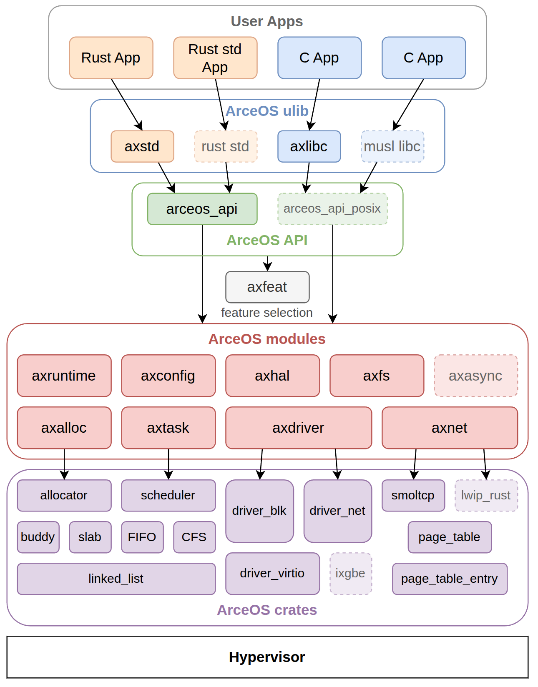
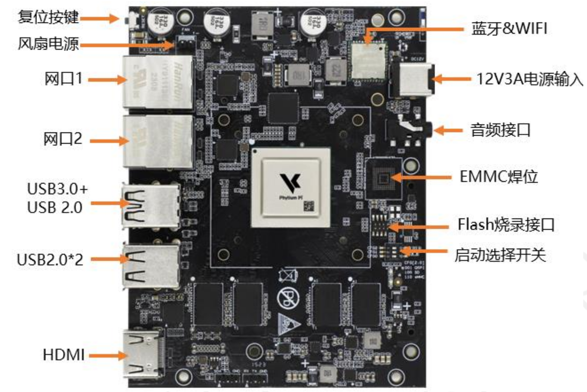

# 0.3 前置知识引导
本章节主要针对在飞腾派上对arceos开发驱动所需的一些前置知识进行简单的介绍

## What is Arceos?
Arceos是基于组件化思想构造、以 Rust 为主要开发语言、Unikernel 形态的操作系统。与传统操作系统的构建方式不同，组件是构成 ArceOS 的基本元素。

### What is Rust？
Rust 最早是 Mozilla 雇员 Graydon Hoare 的个人项目。从 2009 年开始，得到了 Mozilla 研究院的资助，2010 年项目对外公布，2010 ～ 2011 年间实现自举。自此以后，Rust 在部分重构 -> 崩溃的边缘反复横跳（历程极其艰辛），终于，在 2015 年 5 月 15 日发布 1.0 版。

- 相比 Go 语言，Rust 语言表达能力更强，性能更高。同时线程安全方面 Rust 也更强，不容易写出错误的代码。包管理 Rust 也更好，Go 虽然在 1.10 版本后提供了包管理，但是目前还比不上 Rust 。

- 相比 C++ 语言，Rust 与 C++ 的性能旗鼓相当，但是在安全性方面 Rust 会更优，特别是使用第三方库时，Rust 的严格要求会让三方库的质量明显高很多。

- 相比 Java 语言，除了极少数纯粹的数字计算性能，Rust 的性能全面领先于 Java 。同时 Rust 占用内存小的多，因此实现同等规模的服务，Rust 所需的硬件成本会显著降低。

这里是部分 Rust 学习相关资料的链接：
- Rust程序设计语言中文版（https://www.rustwiki.org.cn/zh-CN/book/ch01-02-hello-world.html）
- Rust语言圣经（https://course.rs/into-rust.html）
- Rustling（编程题库，可以在实践中对照学习具体用法，具体练习方法在仓库文档中）（https://github.com/LearningOS/rustling-25S-template）

### What is Unikernel？
Unikernel 是操作系统内核设计的一种架构（或称形态），从下图对比可以看出它与其它内核架构的显著区别：
.png)
Unikernel 相对其它内核架构有三个特点：

单特权级：应用与内核都处于同一特权级 - 即内核态，这使得应用在访问内核时，不需要特权级的切换。
单地址空间：应用没有单独的地址空间，而是共享内核的地址空间，所以在运行中，也不存在应用与内核地址空间切换的问题。
单应用：整个操作系统有且仅有一个应用，所以没有多应用之间隔离、共享及切换的问题。
所以相对于其它内核架构，Unikernel 设计实现的复杂度更低，运行效率相对较高，但在安全隔离方面，它的能力最弱。Unikernel 有它适合的特定的应用领域和场景。

ArceOS 选择 Unikernel 作为起步，希望为将来支持其它的内核架构建立基础。本实验指导正是对应这一阶段，从零开始一步一步的构建 Unikernel 形态的操作系统。Unikernel 本身这种简化的设计，可以让我们暂时忽略那些复杂的方面，把精力集中到最核心的问题上。

上图就是 ArceOS 的整体架构，由apps、crates、modules组成
- apps: 应用程序。它的运行需要依赖于modules组件库。
- modules: ArceOS的组件库。
- crates: 通用的基础库。为modules实现提供支持。

本开发手册主要针对 ArceOS 在 Phytium-Pi上开发驱动进行辅助说明，因此对于apps部分不作过多说明，主要对于目前已实现的crates和modules进行说明以辅助开发人员查询
### Crates
- allocator: 内存分配算法，包括：bitmap、buddy、slab、tlsf。
- arm_gic: ARM通用中断控制器 (GICv2) 。
- arm_pl011: ARM串行通信接口，用于处理器和外部设备之间的串行通信 。
- axerrno: ArceOS的错误码定义。
- axfs_devfs: ArceOS的设备（Device）文件系统，是axfs_vfs一种实现。
- axfs_ramfs: ArceOS的内存（RAM）文件系统，是axfs_vfs一种实现。
- axfs_vfs: ArceOS的虚拟文件系统接口。
- axio: no_std环境下的I/O traits 。
- capability: Capability-based security 通过设置访问权限控制对系统资源的访问。
- crate_interface: 提供一种在 crate 中定义接口（特征）的方法，其目的是解决循环依赖。
- driver_block: 通用的块存储（磁盘）驱动程序的接口定义。
- driver_common: ArceOS的通用设备驱动接口定义，包括：disk、serial port、 ethernet card、GPU。
- driver_display: 通用的图形设备驱动程序接口定义。
- driver_net: 通用的网络设备 (NIC) 驱动程序定义。
- driver_pci: 定义对PCI总线操作。
- driver_virtio: 实现在driver_common定义的驱动。
- flatten_objects: 为每个存储对象分配一个唯一的ID。
- handler_table: 无锁的事件处理程序表。
- kernel_guard: 利用RAII创建具有本地IRQ或禁用抢占的临界区，用于在内核中实现自旋锁。
- lazy_init: 延迟初始化。
- linked_list: 链表。
- memory_addr: 提供理物理和虚拟地址操作的辅助函数。
- page_table: 页表。
- page_table_entry: 页表项。
- percpu: per-CPU的数据结构。
- percpu_macros: per-CPU的数据结构的宏实现。
- ratio: 比率相关计算。
- scheduler: 统一的调度算法接口，包括：cfs、fifo、round_robin。
- slab_allocator: no_std 环境下的 Slab 分配器（一种内存管理算法）。
- spinlock: no_std 环境下的自旋锁实现。
- timer_list: 定时器，在计时器到期时触发。
- tuple_for_each: 提供遍历tuple字段的宏和方法。

crates可以在 https://crates.io/ 进行具体查询

### Modules
- axalloc: ArceOS 的全局内存分配器.
- axconfig: ArceOS 特定平台编译的常量和参数配置。
- axdisplay: ArceOS 的图形化模块。
- axdma: ArceOS 中为需要直接内存访问的设备驱动提供DMA支持。
- axdriver: ArceOS 的设备驱动模块。
- axfs: ArceOS 的文件系统模块。
- axhal: ArceOS硬件抽象层，为特定平台的操作提供统一的API。
- axlog: ArceOS 多个级别日志记录宏，包括：error、warn、info、debug、trace。
- axmm: ArceOS 的内存管理模块，提供虚拟内存地址空间抽象，支持线性映射和按需分配映射
- axnet: ArceOS 的网络模块，包括：IpAddr、TcpSocket、UdpSocket、DnsSocket等。
- axns: ArceOS 中用于命名空间管理功能的模块
- axruntime: ArceOS 的运行时库，负责系统启动和初始化序列，协调其他模块的初始化过程,是应用程序运行的基础环境。
- axsync: ArceOS 提供的同步操作模块，包括：Mutex、spin。
- axtask: ArceOS 的任务调度管理模块，包括：任务创建、调度、休眠、销毁等。

值得注意的是，并非所有模块都是必需的，其中axruntime、axhal、axconfig、axlog在所有构建中都会被启用并编译，而其他模块则会根据启动的功能特性进行选择性的编译，使得ArceOS可以根据不同的需求进行定制化构建

ArceOS最新主线仓库（https://github.com/arceos-org/arceos）

## Phytium-Pi
- 顶层接口视图与说明

- 底层接口视图与说明
.png.png)
