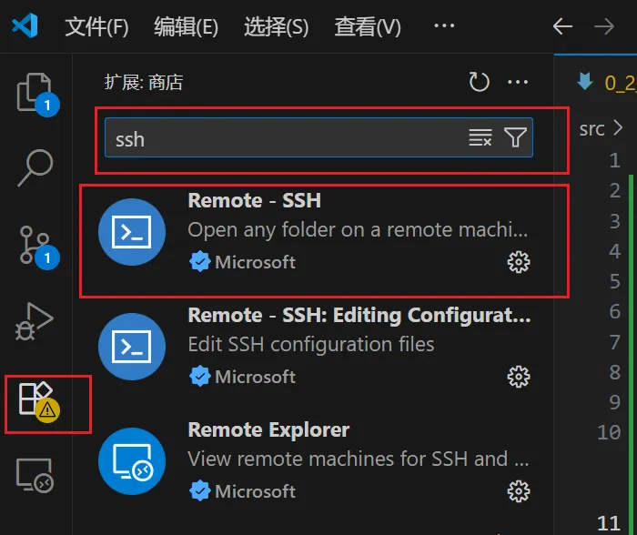
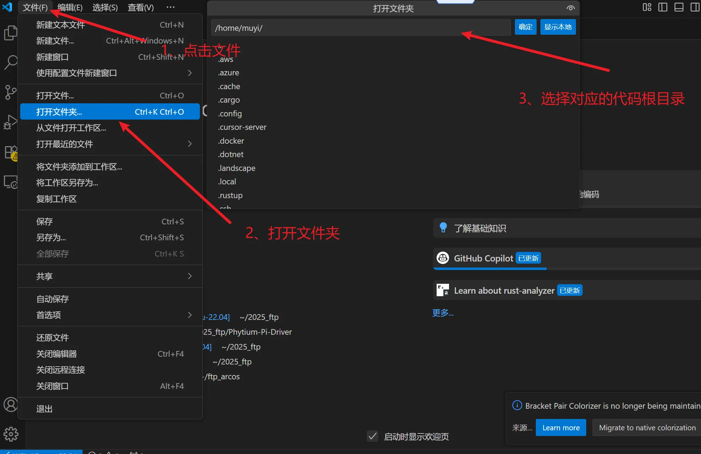
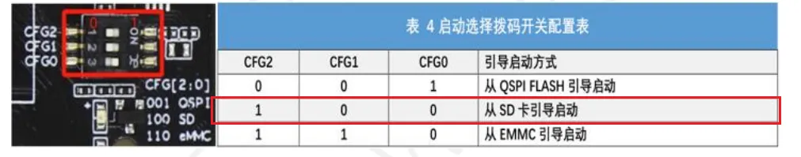
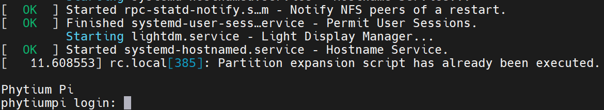
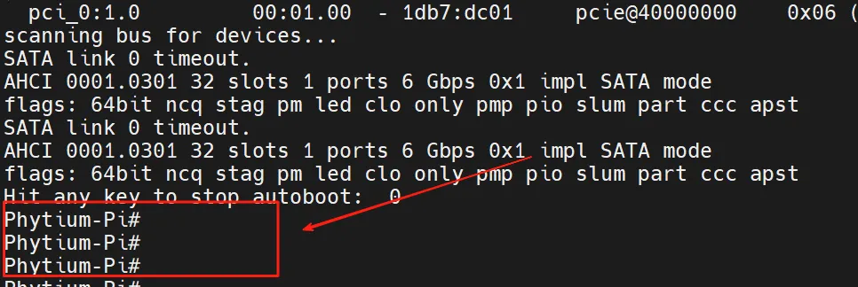
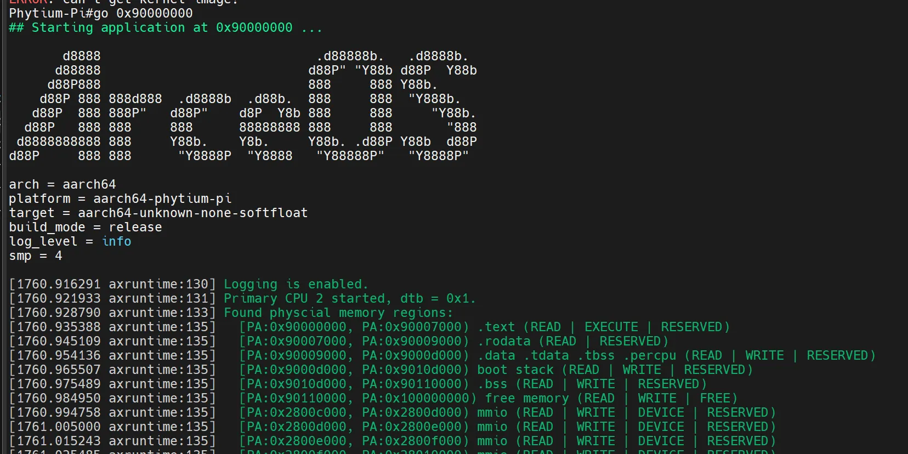

# 0.2 开发环境准备

## 0.2.1 运行环境

### 编译环境

编译依赖ubuntu操作系统，使用的winodws操作系统的同学可以通过安装[WSL](https://learn.microsoft.com/zh-cn/windows/wsl/install#step-4---download-the-linux-kernel-update-package)（linux 子系统）或者[VMwork](https://www.vmware.com/cn/products/workstation-pro/workstation-pro-evaluation.html)虚拟机来安装ubuntu。
安装好ubuntu 后需要安装必要的一些组件可直接执行如下指令

```bash
# 安装git 拉取代码
sudo apt install git
# 输入自己github的邮箱用户名
git config --global user.name "runoob"
git config --global user.email test@runoob.com
# 生成ssh密钥  
ssh-keygen -t rsa -b 4096 -C "your.email@example.com"

# 安装编译qemu所需的依赖包
sudo apt install autoconf automake autotools-dev curl libmpc-dev libmpfr-dev libgmp-dev \
              gawk build-essential bison flex texinfo gperf libtool patchutils bc \
              zlib1g-dev libexpat-dev pkg-config  libglib2.0-dev libpixman-1-dev libsdl2-dev \
              git tmux python3 python3-pip ninja-build
```


> **注释：**  ①基础运行环境可以参考[Arcos指导书](https://rcore-os.cn/arceos-tutorial-book/ch01-00.html) ②想要把修改上传到github仓库还需要 [配置ssh密钥](https://blog.csdn.net/weixin_42310154/article/details/118340458)

### vscode使用
由于是使用的wsl（inux子系统）作为基础编译环境，默认提供的是命令行搭配vim的方式来编辑文件。这可能并不是大部分人喜欢的开发环境，所以推荐使用vscode搭配remote-ssh插件来进行开发，并且该插件对于wsl是有很好的兼容性的，安装插件后直接选择连接wsl即可使用。
<div style="text-align: center;">
  <figure style="display: inline-block; margin: 0 auto; text-align: center;">
    
    <figcaption>图1：安装Remote-SSH插件的界面截图</figcaption>
  </figure>
  <figure style="display: inline-block; margin: 0 auto; text-align: center;">
    
    <figcaption>图2：选择连接到wsl</figcaption>
  </figure>
  <figure style="display: inline-block; margin: 0 auto; text-align: center;">
    
    <figcaption>图3：打开工作目录</figcaption>
  </figure>
</div>

### qemu 补充
在第一节的指导手册上使用的qemu版本是7.0.2，而很多模拟的外设是在后续版本才加到qemu中的。所以推荐从官网安装最新版或指定版本[qemu官网](https://www.qemu.org/download)

以10.0.2 版本为例子，使用如下命令即可完成qemu的安装。

```bash
wget https://download.qemu.org/qemu-10.0.2.tar.xz
tar xvJf qemu-10.0.2.tar.xz
cd qemu-10.0.2
make
make install
```

## 0.2.2 飞腾派上运行Arceos
首先运行Arceos需要依赖其他系统来提供uboot,所以运行Arceos第一步是先烧录提供的飞腾派OS。

### 烧录飞腾派OS
[飞腾派资料包](https://pan.baidu.com/s/1pStiyqohrB3SxHAFFk8R6Q)(提取码：dzdv)
> **注释：** 5-系统镜像/1-PhytiumPIOS（基于Debian）/phytiumpiosv2.1资料包/4G内存-optee版/sdcard.img.7z，解压缩。

下载解压后使用烧录工具将系统镜像烧录到TF卡，之后将TF插到飞腾派的卡槽中，最后连接电源线上电。

烧录工具推荐使用[balenaEtcher](https://etcher.balena.io/)也可以使用[win32 disk image](https://sourceforge.net/projects/win32diskimager/)

> **注释：** 常用的手机以及派上的小卡正式名叫做TF或者说microSD 大的是SD卡当然统称为sd卡也是可以的  具体区别可查看
[TF卡与SD卡](https://www.sd-nand.com/news/technology/312.html)

注意引导方式选择从sd卡启动！！！


> **注释：**  如果使用的是带emmc的版本可以直接从emmc启动，是当前版本的麒麟os启动会禁用风扇请注意，过热可能会损坏飞腾派。

启动后连接串口，可以看到如下打印即说明系统成功启动，

账号:root
密码:root

### 编译及运行
首先快速验证请参考这个链接，可以通过ostool来快速验证当前开发环境是完整可用的，避免后面在进行了较多code后因为难以验证而放弃。

[最快速验证](https://github.com/qclic/phytium-mci/blob/main/docs/%E9%A3%9E%E8%85%BE%E6%B4%BESDMMC%E5%BC%80%E5%8F%91.md#%E6%9C%80%E7%AE%80%E4%BB%A3%E7%A0%81%E6%B5%8B%E8%AF%95%E6%96%B9%E5%BC%8F
)

下载Arceos

```bash
git clone  https://github.com/rcore-os/arceos.git
```

编译Arceos

```bash
make A=examples/helloworld ARCH=aarch64 PLATFORM=aarch64-phytium-pi  FEARURES="irq" SMP=4 LOG=info
```

之后会在example/helloword 文件夹内生成对应的可执行文件helloworld_aarch64-phytium-pi.bin
将该文件拷贝到u盘中后将u盘插入飞腾派，之后重启飞腾派并在重启过程中在串口工具中输入enter以进入cmd模式，成功进入后串口打印如下图所示。


执行如下指令即可将本地编译的Arceos部署到飞腾派上运行

```bash
usb start
fatload usb 0 0x90000000 helloworld_aarch64-phytium-pi.bin
go 0x90000000
```



## 0.2.3 飞腾派上驱动的测试

本次测试旨在全面验证 Arceos 操作系统在飞腾派开发板上各类驱动的功能正确性、稳定性及兼容性，覆盖基本外设驱动与复杂功能驱动，为后续 Arceos 系统在飞腾派平台的应用与优化提供可靠的测试依据，确保驱动程序能够满足实际嵌入式应用场景的需求。

整个测试环境由两个部分组成，一个作为测试机，其上运行Linux，另一个是飞腾派（被测试开发板），其上运行Arceos。

测试机需通过 **USB 转 TTL 模块** 与飞腾派的 12 针调试串口连接，实现数据交互与测试控制，具体接线对应关系如下：

- 飞腾派12针接口：12pin为GND，接USB转TTL的GND
- 飞腾派12针接口：10pin为RX，接USB转TTL的TX
- 飞腾派12针接口：8pin为TX，接USB转TTL的RX

连接完成后，可通过测试机的 `ls /dev/ttyUSB*` 命令确认串口设备是否正常识别。

### 测试机上的准备

```sh
# 在测试机上运行
git clone --recursive https://github.com/shzhxh/driver-test.git
cd driver-test
make build  # 编译测试镜像，生成的镜像在shell目录下

# 安装测试依赖
python3 -m venv ~/.venv
source ~/.venv/bin/activate
pip3 install -r ./scripts/requests.txt
deactivate
```

### 飞腾派上的准备

```sh
# 在测试机上运行。要求：飞腾派上已运行Linux，且与测试机在同一局域网。
scp shell/shell*.bin user@192.168.1.100:arceos.bin

# 在飞腾派上运行  
sudo shutdown -r now  # 重启飞腾派，按任意键进入uboot
# 在uboot下执行如下命令
ext4load mmc 0:1 0x90100000 /home/user/arceos.bin
dcache flush
go 0x90100000   # 启动Arceos
```


