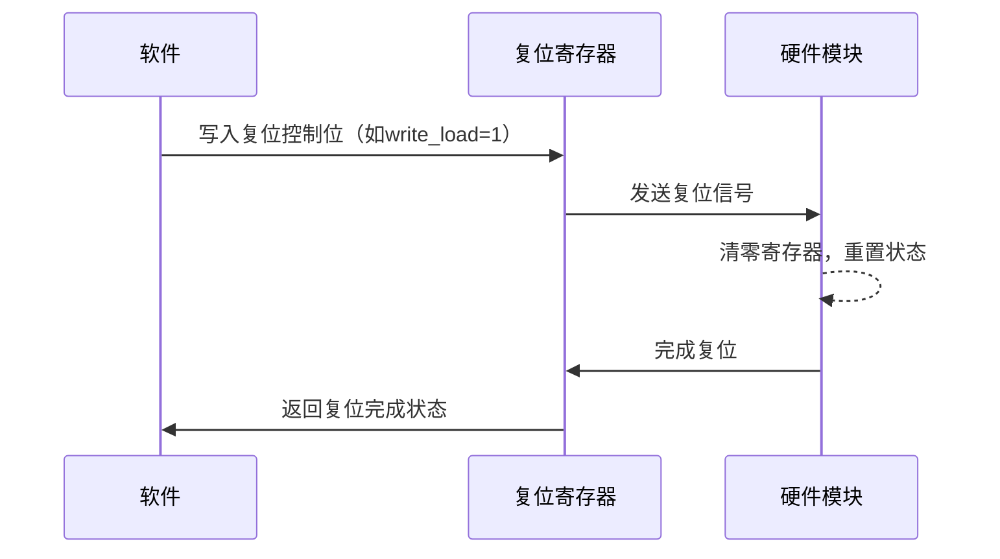
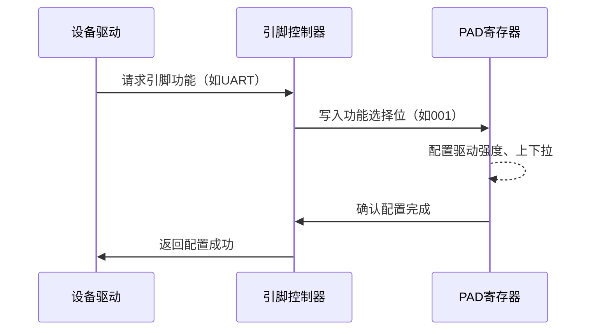
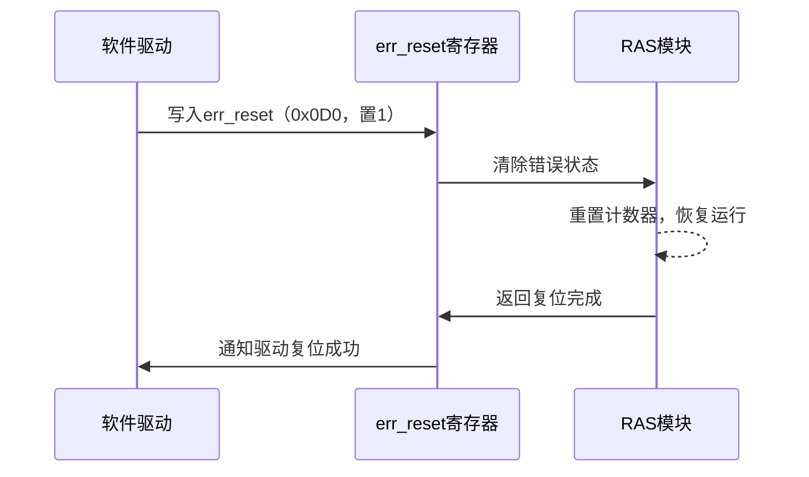
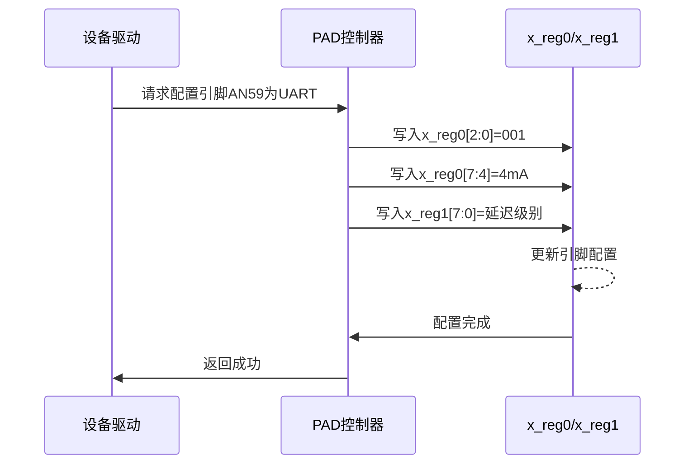

# 1.3 复位与引脚复用驱动

## 硬件原理

**复位**

复位是嵌入式系统中将硬件模块或整个系统恢复到已知初始状态的过程，用于初始化硬件、清除错误状态或恢复系统运行。复位机制通常包括以下类型：

- **上电复位（Power-on Reset, POR）**：系统上电时由硬件自动触发，初始化所有寄存器和模块到默认状态。
- **软件复位（Software Reset）**：通过软件写入特定控制寄存器触发，针对系统或特定模块。
- **看门狗复位（Watchdog Reset）**：由看门狗定时器在检测到系统超时或故障时触发，重启系统。
- **外部复位**：通过外部引脚输入信号（如低电平脉冲）触发，通常用于调试或手动重置。

复位过程通常涉及以下步骤：

1. **触发信号**：硬件或软件生成复位信号（如寄存器写入或外部引脚电平变化）。
2. **寄存器清零**：相关寄存器（如计数器、状态寄存器）被设置为默认值（通常为0x0）。
3. **模块初始化**：硬件模块（如CPU、定时器、外设）恢复到初始状态，准备重新运行。

**复位类型比较**

| 复位类型   | 触发方式         | 作用范围       | 典型应用场景   |
| ---------- | ---------------- | -------------- | -------------- |
| 上电复位   | 硬件上电自动触发 | 整个系统       | 系统启动初始化 |
| 软件复位   | 写入控制寄存器   | 系统或特定模块 | 模块错误恢复   |
| 看门狗复位 | 定时器超时       | 整个系统       | 系统故障恢复   |
| 外部复位   | 外部引脚信号     | 整个系统或模块 | 调试或手动重置 |



**引脚复用**

引脚复用（Pin Multiplexing）是嵌入式系统中优化引脚资源的技术，允许一个物理引脚支持多种功能（如GPIO、UART、SPI、I2C等）。由于SoC引脚数量有限，引脚复用通过配置寄存器动态选择引脚的功能和电气特性（如驱动强度、上下拉电阻、延迟）。

引脚复用机制的工作原理：

- **功能选择**：通过控制寄存器（如功能选择寄存器）的位字段选择引脚功能。例如，3位字段可支持8种功能（如000=GPIO，001=UART）。
- **电气特性配置**：调整驱动强度（mA）、上下拉电阻（上拉/下拉/无）以及输入/输出延迟，以适配不同外设的信号要求。
- **设备树映射**：在嵌入式系统中，引脚复用通常通过设备树（Device Tree）定义，映射到具体寄存器配置。

**引脚复用功能示例**

| 功能选择位 | 功能 | 描述         |
| ---------- | ---- | ------------ |
| 000        | GPIO | 通用输入输出 |
| 001        | UART | 串口通信     |
| 010        | SPI  | 串行外设接口 |
| 011        | I2C  | 两线串行总线 |



## 飞腾派复位与引脚复用系统

飞腾派开发板基于飞腾E2000处理器（ARMv8架构，2个FTC664核@1.8GHz和2个FTC310核@1.5GHz），其复位和引脚复用系统由Timer、RAS和PAD模块支持。以下详细介绍飞腾派的实现。

### 飞腾派复位系统

飞腾派的复位系统由Timer和RAS模块实现，支持系统级和模块级复位。

#### Timer模块

Timer模块用于定时功能，同时支持复位操作。其关键特性包括：

- **全局恢复位**：通过控制寄存器（如ctrl_reg）的write_load位，重置计数器到默认值（通常0x0）。
- **重启/自由运行模式**：复位后可选择重新计数或进入自由运行状态。
- **应用场景**：初始化Timer模块或触发系统软复位。

**Timer模块复位功能**

| 功能       | 描述                    | 触发方式                   |
| ---------- | ----------------------- | -------------------------- |
| 计数器复位 | 将计数器寄存器清零      | 写入ctrl_reg的write_load位 |
| 模块初始化 | 重置Timer模块到初始状态 | 软件控制或上电复位         |

#### RAS模块

RAS（可靠性、可用性和可服务性）模块通过错误重置寄存器管理错误状态恢复，增强系统可靠性。其关键特性包括：

- **错误重置**：通过err_reset寄存器（偏移0x0D0，32位）清除错误状态或计数器。
- **安全属性配置**：通过err_reset_set寄存器（偏移0x0B0，64位）设置安全状态（1为安全，0为非安全）。
- **错误注入**：通过err_inject_num寄存器模拟错误状态，用于调试。

**RAS模块复位功能**

| 功能         | 描述                 | 触发方式           |
| ------------ | -------------------- | ------------------ |
| 错误状态清除 | 清除错误计数器或状态 | 写入err_reset      |
| 安全属性配置 | 设置复位操作的安全性 | 写入err_reset_set  |
| 错误注入     | 模拟错误触发复位     | 写入err_inject_num |



#### 看门狗支持

飞腾派支持看门狗定时器，通过 watchdog_ctrl 寄存器配置超时时间，触发系统级复位，适用于故障恢复场景。

### 飞腾派引脚复用系统

飞腾派的引脚复用由PAD模块管理，支持10个复用引脚，每个引脚通过两个寄存器（x_reg0和x_reg1）配置，基地址为0x32830000。每个引脚可动态切换功能（如GPIO、UART、SPI、I2C）和电气特性。

#### PAD模块功能

- **功能选择**：x_reg0的位[2:0]选择引脚功能（如000=GPIO，001=UART）。
- **驱动强度**：x_reg0的位[7:4]设置驱动电流（默认4mA）。
- **上下拉电阻**：x_reg0的位[9:8]配置上拉、下拉或无电阻。
- **输入/输出延迟**：x_reg1配置输入延迟（位[7:0]，粒度100ps）和输出延迟（位[15:8]，粒度366ps，最大3.7ns）。

**飞腾派引脚复用配置**

| 配置项     | 寄存器 | 位字段 | 功能描述                       |
| ---------- | ------ | ------ | ------------------------------ |
| 功能选择   | x_reg0 | [2:0]  | 选择引脚功能（如GPIO、UART）   |
| 驱动强度   | x_reg0 | [7:4]  | 设置驱动电流（默认4mA）        |
| 上下拉电阻 | x_reg0 | [9:8]  | 配置上拉/下拉/无电阻           |
| 输入延迟   | x_reg1 | [7:0]  | 启用延迟，粒度100ps            |
| 输出延迟   | x_reg1 | [15:8] | 启用延迟，粒度366ps，最大3.7ns |

**飞腾派引脚复用配置**



#### 引脚复用示例

飞腾派40Pin接口支持多种功能（如GPIO、UART、I2C），通过设备树定义引脚组。例如，引脚AN59可配置为：

- **GPIO**：x_reg0[2:0]=000，用于通用输入输出。
- **UART**：x_reg0[2:0]=001，用于串口通信。
- **I2C**：x_reg0[2:0]=011，用于两线总线。

配置时需确保功能有效，并根据外设需求调整电气特性。

## 驱动 API 调用表

### **Reset 驱动 API 调用表**

| **API 函数**         | **描述**                                                     | **参数**                                                     | **返回值**                                           |
| -------------------- | ------------------------------------------------------------ | ------------------------------------------------------------ | ---------------------------------------------------- |
| `FResetInit`         | 初始化 CRU 控制器，设置基址和设备状态，为复位操作准备。      | `instance_p: &mut FResetCtrl`（CRU 控制器实例）<br>`config_p: &FResetConfig`（基址 0x2800_0000 等） | `bool`: true（成功），false（参数错误或已初始化）    |
| `FResetDeInit`       | 去初始化 CRU 控制器，清除状态，标记未就绪。                  | `instance_p: &mut FResetCtrl`（CRU 控制器实例）              | `bool`: true（成功）                                 |
| `FResetLookupConfig` | 根据设备 ID 查找 CRU 配置，返回基址等信息。                  | `instance_id: u32`（设备 ID）                                | `Option<FResetConfig>`: 配置结构体或 None（ID 无效） |
| `FResetSystem`       | 触发系统全局复位，写入 CRU cru_rst_ok 寄存器（bit 0=1），重启 CPU 和外设。 | `instance_p: &mut FResetCtrl`（CRU 实例）                    | `bool`: true（成功），false（超时或寄存器错误）      |
| `FResetPeripheral`   | 重置指定外设（如 GPIO0~5），写入 CRU cru_rst_ok（bit 1~5）。 | `instance_p: &mut FResetCtrl`<br>`periph_id: u32`（外设 ID，如 0=GPIO0） | `bool`: true（成功），false（外设 ID 无效或超时）    |

#### 说明
- **调用顺序**：
  1. 调用 `FResetInit` 和 `FResetLookupConfig` 初始化 CRU，设置基址（0x2800_0000）。
  2. 使用 `FResetSystem` 或 `FResetPeripheral` 触发复位。
  3. 可选调用 `FResetDeInit` 清理状态。
- **硬件依赖**：
  - **基址**：CRU 0x2800_0000。
  - **寄存器**：
    - `cru_rst_ok` (偏移 0x100)：bit 0=系统复位，bit 1~5=外设复位（如 GPIO0~5）。
    - `cru_rst_status` (偏移 0x104)：bit 9=复位完成。
  - **硬件接口**：SW4 按钮（低电平，>10ms）或 Pin 33（GPIO2_8，CRU_RST_OK）。

### Pinmux 驱动 API 调用表

| **API 函数**          | **描述**                                                     | **参数**                                                     | **返回值**                                           |
| --------------------- | ------------------------------------------------------------ | ------------------------------------------------------------ | ---------------------------------------------------- |
| `FIOPadCfgInitialize` | 初始化 PAD 控制器，设置基址和设备 ID，为引脚功能配置准备。   | `instance_p: &mut FIOPadCtrl`（PAD 控制器实例）<br>`input_config_p: &FIOPadConfig`（基址 0x32B30000） | `bool`: true（成功），false（参数错误或已初始化）    |
| `FIOPadDeInitialize`  | 去初始化 PAD 控制器，清除状态，标记未就绪。                  | `instance_p: &mut FIOPadCtrl`（PAD 控制器实例）              | `bool`: true（成功）                                 |
| `FIOPadLookupConfig`  | 根据设备 ID 查找 PAD 配置，返回基址等信息。                  | `instance_id: u32`（设备 ID）                                | `Option<FIOPadConfig>`: 配置结构体或 None（ID 无效） |
| `FIOPadSetFunc`       | 设置指定引脚功能，写入 PAD x_reg0（如 0x00D0，bit 0~3 值 5=I2C）。 | `instance_p: &mut FIOPadCtrl`<br>`offset: u32`（偏移，如 0x00D0）<br>`func: u32`（功能值，如 5=I2C） | `bool`: true（成功），false（偏移或功能值无效）      |
| `FMioFuncInit`        | 初始化 MIO 控制器，设置功能（如 0b00=I2C），写入 creg_mio_func_sel。 | `instance_p: &mut PhitiumMio`<br>`func: u32`（功能值，如 0=I2C） | `bool`: true（成功），false（功能值无效）            |
| `FMioFuncGetAddress`  | 获取 MIO 控制器基址（如 0x2801_4000 for MIO0）。             | `instance_p: &PhitiumMio`<br>`func: u32`（功能值）           | `u64`: 基址或 0（失败）                              |
| `FMioFuncGetIrqNum`   | 获取 MIO 功能的中断编号（如 I2C/UART IRQ，假设 24）。        | `instance_p: &PhitiumMio`<br>`func: u32`（功能值）           | `u32`: 中断号（24）或 0（失败）                      |

#### 说明
- **调用顺序**：
  1. 调用 `FIOPadCfgInitialize` 和 `FIOPadLookupConfig` 初始化 PAD（基址 0x32B30000）。
  2. 调用 `FMioFuncInit` 设置 MIO 功能（如 MIO0 0x2801_4000 为 I2C，creg_mio_func_sel=0b00）。
  3. 调用 `FIOPadSetFunc` 配置引脚功能（如 Pin 3/5 I2C1_SDA/SCL，x_reg0=5）。
  4. 可选调用 `FIOPadDeInitialize` 清理。
- **硬件依赖**：
  - **PAD 基址**：0x32B30000。
    - `x_reg0`（偏移 e.g., 0x00D0 for SCL）：bit 0~3=功能（0=GPIO，5=I2C，1=UART，2=CAN，3=SPI，4=PWM）；bit 4~6=驱动强度（2~12mA）；bit 7=上下拉（1=上拉）。
    - `x_reg1`（偏移 e.g., 0x00DC）：bit 0~3=延迟（100ps/366ps）。
  - **MIO 基址**：0x2801_4000~0x2803_2000（MIO0~15）。
    - `creg_mio_func_sel`（偏移 0x1000）：bit 0~1=功能（0=I2C，1=UART）。
  - **引脚**：40-pin 扩展头（如 Pin 7: GPIO2_10 MUX UART2_TXD，Pin 3: I2C1_SDA）。

## 寄存器信息

### Reset 驱动寄存器信息

#### 基地址
- **CRU (Clock and Reset Unit)**：0x2800_0000

#### 寄存器表
| **寄存器名称**   | **偏移地址** | **描述**                             |
| ---------------- | ------------ | ------------------------------------ |
| `cru_rst_ok`     | 0x100        | 复位控制寄存器，触发系统或外设复位。 |
| `cru_rst_status` | 0x104        | 复位状态寄存器，检查复位完成状态。   |

#### 寄存器位域设置
- **`cru_rst_ok` (偏移 0x100, 读写)**
  - **SYSTEM_RESET** (bit 0, 1 bit)：系统复位，1=触发全局复位（CPU 和外设）。
    - 默认值：0
    - 描述：写入 1 触发系统复位，时序 >10ms。
  - **PERIPH_RESET** (bit 1-5, 5 bits)：外设复位，值 0~5 对应 GPIO0~5 等外设。
    - 默认值：0
    - 描述：写入外设 ID 重置指定外设（如 0=GPIO0）。
- **`cru_rst_status` (偏移 0x104, 只读)**
  - **DONE** (bit 9, 1 bit)：复位完成，1=复位完成，0=进行中。
    - 默认值：0
    - 描述：读取确认复位状态，需轮询。

### Pinmux 驱动寄存器信息

#### 基地址
- **PAD**：0x32B30000
- **MIO**：0x2801_4000 ~ 0x2803_2000（MIO0~15）。

#### 寄存器表
#### PAD 寄存器
| **寄存器名称** | **偏移地址** | **描述**                                                |
| -------------- | ------------ | ------------------------------------------------------- |
| `x_reg0_scl`   | 0x00D0       | SCL 引脚功能选择和电气特性配置（如 Pin 3，I2C1_SCL）。  |
| `x_reg0_sda`   | 0x00D4       | SDA 引脚功能选择和电气特性配置（如 Pin 5，I2C1_SDA）。  |
| `x_reg0_gpio`  | 0x00D8       | GPIO 引脚功能选择和电气特性配置（如 Pin 7，GPIO2_10）。 |
| `x_reg1_scl`   | 0x00DC       | SCL 引脚延迟配置。                                      |
| `x_reg1_sda`   | 0x00E0       | SDA 引脚延迟配置。                                      |
| `x_reg1_gpio`  | 0x00E4       | GPIO 引脚延迟配置。                                     |

#### MIO 寄存器
| **寄存器名称**      | **偏移地址** | **描述**                                          |
| ------------------- | ------------ | ------------------------------------------------- |
| `creg_mio_func_sel` | 0x1000       | MIO 功能选择寄存器，设置引脚功能（如 I2C/UART）。 |
| `func_sel_state`    | 0x1004       | MIO 功能状态寄存器，查询当前功能。                |
| `version`           | 0x1008       | MIO 版本信息。                                    |

#### 寄存器位域设置
#### PAD 寄存器
- **`x_reg0_scl`, `x_reg0_sda`, `x_reg0_gpio` (偏移 0x00D0/0x00D4/0x00D8, 读写)**
  - **FUNC** (bit 0-3, 4 bits)：功能选择。
    - 值：
      - 0 = GPIO
      - 1 = UART
      - 2 = CAN
      - 3 = SPI
      - 4 = PWM
      - 5 = I2C
    - 默认值：0
    - 描述：设置引脚功能（如 Pin 3/5 为 I2C，值 5）。
  - **DRIVE_STRENGTH** (bit 4-6, 3 bits)：驱动强度，2~12mA。
    - 默认值：0
    - 描述：配置电流输出能力。
  - **PULL** (bit 7, 1 bit)：上下拉，1=上拉，0=无。
    - 默认值：0
    - 描述：启用上拉电阻（如 I2C 需 4.7kΩ）。
- **`x_reg1_scl`, `x_reg1_sda`, `x_reg1_gpio` (偏移 0x00DC/0x00E0/0x00E4, 读写)**
  - **DELAY** (bit 0-3, 4 bits)：输入/输出延迟，粒度 100ps/366ps。
    - 默认值：0
    - 描述：调整信号时序。

#### MIO 寄存器
- **`creg_mio_func_sel` (偏移 0x1000, 读写)**
  - **SEL_STATE** (bit 0-1, 2 bits)：功能选择。
    - 值：
      - 0 = I2C
      - 1 = UART
    - 默认值：0
    - 描述：设置 MIO 功能（如 MIO0 为 I2C，值 0）。
- **`func_sel_state` (偏移 0x1004, 只读)**
  - **SEL_STATE** (bit 0-1, 2 bits)：查询当前功能（同上）。
    - 默认值：0
    - 描述：读取 MIO 配置状态。
- **`version` (偏移 0x1008, 只读)**
  - 默认值：未知
  - 描述：MIO 硬件版本信息。

## 驱动实现解析

## Reset 驱动实现讲解（cru.rs）

reset 驱动基于 CRU (Clock and Reset Unit) 控制器，实现系统和外设复位。代码定义寄存器、结构体和 API 函数，使用 SpinNoIrq 锁确保多核安全，依赖 phys_to_virt 进行地址转换。

**寄存器定义部分**

```rust
register_structs! {
    pub CruRegs {
        (0x00 => _reserved0),
        (0x100 => cru_rst_ok: ReadWrite<u32, RST_OK::Register>),
        (0x104 => cru_rst_status: ReadOnly<u32, RST_STATUS::Register>),
        (0x108 => @END),
    }
}

register_bitfields![u32,
    RST_OK [
        SYSTEM_RESET OFFSET(0) NUMBITS(1) [], // 1=触发系统复位
        PERIPH_RESET OFFSET(1) NUMBITS(5) [], // bit 1-5: GPIO0~5 等外设
    ],
    RST_STATUS [
        DONE OFFSET(9) NUMBITS(1) [], // 1=复位完成
    ],
];
```

使用 tock_registers 宏定义 CRU 寄存器布局（基址 0x2800_0000）。cru_rst_ok (偏移 0x100) 是读写寄存器，用于触发复位（bit 0: 系统复位，bit 1-5: 外设复位，如 GPIO0~5）。cru_rst_status (偏移 0x104) 是只读寄存器，检查复位完成（bit 9: DONE=1 表示完成）。位域定义确保类型安全访问，避免手动掩码操作。

**结构体和全局定义部分**

```rust
pub struct CruCtrl {
    regs: NonNull<CruRegs>,
}

unsafe impl Send for CruCtrl {}

impl CruCtrl {
    pub const fn new(base: *mut u8) -> Self {
        Self {
            regs: NonNull::new(base).unwrap().cast(),
        }
    }
    const fn regs(&self) -> &CruRegs {
        unsafe { self.regs.as_ref() }
    }
    const fn regs_mut(&mut self) -> &mut CruRegs {
        unsafe { self.regs.as_mut() }
    }
}

// API 结构体
#[derive(Debug, Clone, Copy, Default)]
pub struct FResetConfig {
    pub instance_id: u32,
    pub base_address: usize,
}

pub struct FResetCtrl {
    pub config: FResetConfig,
    pub is_ready: u32,
}

static CRU_CONFIG: [FResetConfig; 1] = [FResetConfig {
    instance_id: 0,
    base_address: 0x2800_0000usize,
}];

pub static CRU: SpinNoIrq<FResetCtrl> = SpinNoIrq::new(FResetCtrl {
    config: FResetConfig {
        instance_id: 0,
        base_address: 0,
    },
    is_ready: 0,
});
```

CruCtrl 封装寄存器指针，使用 NonNull 确保非空，regs/regs_mut 方法通过 unsafe 提供访问（const fn 允许常量上下文）。unsafe impl Send 允许跨线程传递。FResetConfig 和 FResetCtrl 是 API 结构体，存储配置和状态（is_ready=0x11111111 表示初始化）。全局 CRU 使用 SpinNoIrq 锁保护多核访问，静态配置表 CRU_CONFIG 定义基址 0x2800_0000。

**API 函数部分**

```rust
pub fn FResetInit(instance_p: &mut FResetCtrl, config_p: &FResetConfig) -> bool {
    assert!(Some(*instance_p).is_some() && Some(*config_p).is_some());
    let mut ret = true;
    if instance_p.is_ready == 0x11111111u32 {
        info!("CRU already initialized.");
        return false;
    }
    FResetDeInit(instance_p);
    instance_p.config = *config_p;
    instance_p.is_ready = 0x11111111u32;
    ret
}

pub fn FResetDeInit(instance_p: &mut FResetCtrl) -> bool {
    if instance_p.is_ready == 0 {
        return true;
    }
    instance_p.is_ready = 0;
    unsafe {
        core::ptr::write_bytes(instance_p as *mut FResetCtrl, 0, core::mem::size_of::<FResetCtrl>());
    }
    true
}

pub fn FResetLookupConfig(instance_id: u32) -> Option<FResetConfig> {
    if instance_id >= 1 {
        return None;
    }
    Some(CRU_CONFIG[instance_id as usize])
}

pub fn FResetSystem(instance_p: &mut FResetCtrl) -> bool {
    let base = instance_p.config.base_address;
    let cru = CruCtrl::new(phys_to_virt(PhysAddr::from(base)).as_mut_ptr());
    cru.regs().cru_rst_ok.modify(RST_OK::SYSTEM_RESET::SET);
    let mut timeout = 0;
    while cru.regs().cru_rst_status.read(RST_STATUS::DONE) != 1 && timeout < 500 {
        timeout += 1;
        crate::time::busy_wait(core::time::Duration::from_millis(1));
    }
    timeout < 500
}

pub fn FResetPeripheral(instance_p: &mut FResetCtrl, periph_id: u32) -> bool {
    if periph_id > 5 {
        return false;
    }
    let base = instance_p.config.base_address;
    let cru = CruCtrl::new(phys_to_virt(PhysAddr::from(base)).as_mut_ptr());
    cru.regs().cru_rst_ok.modify(RST_OK::PERIPH_RESET.val(periph_id));
    let mut timeout = 0;
    while cru.regs().cru_rst_status.read(RST_STATUS::DONE) != 1 && timeout < 500 {
        timeout += 1;
        crate::time::busy_wait(core::time::Duration::from_millis(1));
    }
    timeout < 500
}
```

- FResetInit：检查指针和状态（is_ready=0x11111111 表示已初始化），调用 FResetDeInit 清理，设置 config 和 is_ready。效果是准备 CRU 控制器。
- FResetDeInit：清除 is_ready 并零初始化结构体（unsafe write_bytes），释放状态。
- FResetLookupConfig：根据 ID 从静态表返回配置（基址 0x2800_0000），支持多实例扩展。
- FResetSystem：创建 CruCtrl 实例（phys_to_virt 转换虚拟地址），修改 cru_rst_ok 的 SYSTEM_RESET bit=1 触发复位。轮询 cru_rst_status 的 DONE bit（超时 500ms），返回成功。
- FResetPeripheral：类似系统复位，但设置 PERIPH_RESET bit=periph_id (0~5，如 GPIO0），轮询完成。ID >5 返回 false，限制外设范围。

**硬件关联**：CRU 基址 0x2800_0000，寄存器偏移 0x100/0x104（推测，手册定义）。SW4 按钮或 Pin 33（GPIO2_8）可触发外部复位，但代码未处理。

**ArceOS 上下文**：使用 SpinNoIrq 锁保护全局 CRU，busy_wait 来自 crate::time。兼容 axhal 的平台初始化（如 platform_init）。

## Pinmux 驱动实现讲解（pinctrl.rs）

pinmux 驱动基于 PAD 和 MIO 控制器，实现引脚功能复用和配置。代码扩展 mio.rs 的 PhitiumMio，依赖 phys_to_virt 和 SpinNoIrq。

**寄存器定义部分**

```rust
// PAD 寄存器定义（基址 0x32B30000）
register_structs! {
    pub PadRegs {
        (0x00 => _reserved0),
        (0x00D0 => x_reg0_scl: ReadWrite<u32, X_REG0::Register>),
        (0x00D4 => x_reg0_sda: ReadWrite<u32, X_REG0::Register>),
        (0x00D8 => x_reg0_gpio: ReadWrite<u32, X_REG0::Register>),
        (0x00DC => x_reg1_scl: ReadWrite<u32, X_REG1::Register>),
        (0x00E0 => x_reg1_sda: ReadWrite<u32, X_REG1::Register>),
        (0x00E4 => x_reg1_gpio: ReadWrite<u32, X_REG1::Register>),
        (0x1000 => @END),
    }
}

register_bitfields![u32,
    X_REG0 [
        FUNC OFFSET(0) NUMBITS(4) [
            GPIO = 0,
            I2C = 5,
            UART = 1,
            CAN = 2,
            SPI = 3,
            PWM = 4,
        ],
        DRIVE_STRENGTH OFFSET(4) NUMBITS(3) [], // 2~12mA
        PULL OFFSET(7) NUMBITS(1) [], // 1=上拉
    ],
    X_REG1 [
        DELAY OFFSET(0) NUMBITS(4) [], // 100ps/366ps 粒度
    ],
];
```

使用 tock_registers 宏定义 PAD 寄存器布局（基址 0x32B30000）。x_reg0_* (偏移 0x00D0~0x00D8) 为读写寄存器，用于功能选择（如 SCL/SDA/GPIO）。x_reg1_* (偏移 0x00DC~0x00E4) 配置延迟。位域定义 FUNC (bit 0-3) 支持 GPIO/I2C/UART/CAN/SPI/PWM（值 0~5），DRIVE_STRENGTH (bit 4-6) 电流，PULL (bit 7) 上拉，DELAY (bit 0-3) 时序调整。

**结构体和全局定义部分**

```rust
// PAD 控制器结构体
pub struct PadCtrl {
    regs: NonNull<PadRegs>,
}

unsafe impl Send for PadCtrl {}

impl PadCtrl {
    pub const fn new(base: *mut u8) -> Self {
        Self {
            regs: NonNull::new(base).unwrap().cast(),
        }
    }
    const fn regs(&self) -> &PadRegs {
        unsafe { self.regs.as_ref() }
    }
    const fn regs_mut(&mut self) -> &mut PadRegs {
        unsafe { self.regs.as_mut() }
    }
}

// API 结构体（复用 I2C 模式）
use super::mio::{PhitiumMio, MIO0, MIO1};

#[derive(Debug, Clone, Copy, Default)]
pub struct FIOPadConfig {
    pub instance_id: u32,
    pub base_address: usize,
}

pub struct FIOPadCtrl {
    pub config: FIOPadConfig,
    pub is_ready: u32,
}

static PAD_CONFIG: [FIOPadConfig; 1] = [FIOPadConfig {
    instance_id: 0,
    base_address: 0x32B30000usize,
}];

pub static PAD: SpinNoIrq<FIOPadCtrl> = SpinNoIrq::new(FIOPadCtrl {
    config: FIOPadConfig {
        instance_id: 0,
        base_address: 0,
    },
    is_ready: 0,
});
```

PadCtrl 封装寄存器指针，使用 NonNull 确保非空，regs/regs_mut 方法通过 unsafe 提供访问。unsafe impl Send 允许跨线程。FIOPadConfig 和 FIOPadCtrl 是 API 结构体，存储配置和状态（is_ready=0x11111111 表示初始化）。全局 PAD 使用 SpinNoIrq 锁保护多核访问，静态配置表 PAD_CONFIG 定义基址 0x32B30000。复用 mio.rs 的 PhitiumMio 和 MIO0/MIO1，整合 MIO 配置。

**API 函数部分**

```rust
pub fn FIOPadCfgInitialize(instance_p: &mut FIOPadCtrl, input_config_p: &FIOPadConfig) -> bool {
    assert!(Some(*instance_p).is_some() && Some(*input_config_p).is_some());
    let mut ret = true;
    if instance_p.is_ready == 0x11111111u32 {
        info!("PAD already initialized.");
        return false;
    }
    FIOPadDeInitialize(instance_p);
    instance_p.config = *input_config_p;
    instance_p.is_ready = 0x11111111u32;
    ret
}

pub fn FIOPadDeInitialize(instance_p: &mut FIOPadCtrl) -> bool {
    if instance_p.is_ready == 0 {
        return true;
    }
    instance_p.is_ready = 0;
    unsafe {
        core::ptr::write_bytes(instance_p as *mut FIOPadCtrl, 0, core::mem::size_of::<FIOPadCtrl>());
    }
    true
}

pub fn FIOPadLookupConfig(instance_id: u32) -> Option<FIOPadConfig> {
    if instance_id >= 1 {
        return None;
    }
    Some(PAD_CONFIG[instance_id as usize])
}

pub fn FIOPadSetFunc(instance_p: &mut FIOPadCtrl, offset: u32, func: u32) -> bool {
    if ![0x00D0, 0x00D4, 0x00D8].contains(&offset) {
        return false;
    }
    let base = instance_p.config.base_address;
    let pad = PadCtrl::new(phys_to_virt(PhysAddr::from(base)).as_mut_ptr());
    match offset {
        0x00D0 => pad.regs_mut().x_reg0_scl.modify(X_REG0::FUNC.val(func)),
        0x00D4 => pad.regs_mut().x_reg0_sda.modify(X_REG0::FUNC.val(func)),
        0x00D8 => pad.regs_mut().x_reg0_gpio.modify(X_REG0::FUNC.val(func)),
        _ => return false,
    }
    true
}

pub fn FMioFuncInit(instance_p: &mut PhitiumMio, func: u32) -> bool {
    match func {
        0 => instance_p.set_i2c(),
        1 => instance_p.set_uart(),
        _ => return false,
    }
    true
}

pub fn FMioFuncGetAddress(instance_p: &PhitiumMio, func: u32) -> u64 {
    let base = instance_p.regs().func_sel.get() as u64;
    match func {
        0 | 1 => base, // I2C/UART 使用 MIO 基址
        _ => 0,
    }
}

pub fn FMioFuncGetIrqNum(_instance_p: &PhitiumMio, _func: u32) -> u32 {
    24 
}
```

**讲解**：

- FIOPadCfgInitialize：检查指针和状态（is_ready=0x11111111 表示已初始化），调用 FIOPadDeInitialize 清理，设置 config 和 is_ready。效果是准备 PAD 控制器。
- FIOPadDeInitialize：清除 is_ready 并零初始化结构体（unsafe write_bytes），释放状态。
- FIOPadLookupConfig：根据 ID 从静态表返回配置（基址 0x32B30000），支持多实例扩展。
- FIOPadSetFunc：检查偏移（如 0x00D0 SCL），创建 PadCtrl 实例（phys_to_virt 转换虚拟地址），匹配偏移修改 x_reg0_* 的 FUNC bit (val(func)，如 5=I2C)。返回成功或失败。
- FMioFuncInit：调用 PhitiumMio 的 set_i2c/set_uart（从 mio.rs），设置 creg_mio_func_sel bit 0-1 (0=I2C, 1=UART)。
- FMioFuncGetAddress：读取 func_sel 作为基址（u64），限制于 func 0/1（I2C/UART）。
- FMioFuncGetIrqNum：返回固定中断号

**硬件关联**：PAD 基址 0x32B30000，偏移 0x00D0~0x00E4（SCL/SDA/GPIO 示例）。MIO 基址 0x2801_4000~0x2803_2000，creg_mio_func_sel (0x1000) 配置 MUX。

**ArceOS 上下文**：使用 SpinNoIrq 锁保护全局 PAD，info! 来自 ArceOS 日志。兼容 axhal 的 pinctrl trait。
