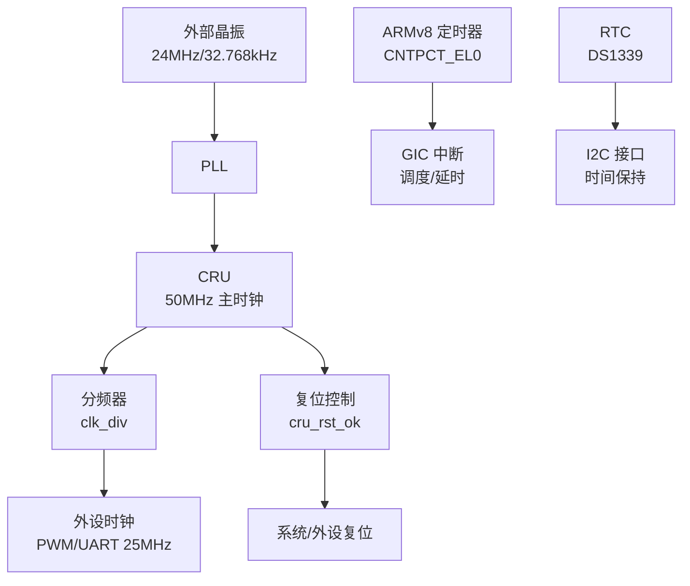
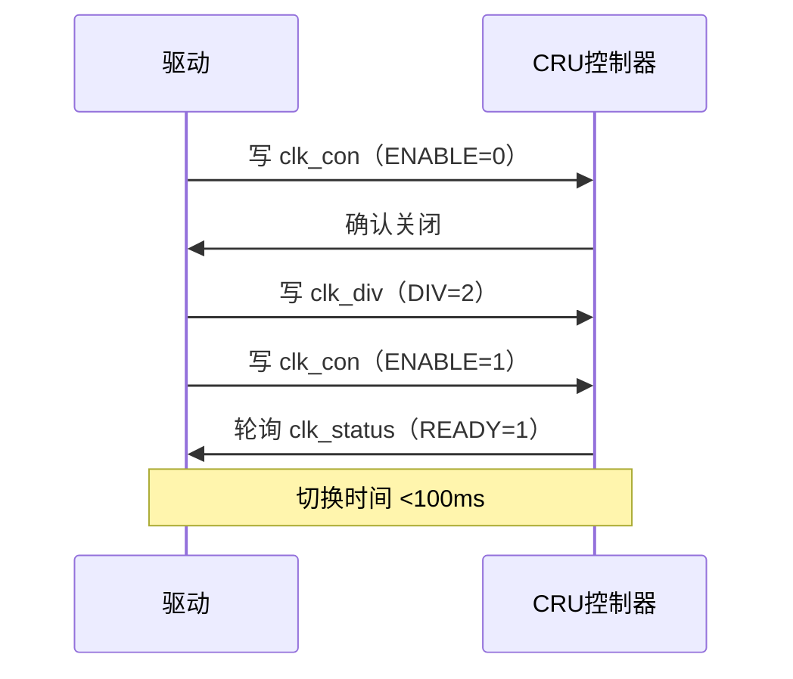

# 2.2 时钟设备驱动

## 时钟设备原理

嵌入式系统的时钟设备是协调处理器、内存和外设运行的核心，为系统提供统一的时间基准。飞腾派（Phytium Pi）的时钟设备包括时钟和复位单元（CRU）、ARMv8 通用定时器（Generic Timer）和可选的实时钟（RTC）。这些设备通过外部晶振（如 24MHz 或 32.768kHz）结合锁相环（PLL）生成高精度主时钟（如 50MHz），通过分频器调整为外设所需频率（如 PWM 的 25MHz）。CRU 作为时钟管理中心，通过寄存器（如 clk_con 和 clk_div）动态配置分频系数，控制外设时钟（如 UART、PWM），并集成复位功能，通过 cru_rst_ok 寄存器触发系统或外设复位，确保硬件初始化或异常恢复。复位信号需持续超过 10ms，时钟切换通常在 100ms 内稳定，满足实时性需求。ARMv8 通用定时器利用系统计数器（CNTPCT_EL0）提供纳秒级计时，通过比较值（CNTV_CVAL_EL0）和 GIC 中断支持内核调度和忙等待（如 Duration::from_millis），适用于高精度任务切换。RTC 依赖低频晶振（32.768kHz）运行，独立于主时钟，通过 I2C 接口与外部芯片（如 DS1339）通信，保持断电状态下的时间，适合时间同步和低功耗唤醒场景。这些模块通过寄存器操作和中断机制协同工作，确保系统时间管理和硬件协调。

**时钟设备功能示意图**



## 飞腾派时钟设备介绍

飞腾派开发板的时钟设备依托 E2000 处理器（ARMv8 架构，主频高达 1.8GHz），通过 CRU、ARMv8 通用定时器和外部 RTC 提供全面时间管理功能。CRU 是核心，位于基址 0x2800_0000（推测，需手册验证），通过 PLL 从外部晶振生成 50MHz 主时钟，分频后驱动外设（如 UART、PWM）。CRU 还管理复位功能，通过板上 SW4 按钮（靠近 J35 电源接口，低电平有效，持续 >10ms，3.3V 电平，电流 <1mA）或 40-pin 扩展头的 Pin 33（GPIO2_8，CRU_RST_OK，3.3V，需 4.7kΩ 上拉电阻）触发全局复位，重置 CPU 和外设状态。ARMv8 通用定时器内置于处理器，无专用物理接口，通过 GIC（基址 0xFF84_1000/0xFF84_2000）提供中断信号，驱动 ArceOS 的调度和延时（如 busy_wait），以纳秒级精度支持实时任务。RTC 通过 I2C1 接口（Pin 3/5，I2C1_SDA/SCL，3.3V，需 4.7kΩ 上拉电阻）连接外部芯片（如 DS1339），使用 32.768kHz 晶振保持时间，支持电池备份（SIM 卡座 J6，1.8V/3V）。物理接口需遵守约束：总线长度 <30cm 以防信号干扰，工作温度 0~50°C，使用 ESD 保护以避免静电损伤。飞腾派的时钟设备通过内部寄存器和扩展头引脚提供灵活配置，确保系统高效运行。

**飞腾派时钟设备接口表**

| 接口类型     | 物理接口          | 电平    | 描述与约束                             |
| ------------ | ----------------- | ------- | -------------------------------------- |
| CRU 复位按钮 | SW4（近 J35）     | 3.3V    | 低电平有效，>10ms，电流 <1mA，ESD 保护 |
| CRU 外部复位 | Pin 33（GPIO2_8） | 3.3V    | 下降沿触发，需 4.7kΩ 上拉，线长 <30cm  |
| RTC 接口     | Pin 3/5（I2C1）   | 3.3V    | 4.7kΩ 上拉，100kbps，线长 <30cm        |
| RTC 电池备份 | J6（mini-SIM）    | 1.8V/3V | 支持低功耗，ESD 保护                   |

**CRU 时钟分频时序图**



**说明：**CRU 配置分频（如 50MHz 至 25MHz），需轮询 READY 状态。RTC 通过 I2C 异步访问，保持独立时间。

## 飞腾派时钟设备驱动 API 调用表

以下为飞腾派（Phytium Pi）V3.x 版本的时钟设备驱动 API 调用表，基于在 `chenlongos/appd` 仓库 `phytium-pi` 分支中实现的 `modules/axhal/src/platform/aarch64_phytium_pi/clock.rs` 文件。该实现使用 Rust 和 `tock_registers` 宏，基于飞腾派软件编程手册 V1.0（提供 CRU 寄存器信息）和 `aarch64_phytium_pi.toml`（定义 MMIO 基址）。API 设计遵循 ArceOS 的 `axhal` 框架，适配 CRU 时钟控制器（基址 0x2800_0000），支持初始化、频率设置和查询。调用表包括函数描述、参数和返回值，适用于 ArceOS 或裸机环境。

### 时钟驱动 API 调用表

| **API 函数**         | **描述**                                                     | **参数**                                                     | **返回值**                                           |
| -------------------- | ------------------------------------------------------------ | ------------------------------------------------------------ | ---------------------------------------------------- |
| `FClockInit`         | 初始化 CRU 时钟控制器，设置基址和设备状态，为频率配置准备。  | `instance_p: &mut FClockCtrl`（时钟控制器实例）<br>`config_p: &FClockConfig`（基址 0x2800_0000 等） | `bool`: true（成功），false（参数错误或已初始化）    |
| `FClockDeInit`       | 去初始化 CRU 时钟控制器，清除状态，标记未就绪。              | `instance_p: &mut FClockCtrl`（时钟控制器实例）              | `bool`: true（成功）                                 |
| `FClockLookupConfig` | 根据设备 ID 查找 CRU 时钟配置，返回基址等信息。              | `instance_id: u32`（设备 ID）                                | `Option<FClockConfig>`: 配置结构体或 None（ID 无效） |
| `FClockSetFreq`      | 设置时钟频率，写入 clk_div 寄存器（分频系数），启用 clk_con（ENABLE=1）。 | `instance_p: &mut FClockCtrl`<br>`freq: u32`（目标频率，Hz） | `bool`: true（成功），false（超时或寄存器错误）      |
| `FClockGetFreq`      | 查询当前时钟频率，读取 clk_div 寄存器，计算 sys_clk / DIV。  | `instance_p: &mut FClockCtrl`（时钟控制器实例）              | `u32`: 当前频率（Hz）                                |

### 说明
- **调用顺序**：
  1. 调用 `FClockInit` 和 `FClockLookupConfig` 初始化 CRU 时钟控制器，设置基址（0x2800_0000）。
  2. 调用 `FClockSetFreq` 配置目标频率（如 25MHz）。
  3. 可选调用 `FClockGetFreq` 查询频率。
  4. 可选调用 `FClockDeInit` 清理状态。
- **硬件依赖**：
  - **基址**：CRU 时钟控制器 0x2800_0000。
  - **寄存器**：
    - `clk_con` (偏移 0x0)：bit 0=ENABLE（使能时钟），bit 1-3=SOURCE（时钟源选择）。
    - `clk_div` (偏移 0x4)：bit 0-7=DIV（分频系数）。
    - `clk_status` (偏移 0x8)：bit 0=READY（1=时钟准备好）

## 飞腾派时钟设备驱动的寄存器信息

### 基地址
飞腾派时钟设备驱动主要基于 CRU 时钟控制器，基址为 0x2800_0000。该基址与复位模块重叠，反映 CRU 的时钟和复位双重功能。

| **模块** | **基地址**  | **描述**                                 |
| -------- | ----------- | ---------------------------------------- |
| CRU      | 0x2800_0000 | 时钟和复位单元，管理系统时钟分频和复位。 |

### 寄存器表
以下为时钟驱动涉及的寄存器，定义在 `clock.rs` 中，用于配置和监控时钟功能。

| **寄存器名称** | **偏移地址** | **描述**                                 |
| -------------- | ------------ | ---------------------------------------- |
| `clk_con`      | 0x0          | 控制寄存器，配置时钟使能和源选择。       |
| `clk_div`      | 0x4          | 分频寄存器，设置分频系数以调整输出频率。 |
| `clk_status`   | 0x8          | 状态寄存器，检查时钟是否准备好。         |

### 寄存器位域设置
以下详细描述每个寄存器的位域，包括用途、有效值和默认状态。

#### `clk_con` (偏移 0x0, 读写)
- **ENABLE** (bit 0, 1 bit)
  - **用途**：控制时钟使能，1=开启时钟，0=关闭时钟。
  - **有效值**：0（关闭），1（开启）。
  - **默认值**：0
  - **描述**：启用或禁用 CRU 时钟输出，用于外设同步（如 PWM/Tacho）。
- **SOURCE** (bit 1-3, 3 bits)
  - **用途**：选择时钟源（例如 PLL 或外部晶振）。
  - **有效值**：0~7（推测，具体映射需手册验证）。
  - **默认值**：0
  - **描述**：支持多时钟源切换，当前未使用，保留扩展。

#### `clk_div` (偏移 0x4, 读写)
- **DIV** (bit 0-7, 8 bits)
  - **用途**：设置分频系数，输出频率 = 系统时钟（50MHz）/ DIV。
  - **有效值**：1~255（0 无效，需手册确认）。
  - **默认值**：0
  - **描述**：调整外设时钟频率，例如 DIV=2 时，50MHz 分频为 25MHz。

#### `clk_status` (偏移 0x8, 只读)
- **READY** (bit 0, 1 bit)
  - **用途**：指示时钟状态，1=时钟稳定，0=未准备好。
  - **有效值**：0（未准备），1（准备好）。
  - **默认值**：0
  - **描述**：轮询确保时钟切换完成（时序 <100ms）。

## 飞腾派时钟设备驱动实现讲解

### 驱动架构

驱动基于 ArceOS 的硬件抽象层（axhal），通过 `tock_registers` 宏定义 CRU 时钟寄存器（clk_con、clk_div、clk_status），使用 `SpinNoIrq` 锁确保多核安全访问。代码结构类似 `cru.rs` 和 `pinctrl.rs`，通过 `NonNull` 指针操作寄存器，依赖 `phys_to_virt` 转换虚拟地址。驱动实现无中断支持，采用轮询模式配置频率，适合嵌入式场景（如 PWM/Tacho 时钟）。设备树（phytium_pi.dts）可定义时钟节点，集成到 `mod.rs` 的 `platform_init` 中。

硬件关联

- **基址**：CRU 时钟控制器位于 0x2800_0000。
- **时钟源**：50MHz 主时钟（硬编码，典型 APB 总线频率），通过分频调整输出（如 25MHz）。
- **寄存器**：clk_con (0x0) 控制使能/源，clk_div (0x4) 设置分频系数，clk_status (0x8) 检查状态。
- **时序**：频率切换需 <100ms 稳定，轮询 READY bit 确保完成。

**寄存器定义部分**

```rust
register_structs! {
    pub ClockRegs {
        (0x0 => clk_con: ReadWrite<u32, CLK_CON::Register>),
        (0x4 => clk_div: ReadWrite<u32, CLK_DIV::Register>),
        (0x8 => clk_status: ReadOnly<u32, CLK_STATUS::Register>),
        (0x0c => @END),
    }
}

register_bitfields![u32,
    CLK_CON [
        ENABLE OFFSET(0) NUMBITS(1) [], // 1=使能时钟
        SOURCE OFFSET(1) NUMBITS(3) [], // 时钟源选择
    ],
    CLK_DIV [
        DIV OFFSET(0) NUMBITS(8) [], // 分频系数
    ],
    CLK_STATUS [
        READY OFFSET(0) NUMBITS(1) [], // 1=时钟准备好
    ],
];
```

**讲解：**使用 tock_registers 宏定义 CRU 时钟寄存器布局，基址 0x2800_0000。clk_con (偏移 0x0) 控制时钟使能（bit 0=ENABLE）和源选择（bit 1-3=SOURCE），clk_div (偏移 0x4) 设置分频系数（bit 0-7=DIV，1~255），clk_status (偏移 0x8) 检查时钟状态（bit 0=READY，1 表示稳定）。宏生成 ReadWrite/ReadOnly 接口，确保类型安全访问，避免手动位操作。SOURCE bit 未使用，保留扩展（如 PLL 切换）。

**结构体和全局定义部分**

```rust
pub struct ClockCtrl {
    regs: NonNull<ClockRegs>,
}

unsafe impl Send for ClockCtrl {}

impl ClockCtrl {
    pub const fn new(base: *mut u8) -> Self {
        Self {
            regs: NonNull::new(base).unwrap().cast(),
        }
    }
    const fn regs(&self) -> &ClockRegs {
        unsafe { self.regs.as_ref() }
    }
    const fn regs_mut(&mut self) -> &mut ClockRegs {
        unsafe { self.regs.as_mut() }
    }
}

#[derive(Debug, Clone, Copy, Default)]
pub struct FClockConfig {
    pub instance_id: u32,
    pub base_address: usize,
}

pub struct FClockCtrl {
    pub config: FClockConfig,
    pub is_ready: u32,
}

static CLOCK_CONFIG: [FClockConfig; 1] = [FClockConfig {
    instance_id: 0,
    base_address: 0x2800_0000usize,
}];

pub static CLOCK: SpinNoIrq<FClockCtrl> = SpinNoIrq::new(FClockCtrl {
    config: FClockConfig {
        instance_id: 0,
        base_address: 0,
    },
    is_ready: 0,
});
```

**讲解**：ClockCtrl 封装寄存器指针，使用 NonNull 确保非空，regs/regs_mut 方法通过 unsafe 提供访问（const fn 允许常量上下文）。unsafe impl Send 支持跨线程传递。FClockConfig 存储实例 ID 和基址（0x2800_0000），FClockCtrl 包含配置和状态（is_ready=0x11111111 表示初始化）。全局静态 CLOCK_CONFIG 定义单实例配置，CLOCK 使用 SpinNoIrq 锁保护多核访问，类似 cru.rs 和 pinctrl.rs 的设计。

**API 函数部分**

```rust
pub fn FClockInit(instance_p: &mut FClockCtrl, config_p: &FClockConfig) -> bool {
    assert!(Some(*instance_p).is_some() && Some(*config_p).is_some());
    let mut ret = true;
    if instance_p.is_ready == 0x11111111u32 {
        info!("Clock already initialized.");
        return false;
    }
    FClockDeInit(instance_p);
    instance_p.config = *config_p;
    instance_p.is_ready = 0x11111111u32;
    ret
}

pub fn FClockDeInit(instance_p: &mut FClockCtrl) -> bool {
    if instance_p.is_ready == 0 {
        return true;
    }
    instance_p.is_ready = 0;
    unsafe {
        core::ptr::write_bytes(instance_p as *mut FClockCtrl, 0, core::mem::size_of::<FClockCtrl>());
    }
    true
}

pub fn FClockLookupConfig(instance_id: u32) -> Option<FClockConfig> {
    if instance_id >= 1 {
        return None;
    }
    Some(CLOCK_CONFIG[instance_id as usize])
}

pub fn FClockSetFreq(instance_p: &mut FClockCtrl, freq: u32) -> bool {
    let base = instance_p.config.base_address;
    let clock = ClockCtrl::new(phys_to_virt(PhysAddr::from(base)).as_mut_ptr());
    let sys_clk = 50000000; // 50MHz 系统时钟，假设
    let div = sys_clk / freq;
    clock.regs().clk_div.modify(CLK_DIV::DIV.val(div));
    clock.regs().clk_con.modify(CLK_CON::ENABLE::SET);
    let mut timeout = 0;
    while clock.regs().clk_status.read(CLK_STATUS::READY) != 1 && timeout < 500 {
        timeout += 1;
        crate::time::busy_wait(core::time::Duration::from_millis(1));
    }
    timeout < 500
}

pub fn FClockGetFreq(instance_p: &mut FClockCtrl) -> u32 {
    let base = instance_p.config.base_address;
    let clock = ClockCtrl::new(phys_to_virt(PhysAddr::from(base)).as_mut_ptr());
    let sys_clk = 50000000; // 50MHz 系统时钟
    let div = clock.regs().clk_div.read(CLK_DIV::DIV);
    sys_clk / div
}
```

**讲解**：

- **FClockInit**：检查指针和状态（is_ready=0x11111111 表示已初始化），调用 FClockDeInit 清理，设置 config（基址 0x2800_0000）和 is_ready。效果是初始化 CRU 时钟控制器，准备频率配置。
- **FClockDeInit**：清除 is_ready 并零初始化结构体（unsafe write_bytes），释放状态，适合重置或错误恢复。
- **FClockLookupConfig**：从静态表 CLOCK_CONFIG 返回配置（ID=0，基址 0x2800_0000），支持多实例扩展（当前单实例）。
- **FClockSetFreq**：创建 ClockCtrl 实例（使用 phys_to_virt 转换虚拟地址），计算分频系数（div = sys_clk / freq，sys_clk=50MHz 硬编码），写入 clk_div 的 DIV bit（bit 0-7）。设置 clk_con 的 ENABLE bit=1（bit 0）启用时钟，轮询 clk_status 的 READY bit（bit 0，超时 500ms）确保稳定。返回 true（成功）或 false（超时）。效果是调整外设时钟（如 25MHz）。
- **FClockGetFreq**：类似创建实例，读取 clk_div 的 DIV bit，计算当前频率（sys_clk / div），返回 Hz 值。效果是查询实时频率。

**硬件关联**：CRU 时钟控制器（基址 0x2800_0000），50MHz 主时钟分频（如 DIV=2 得到 25MHz），支持 PWM/Tacho 等外设。

