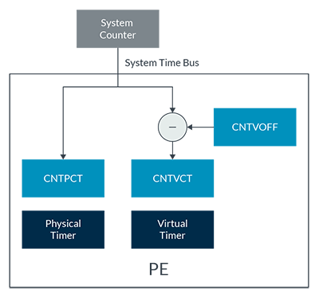
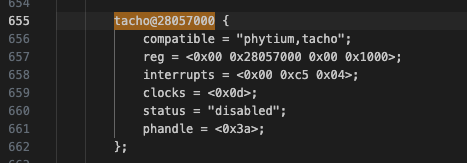
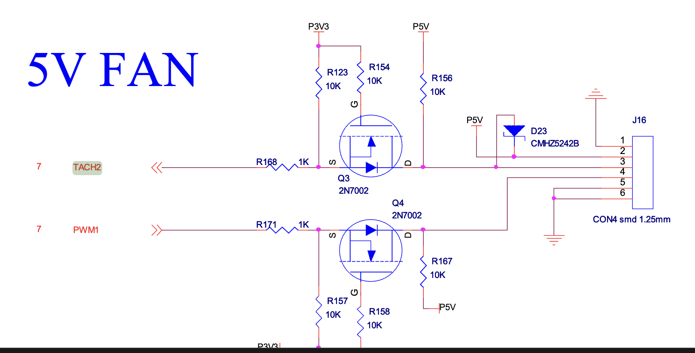

# 2.2 Timer 驱动

## 1. 硬件工作原理
### 1.1 noc模块概述

- **功能概述**
*noc* 是 *network on chip* 的缩写。简单的来说，它是arm公司设计的一种总线。
总线按照根据不同拓扑来分，分为:
- NIC/CCI系列，交叉矩阵
- CCN系列，环状总线的(Ring)
- NoC系列，网状总线(Mesh)

noc的示意图可以如下:


每个节点都被视为是一种小型路由，他们之间通过发送异步的包进行通信，就好像是一个局域网。中间的noc总线，则可以视为是接入交换机。
这样，就不必维持路由和路由之间很大数量的连线，从而提高频率，也能支持更多的设备

- **应用场景**
  - NOC设计用于解决片上系统（SoC）内部不同组件之间的通信需求。
  - 提供片上处理器核心、存储器、外设、专用加速单元（如GPU、AI加速器等）之间的高效数据传输通道。
  - 使用网络路由技术（类似于计算机网络中使用的技术）在芯片内部形成一个网状或其他拓扑结构，以提高带宽和降低延迟。
  - 多核处理器和复杂SoC中，以有效管理和调度大量的数据流。
  - 高性能计算、移动设备、嵌入式系统、数据中心加速卡等。
  - 取代传统总线架构，解决总线传输瓶颈，提高可扩展性和并发性能。


### 1.2 generic timer介绍

- **功能描述**

generic timer arm公司提出的一种硬件上的设计框架。在早期单核时代，每个SOC vendor厂商购买arm core的IP，然后自己设计soc上的timers。这就导致了对于每一种soc，驱动代码都会不同。此外，linux对硬件timer也有一定的要求，有些硬件厂商设计的timer支持的不是很好。在进入多核时代之后，核与核之间有同步的需求，为单核设计timer的方案会变的更加复杂。由此，arm公司提供了timer的硬件设计，集成在了自己的多核结构中。也就是[generic_timer](https://developer.arm.com/documentation/102379/0104/What-is-the-Generic-Timer-).

- **核心特性**

对于软件开发者来说，总体框架如下：

非虚拟化：


虚拟化：



每一个核有单独的timer，以及一个全局的system counter，它们通过system time bus相连。此外，对于虚拟化场景，还额外增加了CNTVOFF这个寄存器，主要作用是对于让虚拟机感受不到非调度时间的流逝。对于这个架构保证了对于所有的核来说，timer的clock都是一致的。产生的中断位于gic的ppi区，产生的中断会分发到对应的核上。


### 1.3 飞腾派外设timer介绍

- **核心特性**

沸腾派共有38个外设timer，其中0-15支持基础的 *timer*, *tacho_meter* 以及单纯的 *capture* 功能， 16-37只有timer功能。由于已经有 *generic timer* 来为每个cpu提供可靠的timer中断，通常来说，飞腾派的这些外设timer会主要被用于提供tachometer功能。它们的时钟频率都是50MHz。

在飞腾派的设备树中可以找到对这些设备的定义。关键字：*tacho*。


- **核心特性**
  - timer功能

  与generic timer类似，计数器当达到设定值之后，产生一个中断给cpu核。不过需要注意的是，generic timer产生的中断是每个cpu独立的，而外设timer产生的中断会通过gic，最终通知到某一个cpu上，具体通知策略得看gic的配置。

  常见的配置方式如下(具体参照飞腾派软件开发手册的5.25.2.6章节)：
    - 设置对应timer外设功能为 timer
    - 使能相关中断
    - 配置定时计数值，超过这个值并且配置了中断，系统将能收到中断
    - 使能计数器，开始计数
    - 支持 free_run 等配置

  肯定的是，外设timer作为多核场景的调度源是不合适的，这种timer应当被用于对外设的计数等场景。

  - tachometer 功能

  翻译过来就是"转速表"或"转速计，通过与电机的协作来完成对电机的转速计数：每当电机转动一圈，则电机通过tacho线触发一次信号（通常通过光电编码器或者霍尔传感器）。
  tachometer在一次周期里对这个信号的数量进行技术，就能够获取外部某个设备的转速，比如说风扇。

  常常与pwm结合，通过pid等控制算法来控制电机转速。

  基础工作原理如下(具体参照飞腾派软件开发手册的5.25.2.7章节)：
   - 设置对应timer外设功能为 tachometer，并配置外部触发方式(边沿 or 高/低电平)
   - 配置定时计数器值，这个值*50MHz 就是一次计数周期
   - 配置高转数值和低转速值，转速过高或者过低会尝试触发一次中断
   - 使能相关中断，比如过快中断，或者过慢中断
   - 中断触发时软件进行可以读取转速值，并相应的调整pwm占空比来调整转速。

  - capture 功能

  个人认为是 tachometer 的简化版本：对一段时间内发生的脉冲数量进行计数，当计数达到阈值之后，产生一次相应的中断。

  基础工作原理如下(具体参照飞腾派软件开发手册的5.25.2.8章节)：
   - 设置对应timer外设功能为 capture, 并配置外部触发方式(边沿 or 高/低电平)
   - 配置cnt值，7bits
   - 使能相关中断
   - 当秒冲数量达到cnt值之后，会触发一次中断，然后重新计数。


## 2. 接口表
### 2.1 arm generic timer接口表
文档和代码可以在这儿看到 <https://docs.rs/aarch64-cpu/10.0.0/aarch64_cpu/>

| API函数 | 描述   | 参数           |  返回值    |
| --- | --- |  --- | --- |
| CNTFRQ_EL0.get() | 获取el0的级别的频率 | none | generic timer的频率 |
| CNTP_TVAL_EL0.set() | 设置el0级别的比较值 | interval:u64| none |

### 2.2 飞腾派接口表
代码在这儿: <https://github.com/chenlongos/appd/commit/5502dcc3de5b5ffbe266718f001ae6213bd7b03b>
| API函数 | 描述   | 参数           |  返回值    |
| --- | --- |  --- | --- |
| Tacho::new() | 创建一个新的tacho控制器 | va： nonnull<u8> | Tacho 控制器实例 |
| Tacho::init() | 将外设timer初始化为 tacho-meter 模式,计数周期为1s | none | none |
| Tacho::get_result() | 获取一个可能的转速结果 | none | option<u32> |


## 3. 主要寄存器介绍

### 3.1 arm generic timer

| 寄存器名称 | 偏移 |寄存器定义 |
| --- | --- |  --- |
| CNTFRQ_EL0 | none | EL1级别物理system counter时钟的频率，对于EL1及以上，这个寄存器是只读的。 |
| CNTP_CTL_EL0 | none | EL1级别物理timer的控制器，用于开启/关闭这个核的timer中断。 |
| CNTP_TVAL_EL0 | none | EL1级别物理timer的时钟值，当system counter值 >= 这个值，会产生一个可能的中断。|
| CNTPCT_EL0 | none | EL1级别物理timer的比较值，当这个值被写时，会将 system_count + CNTPCT_EL0 写入 CNTP_TVAL_EL0 |

### 3.2 飞腾派 外设timer
| 寄存器名称 | 偏移 |寄存器定义 |
| --- | --- |  --- |
| ctrl | 0x00 | 控制寄存器，可以配置tacho模式，计数模式等 |
| tach_result | 0x04 | tach 结果寄存器，如果高1位为1，说明结果有效|
| tacho_cycle | 0x1c | 一次计数的cnt，比如说设置为50M，那么就是 50M * clock_hz 为一次计数周期 |

## 4 具体实现讲解

### 多核时钟驱动实验步骤
- timer 初始化代码
  - main core获取 system counter的 frequency
  ```rust
    /// Early stage initialization: stores the timer frequency.
    pub(crate) fn init_early() {
        let freq = CNTFRQ_EL0.get();
        unsafe {
            // crate::time::NANOS_PER_SEC = 1_000_000_000;
            CNTPCT_TO_NANOS_RATIO = Ratio::new(crate::time::NANOS_PER_SEC as u32, freq as u32);
            NANOS_TO_CNTPCT_RATIO = CNTPCT_TO_NANOS_RATIO.inverse();
        }
    }
  ```
- 每个核都开启timer中断，注册timer回调
  ```rust
    /// Set a one-shot timer.
    ///
    /// A timer interrupt will be triggered at the specified monotonic time deadline (in nanoseconds).
    #[cfg(feature = "irq")]
    pub fn set_oneshot_timer(deadline_ns: u64) {
        let cnptct = CNTPCT_EL0.get();
        let cnptct_deadline = nanos_to_ticks(deadline_ns);
        if cnptct < cnptct_deadline {
            let interval = cnptct_deadline - cnptct;
            debug_assert!(interval <= u32::MAX as u64);
            CNTP_TVAL_EL0.set(interval);
        } else {
            CNTP_TVAL_EL0.set(0);
        }
    }
    #[cfg(feature = "irq")]
    fn init_interrupt() {
        use axhal::time::TIMER_IRQ_NUM;

        // Setup timer interrupt handler
        const PERIODIC_INTERVAL_NANOS: u64 =
            axhal::time::NANOS_PER_SEC / axconfig::TICKS_PER_SEC as u64;

        #[percpu::def_percpu]
        static NEXT_DEADLINE: u64 = 0;

        fn update_timer() {
            let now_ns = axhal::time::monotonic_time_nanos();
            // Safety: we have disabled preemption in IRQ handler.
            let mut deadline = unsafe { NEXT_DEADLINE.read_current_raw() };
            if now_ns >= deadline {
                deadline = now_ns + PERIODIC_INTERVAL_NANOS;
            }
            unsafe { NEXT_DEADLINE.write_current_raw(deadline + PERIODIC_INTERVAL_NANOS) };
            axhal::time::set_oneshot_timer(deadline);
        }

        axhal::irq::register_handler(TIMER_IRQ_NUM, || {
            update_timer();
            #[cfg(feature = "multitask")]
            axtask::on_timer_tick();
        });

        # // Enable IRQs before starting app
        # axhal::asm::enable_irqs();
    }

    pub(crate) fn init_percpu() {
        #[cfg(feature = "irq")]
        {
            CNTP_CTL_EL0.write(CNTP_CTL_EL0::ENABLE::SET);
            // 设置为0,马上就会触发一次中断。
            CNTP_TVAL_EL0.set(0);
            // gic 中断时能
            crate::platform::irq::set_enable(crate::platform::irq::TIMER_IRQ_NUM, true);
        }
    }
  ```
- 通过这个命令`make A=examples/helloworld ARCH=aarch64 PLATFORM=aarch64-qemu-virt FEATURES=irq LOG=trace ACCEL=n SMP=4 run`在qemu上运行得到下列结果
  <details>
    <summary>运行结果</summary>
        qemu-system-aarch64 -m 128M -smp 4 -cpu cortex-a72 -machine virt -kernel examples/helloworld/helloworld_aarch64-qemu-virt.bin -nographic

        d8888                            .d88888b.   .d8888b.
        d88888                           d88P" "Y88b d88P  Y88b
        d88P888                           888     888 Y88b.
        d88P 888 888d888  .d8888b  .d88b.  888     888  "Y888b.
        d88P  888 888P"   d88P"    d8P  Y8b 888     888     "Y88b.
        d88P   888 888     888      88888888 888     888       "888
        d8888888888 888     Y88b.    Y8b.     Y88b. .d88P Y88b  d88P
        d88P     888 888      "Y8888P  "Y8888   "Y88888P"   "Y8888P"

        arch = aarch64
        platform = aarch64-qemu-virt
        target = aarch64-unknown-none-softfloat
        build_mode = release
        log_level = trace
        smp = 4

        [  0.003638 axruntime:130] Logging is enabled.
        [  0.004146 axruntime:131] Primary CPU 0 started, dtb = 0x44000000.
        [  0.004338 axruntime:133] Found physcial memory regions:
        [  0.004530 axruntime:135]   [PA:0x40200000, PA:0x40207000) .text (READ | EXECUTE | RESERVED)
        [  0.004790 axruntime:135]   [PA:0x40207000, PA:0x4020a000) .rodata (READ | RESERVED)
        [  0.004938 axruntime:135]   [PA:0x4020a000, PA:0x4020e000) .data .tdata .tbss .percpu (READ | WRITE | RESERVED)
        [  0.005096 axruntime:135]   [PA:0x4020e000, PA:0x4030e000) boot stack (READ | WRITE | RESERVED)
        [  0.005232 axruntime:135]   [PA:0x4030e000, PA:0x40311000) .bss (READ | WRITE | RESERVED)
        [  0.005372 axruntime:135]   [PA:0x40311000, PA:0x48000000) free memory (READ | WRITE | FREE)
        [  0.005530 axruntime:135]   [PA:0x9000000, PA:0x9001000) mmio (READ | WRITE | DEVICE | RESERVED)
        [  0.005672 axruntime:135]   [PA:0x9100000, PA:0x9101000) mmio (READ | WRITE | DEVICE | RESERVED)
        [  0.005808 axruntime:135]   [PA:0x8000000, PA:0x8020000) mmio (READ | WRITE | DEVICE | RESERVED)
        [  0.005944 axruntime:135]   [PA:0xa000000, PA:0xa004000) mmio (READ | WRITE | DEVICE | RESERVED)
        [  0.006080 axruntime:135]   [PA:0x10000000, PA:0x3eff0000) mmio (READ | WRITE | DEVICE | RESERVED)
        [  0.006216 axruntime:135]   [PA:0x4010000000, PA:0x4020000000) mmio (READ | WRITE | DEVICE | RESERVED)
        [  0.006386 axruntime:150] Initialize platform devices...
        [  0.006506 axhal::platform::aarch64_common::gic:51] Initialize GICv2...
        [  0.007098 axhal::platform::aarch64_common::gic:27] GICD set enable: 30 true
        [  0.007574 axhal::platform::aarch64_common::gic:27] GICD set enable: 33 true
        [  0.007854 axruntime::mp:20] starting CPU 1...
        [  0.007976 axhal::platform::aarch64_common::psci:115] Starting CPU 1 ON ...
        [  0.008234 axruntime::mp:37] Secondary CPU 1 started.
        [  0.008236 axruntime::mp:20] starting CPU 2...
        [  0.008672 axhal::platform::aarch64_common::gic:27] GICD set enable: 30 true
        [  0.008768 axhal::platform::aarch64_common::psci:115] Starting CPU 2 ON ...
        [  0.008974 axruntime::mp:47] Secondary CPU 1 init OK.
        [  0.009110 axruntime::mp:37] Secondary CPU 2 started.
        [  0.009300 axruntime::mp:20] starting CPU 3...
        [  0.009550 axhal::platform::aarch64_common::gic:27] GICD set enable: 30 true
        [  0.009712 axhal::platform::aarch64_common::psci:115] Starting CPU 3 ON ...
        [  0.009934 axruntime::mp:47] Secondary CPU 2 init OK.
        [  0.010186 axruntime::mp:37] Secondary CPU 3 started.
        [  0.010218 axruntime:176] Initialize interrupt handlers...
        [  0.010548 axhal::platform::aarch64_common::gic:27] GICD set enable: 30 true
        [  0.010790 axruntime::mp:47] Secondary CPU 3 init OK.
        [  0.010818 axhal::platform::aarch64_common::gic:36] register handler irq 30
        [  0.011058 axhal::platform::aarch64_common::gic:27] GICD set enable: 30 true
        [  0.011578 axhal::irq:18] IRQ 30
        [  0.012612 axruntime:188] Primary CPU 0 init OK.
        Hello, world!
        [  0.012760 3 axhal::irq:18] IRQ 30
        [  0.012750 1 axhal::irq:18] IRQ 30
        [  0.012944 2 axhal::irq:18] IRQ 30
        [  0.024292 0 axhal::irq:18] IRQ 30
        [  0.024338 2 axhal::irq:18] IRQ 30
        [  0.024350 3 axhal::irq:18] IRQ 30
        [  0.024344 1 axhal::irq:18] IRQ 30
        [  0.034532 2 axhal::irq:18] IRQ 30
        [  0.034566 1 axhal::irq:18] IRQ 30
        [  0.034568 0 axhal::irq:18] IRQ 30
        [  0.034564 3 axhal::irq:18] IRQ 30
        [  0.043722 2 axhal::irq:18] IRQ 30
        [  0.043730 0 axhal::irq:18] IRQ 30
        [  0.043724 1 axhal::irq:18] IRQ 30
        [  0.043730 3 axhal::irq:18] IRQ 30
        [  0.053962 2 axhal::irq:18] IRQ 30
        [  0.053986 0 axhal::irq:18] IRQ 30
  </details>
- 可以看出，4个cpu的中断每10ms被触发一次，符合预期。

###  实验总结
验证了arm多核架构下的timer。

### 飞腾派 tacho 实验
本次选择的为tacho2，通过原理图可以得出。


- 先通过 new 方法将 tach2 的基地址传入，创建一个 tach2 控制器
```rust

let mut tacho = axhal::misc::Tacho::new(
    NonNull::new(axhal::misc::phys_to_virt(TACHO2).as_usize() as _)
        .expect("new tacho va failed"),
);
```
- 初始化 tach2 控制器，将其配置为 tacho 模式，然后使能counter和tacho
```rust
tacho.init();

/// clock = 50M hz,
pub fn init(&mut self) {
    self.regs_mut().ctrl.write(CTRL::SWR::SET);
    while self.regs().ctrl.any_matching_bits_set(CTRL::SWR::SET) {}
    self.regs_mut().ctrl.modify(
        CTRL::MODE::TACHO
            + CTRL::COUNTER_SERIES::SER32
            + CTRL::TACH_MODE::DOWN_UP
            + CTRL::COUNTER_EN::SET
            + CTRL::TACHO_EN::SET,
    );
    // clock is 50M hz
    let d = 0x2faf07f; // copy from linux
    info!("set tacho cyle = {d}");
    self.regs_mut().tacho_cycle.set(d);
}
```

- 循环获取 tach2 结果
```rust
loop {
    if let Some(res) = tacho.get_result() {
        meter = res;
        println!("res = {res}");
        break;
    }
    axstd::thread::sleep(time::Duration::from_millis(50));
}

pub fn get_result(&self) -> Option<u32> {
    let res = self.regs().tach_result.get();
    info!("res = {res}");
    if res & TACH_RESULT::VALID::SET.value != 0 {
        Some(res & 0x7fff_ffff)
    } else {
        None
    }
}

```

- 日志如下
```shell
... # 前面部分略过
[ 14.219282 0 axhal::platform::aarch64_phytium_pi::tacho:89] set tacho cyle = 49999999
[ 14.228311 0 axhal::platform::aarch64_phytium_pi::tacho:94] res = 0
[ 14.285774 0 axhal::platform::aarch64_phytium_pi::tacho:94] res = 0
[ 14.340367 0 axhal::platform::aarch64_phytium_pi::tacho:94] res = 0
[ 14.394959 0 axhal::platform::aarch64_phytium_pi::tacho:94] res = 0
[ 14.449552 0 axhal::platform::aarch64_phytium_pi::tacho:94] res = 0
[ 14.504145 0 axhal::platform::aarch64_phytium_pi::tacho:94] res = 0
[ 14.558738 0 axhal::platform::aarch64_phytium_pi::tacho:94] res = 0
[ 14.613331 0 axhal::platform::aarch64_phytium_pi::tacho:94] res = 0
[ 14.667924 0 axhal::platform::aarch64_phytium_pi::tacho:94] res = 0
[ 14.722517 0 axhal::platform::aarch64_phytium_pi::tacho:94] res = 0
[ 14.777110 0 axhal::platform::aarch64_phytium_pi::tacho:94] res = 0
[ 14.831702 0 axhal::platform::aarch64_phytium_pi::tacho:94] res = 0
[ 14.886295 0 axhal::platform::aarch64_phytium_pi::tacho:94] res = 0
[ 14.940888 0 axhal::platform::aarch64_phytium_pi::tacho:94] res = 0
[ 14.995481 0 axhal::platform::aarch64_phytium_pi::tacho:94] res = 0
[ 15.050074 0 axhal::platform::aarch64_phytium_pi::tacho:94] res = 0
[ 15.104667 0 axhal::platform::aarch64_phytium_pi::tacho:94] res = 0
[ 15.159260 0 axhal::platform::aarch64_phytium_pi::tacho:94] res = 0
[ 15.213852 0 axhal::platform::aarch64_phytium_pi::tacho:94] res = 0
[ 15.268445 0 axhal::platform::aarch64_phytium_pi::tacho:94] res = 2147483648
res = 0
loop current duty 1, meter = 0
```

## 5. 参考资料
[arm_generic_timer](https://developer.arm.com/documentation/102379/0104/What-is-the-Generic-Timer-)
[generic_timer_in_linux](https://cloud.tencent.com/developer/article/1518249)