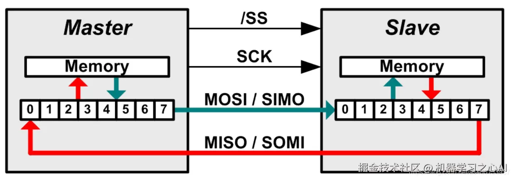
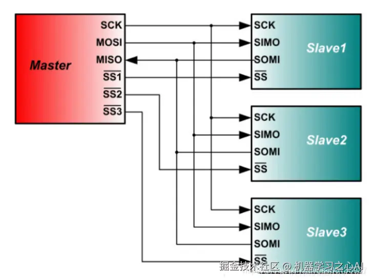
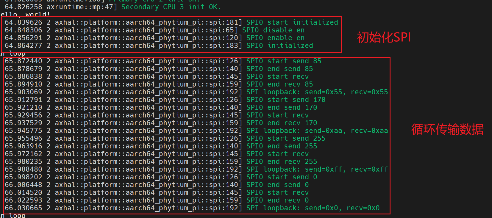

# 3.3 SPI驱动开发

## *SPI* 介绍
### 1.1 模块概述

**SPI（Serial Peripheral Interface）串行外围设备接口**是一种单主多从模式、**高速**、**全双工**同步串行总线，通常用在一些 flash、LCD 屏幕等设备的通信上。SPI总线相较于UART和IIC有以下两个显著的区别。

---

**1. 传输方式：数据交换**  
SPI 工作在主从模式下，但在每个时钟周期（Clock）内，主从设备都会**同时发送和接收 1 bit 数据**，实现真正的**全双工数据交换**。无论是主设备还是从设备，每个时钟周期都会有数据交换。  
主机进行写操作时，只需忽略接收到的字节；主机要读取从机的一个字节时，必须发送一个空字节来引发从机的传输。

<div align="center">
  
</div>

---

**2. 传输规范：无速率限制无格式要求**  
SPI 没有严格的速度限制，一般实现通常能达到甚至超过 **100Mbps**，适合高速数据传输场景。  
SPI 没有指定的流控制，没有应答机制确认是否接收到数据。不像其他协议会有协议头、设备地址以及各种指令。只要四根信号线连接正确，SPI模式相同，将CS/SS信号线拉低，即可以直接通信。一次一个字节的传输，读写数据同时操作。  
所以 SPI 设备更适合一些适用流数据的设备，比如 LCD 屏幕、AD 转换器等。

---
### 1.2 硬件接口介绍
- **SPI连接图**
**1. 四线制：SPI通信需要四根线：**
- **MISO**：主设备输入/从设备输出引脚。该引脚在从模式下发送数据，在主模式下接收数据。
- **MOSI**：主设备输出/从设备输入引脚。该引脚在主模式下发送数据，在从模式下接收数据。
- **SCK**：串行时钟信号，由主设备产生。
- **CS/SS**：从设备片选信号，由主设备控制。它的功能是用来作为“片选引脚”，也就是选择指定的从设备，让主设备可以单独地与特定从设备通讯，避免数据线上的冲突。

<div align="center">
  
</div>
<div align="center">
  
</div>

常见的连接方法有上面两种，还有一种额外电路所能实现的片选方案。众所周知三个引脚其实是存在8种状态，所以实际上可以利用译码器实现三个CS/SS控制8个SPI设备。

<div align="center">
  
</div>

### 1.3 时序图
SPI 有四种模式简单理解就是上升沿下降沿采样和空闲时高电平与低电平，两两组合而出现的四种模式

- 模式0：CPOL= 0，CPHA=0。SCK串行时钟线空闲是为低电平，数据在SCK时钟的上升沿被采样
- 模式1：CPOL= 0，CPHA=1。SCK串行时钟线空闲是为低电平，数据在SCK时钟的下降沿被采样
- 模式2：CPOL= 1，CPHA=0。SCK串行时钟线空闲是为高电平，数据在SCK时钟的下降沿被采样
- 模式3：CPOL= 1，CPHA=1。SCK串行时钟线空闲是为高电平，数据在SCK时钟的上升沿被采样

以模式0为例子，下图为模式0下的SPI时序图
<div align="center">
  
</div>

## 2. 接口表

- **接口表**

| API函数 | 描述         | 参数           | 返回值         |
| --- | --- |  --- | --- |
| PhytiumSPI::new | 新的飞腾派SPI实例 |  base:uart控制器基地址 | SPI控制器 |
| PhytiumSPI::init | 创建非irq模式的uart控制器 | self, baude_rate: spi传输频率，test_mode: 1打开回路测试 0 正常模式 | none |
| PhytiumSPI::recv| 轮询的方式读取一个字节 | self | u8，一个读取的字节 |
| PhytiumSPI::send | 轮询的方式输出一个字节 | self, data:输出的字节 | none |

- **调用顺序**
首先进行 new -> init, 之后可以按照需求进行读取或者写入字节。
- **硬件依赖**：
  - SPI寄存器基地址：0x2803A000


## 3. 寄存器结构

我们主要关注下面几个SPI寄存器，这些寄存器的定义可以在[飞腾派软件开发手册](#参考资料)里找到。

- **SPICTRL0**：控制寄存器0，配置数据位宽、帧格式、时钟极性/相位、主从模式、测试模式等。
- **SPICTRL1**：控制寄存器1，主要用于配置连续接收的数据量等。
- **SPIEN**：使能寄存器，控制SPI控制器的开启和关闭。
- **SPIMWCR**：Microwire控制寄存器，配置Microwire模式相关参数。
- **SPISER**：从机选择寄存器，选择与主机通信的从设备。
- **SPIBAUDR**：波特率寄存器，设置SPI时钟分频系数，决定通信速率。
- **SPITXFTLR**：发送FIFO阈值寄存器，设置发送FIFO的阈值。
- **SPIRXFTLR**：接收FIFO阈值寄存器，设置接收FIFO的阈值。
- **SPITXFLR**：发送FIFO等级寄存器，指示当前发送FIFO中的数据量。
- **SPIRXFLR**：接收FIFO等级寄存器，指示当前接收FIFO中的数据量。
- **SPISR**：状态寄存器，包含SPI忙、FIFO状态、错误等标志位。
- **SPIIMR**：中断屏蔽寄存器，控制各类中断的使能。
- **SPIISR**：中断状态寄存器，显示当前中断状态。
- **SPIRISR**：原始中断状态寄存器，显示未屏蔽的中断状态。
- **SPIDMACR**：DMA控制寄存器，配置DMA相关功能。
- **SPIDR**：数据寄存器，进行数据的收发操作。
- **SPIRXSAMPLEDLY**：接收采样延迟寄存器，调整接收数据的采样时序。
- **SPICS**：片选寄存器，控制片选信号。

| 寄存器名称         | 偏移    | 寄存器定义                   |
|-------------------|---------|------------------------------|
| SPICTRL0          | 0x000   | 控制寄存器0                  |
| SPICTRL1          | 0x004   | 控制寄存器1                  |
| SPIEN             | 0x008   | 使能寄存器                   |
| SPIMWCR           | 0x00C   | Microwire控制寄存器           |
| SPISER            | 0x010   | 从机选择寄存器               |
| SPIBAUDR          | 0x014   | 波特率寄存器                 |
| SPITXFTLR         | 0x018   | 发送FIFO阈值寄存器           |
| SPIRXFTLR         | 0x01C   | 接收FIFO阈值寄存器           |
| SPITXFLR          | 0x020   | 发送FIFO等级寄存器           |
| SPIRXFLR          | 0x024   | 接收FIFO等级寄存器           |
| SPISR             | 0x028   | 状态寄存器                   |
| SPIIMR            | 0x02C   | 中断屏蔽寄存器               |
| SPIISR            | 0x030   | 中断状态寄存器               |
| SPIRISR           | 0x034   | 原始中断状态寄存器           |
| SPIICR            | 0x048   | 中断清除寄存器               |
| SPIDMACR          | 0x04C   | DMA控制寄存器                |
| SPIDR             | 0x060   | 数据寄存器                   |
| SPIRXSAMPLEDLY    | 0x0FC   | 接收采样延迟寄存器           |
| SPICS             | 0x100   | 片选寄存

## 4. 飞腾派 *SPI* 驱动实验
### 4.1 实验目标
- 编写代码实现SPI驱动
- 验证SPI通信的基本原理
### 4.2 实验原理
驱动支持测试模式，使能spi控制器的测试模式，这个模式下控制器内部会短接MISO和MOSI，无需额外连线。

### 4.3 实验步骤
- 根据数据手册，先使用tock-register库将寄存器定义好，将初始化函数实现。使用者通过传入一个 基地址 指向SPI寄存器。
- 飞腾派默认是打开SPI0 基地址为 0x2803_A000
如果未找到dts文件可以进入uboot后执行

```bash
bdinfo
#找到fdt_blob = 0x00000000f9c3ae70
fdt addr 0xf9c3ae70
fdt print
# 打印dts 可以直接保存后查看
```

```rust
// modules/axhal/src/platform/aarch64_phytium_pi/spi.rs
use core::ptr::NonNull;

use tock_registers::{
    interfaces::{Readable, Writeable},
    register_bitfields, register_structs,
    registers::{ReadOnly, ReadWrite, WriteOnly},
};

register_structs! {
    /// SPI registers mapping
    SPIRegs {
        (0x00 => ctrl_r0: ReadWrite<u32>),      // 控制寄存器0
        (0x04 => ctrl_r1: ReadWrite<u32>),      // 控制寄存器1
        (0x08 => ssienr: ReadWrite<u32>),       // SPI使能
        (0x0C => mwcr: ReadWrite<u32>),         // Microwire控制
        (0x10 => ser: ReadWrite<u32>),          // 从机选择
        (0x14 => baudr: ReadWrite<u32>),        // 波特率
        (0x18 => txftlr: ReadWrite<u32>),       // 发送FIFO阈值
        (0x1C => rxftlr: ReadWrite<u32>),       // 接收FIFO阈值
        (0x20 => txflr: ReadWrite<u32>),        // 发送FIFO等级
        (0x24 => rxflr: ReadWrite<u32>),        // 接收FIFO等级
        (0x28 => sr: ReadWrite<u32>),           // 状态寄存器
        (0x2C => imr: ReadWrite<u32>),          // 中断屏蔽
        (0x30 => isr: ReadWrite<u32>),          // IRQ状态
        (0x34 => risr: ReadWrite<u32>),         // 原始中断状态
        (0x38 => txoicr: ReadWrite<u32>),       // TX FIFO溢出清除
        (0x3C => rxoicr: ReadWrite<u32>),       // RX FIFO溢出清除
        (0x40 => rxuicr: ReadWrite<u32>),       // TX FIFO下溢清除
        (0x44 => msti_cr: ReadWrite<u32>),      // 多从机中断清除
        (0x48 => icr: ReadWrite<u32>),          // 中断清除
        (0x4C => dma_cr: ReadWrite<u32>),       // DMA控制
        (0x50 => dma_tdlr: ReadWrite<u32>),     // DMA TX数据等级
        (0x54 => dma_rdlr: ReadWrite<u32>),     // DMA RX数据等级
        (0x58 => idr: ReadWrite<u32>),          // 识别寄存器
        (0x5C => _reserved0),                   // 0x5C ~ 0x5F 保留
        (0x60 => dr: ReadWrite<u32>),           // 数据寄存器
        (0x64 => _reserved1),                   // 0x64 ~ 0xFB 保留
        (0xFC => rx_sample_dly: ReadWrite<u32>),// RX数据延迟
        (0x100 => cs: ReadWrite<u32>),          // 片选
        (0x104 => @END),
    }
}

/// SPI驱动结构体
pub struct SPI {
    base: NonNull<SPIRegs>,
}

unsafe impl Send for SPI {}
unsafe impl Sync for SPI {}

impl SPI {
    /// 创建SPI实例
    pub const fn new(base: *mut u8) -> Self {
        Self {
            base: NonNull::new(base).unwrap().cast(),
        }
    }
}
```

- 将飞腾派spi暴露给上层应用
```rust
// modules/axhal/src/platform/aarch64_phytium_pi/uart.rs
use kspin::SpinNoIrq;
use memory_addr::PhysAddr;
use crate::mem::phys_to_virt;

const SPI_BASE: PhysAddr = pa!(axconfig::devices::SPI0_PADDR);

pub static SPI0: SpinNoIrq<SPI> =
    SpinNoIrq::new(SPI::new(phys_to_virt(SPI_BASE).as_mut_ptr()));

pub fn spi_init(baude_rate:u32, test_mode:bool) {
    info!("SPI0 start initialized");
    SPI0.lock().init(baude_rate, test_mode);
    info!("SPI0 initialized");
}

/// 测试收发
pub fn spi_test() {
    let mut spi = SPI0.lock();
    for data in [0x55, 0xAA, 0xFF, 0x00] {
        spi.send(data);
        let recv = spi.recv();
        info!("SPI loopback: send={:#x}, recv={:#x}", data, recv);
    }
}
```
```rust
// modules/axhal/src/platform/aarch64_phytium_pi/mod.rs
...

pub mod misc {
    pub fn terminate() -> ! {
        info!("Shutting down...");
        loop {
            crate::arch::halt();
        }
    }
    pub use crate::platform::spi::*;
}
...
```
- 在应用层代码中使用 SPI，进行初始化，读取接收数据，并将结果通过*println!*进行输出。由于默认的Cargo没有添加axhal为依赖需要额外添加。
```rust
// examples/helloworld/Cargo.toml
[dependencies]
axstd = { workspace = true, optional = true , features = ["irq"]}
axhal = { path = "../../modules/axhal" }
// examples/helloworld/src/main.rs
#![cfg_attr(feature = "axstd", no_std)]
#![cfg_attr(feature = "axstd", no_main)]

use core::time;

use axstd::time;

use axhal::misc::*;
#[cfg_attr(feature = "axstd", unsafe(no_mangle))]
fn main() {
    println!("Hello, world!");
    spi_init(16, true);
    loop {
        sleep(time::Duration::from_secs(1));
        println!("in loop");
        spi_test();
    }
}

```
- 烧入飞腾派开发板，运行结果如下图。

<div align="center">
  
</div>

### 4.4 实验结论
本实验验证了spi无中断，poll mode的通信模型，实现了相应的驱动代码。