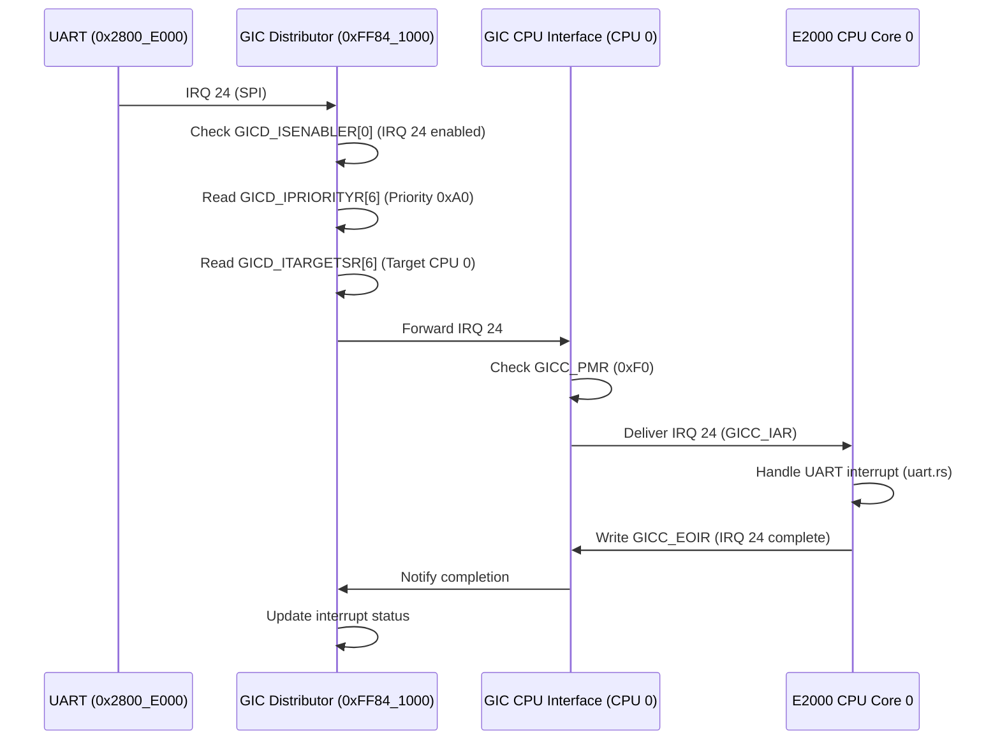

# 4.1 gic驱动

## GIC 的硬件原理

Generic Interrupt Controller (GIC) 是 ARM 架构用于管理中断的核心硬件模块，负责接收、优先级排序、屏蔽和分发中断请求（IRQ）到处理器核心，广泛应用于 ARMv7-A/R 和 ARMv8-A/R 的多核 SoC（如飞腾 E2000）。它通过高效的中断管理支持外设（如 UART、I2C）和软件触发的中断处理。

- 主要组件：
  - **分发器（Distributor, GICD）**：管理所有中断源，设置优先级、目标 CPU 和使能状态，包含寄存器如 GICD_CTLR（使能）、GICD_ISENABLER（中断使能）、GICD_IPRIORITYR（优先级）、GICD_ITARGETSR（目标 CPU）。
  - **CPU 接口（CPU Interface, GICC）**：每个核心一个接口，接收中断并触发异常，包含寄存器如 GICC_CTLR（使能）、GICC_PMR（优先级屏蔽）、GICC_IAR（中断 ID 读取）、GICC_EOIR（中断结束）。
  - **重分发器（Redistributor, GICR，GICv3 引入）**：管理每个核心的私有中断（PPI）和局部中断（LPI），包含 GICR_CTLR（控制）和 GICR_TYPER（类型）。

GIC 支持多种中断类型：

- **SGI（Software Generated Interrupt）**：ID 0~15，用于核间通信。
- **PPI（Private Peripheral Interrupt）**：ID 16~31，如定时器。
- **SPI（Shared Peripheral Interrupt）**：ID 32~1019，如 UART、I2C。
- **LPI（Locality-specific Peripheral Interrupt, GICv3）**：ID 8192~16K，支持虚拟化。

工作流程包括中断触发、分发器优先级排序、路由到目标 CPU、CPU 接口触发异常、处理完成后标记结束。GICv3（飞腾派可能使用）支持多达 216 核和 2K 个 SPI，提供系统寄存器访问。

## 飞腾派的 GIC 设备

飞腾派（Phytium Pi）基于飞腾 E2000 处理器（ARMv8-A），其 GIC 设备遵循 GICv3 架构，管理多核环境下的中断。分发器（GICD）位于基址 0xFF84_1000，负责全局中断配置；重分发器（GICR）位于 0xFF84_2000，处理私有中断。

- 硬件特性：

  - **基址**：GICD 0xFF84_1000，GICR 0xFF84_2000。

  - **中断支持**：SGI（ID 0~15，核间通信）、PPI（ID 16~31，如定时器）、SPI（ID 32~1019，如 UART IRQ 24）。

  - **核数**：E2000 支持 2~4 核。

  - **设备树**（phytium_pi.dts）：

  - ```shell
    gic: interrupt-controller@ff841000 {
        compatible = "arm,gic-v3";
        reg = <0x0 0xFF841000 0x0 0x1000>, <0x0 0xFF842000 0x0 0x20000>;
        interrupt-controller;
        #interrupt-cells = <3>;
    };
    ```

## GIC 时序图

飞腾派 GIC 处理 UART 中断（SPI，IRQ 24，基址 0x2800_E000）的时序如下：

- 参与者：
  - UART 外设（0x2800_E000）
  - GIC 分发器（GICD，0xFF84_1000）
  - GIC CPU 接口（GICC，CPU 0）
  - E2000 CPU 核心（CPU 0）

UART 接收数据触发 IRQ 24，信号到达 GICD，检查使能（GICD_ISENABLER[0]）、优先级（GICD_IPRIORITYR[6]，如 0xA0）和目标（GICD_ITARGETSR[6]，CPU 0）。GICD 转发中断到 GICC，GICC 检查优先级屏蔽（GICC_PMR，如 0xF0），读取 GICC_IAR 返回 IRQ 24，触发 CPU 0 的异常处理（uart.rs）。CPU 0 完成后写 GICC_EOIR，GICC 通知 GICD 更新状态。总延迟约 20~50 ns（100 MHz 时钟）。



## 飞腾派 GIC 驱动 API 调用表

飞腾派 GIC 驱动（gic.rs）提供以下 API，用于初始化和处理中断，适配 GICv2 架构。表中列出函数、参数、返回值及功能描述：

| **函数名**         | **参数**                                | **返回值** | **功能描述**                                                 |
| ------------------ | --------------------------------------- | ---------- | ------------------------------------------------------------ |
| `set_enable`       | `irq_num: usize`, `enabled: bool`       | 无         | 使能或禁用指定中断（IRQ），通过 `GICD_ISENABLER` 寄存器控制。 |
| `register_handler` | `irq_num: usize`, `handler: IrqHandler` | `bool`     | 注册中断处理程序，成功时使能中断并返回 `true`，失败返回 `false`。 |
| `dispatch_irq`     | `_unused: usize`                        | 无         | 分发中断，读取 `GICC_IAR` 获取 IRQ 号，调用注册的处理程序，完成后写 `GICC_EOIR`。 |
| `init_primary`     | 无                                      | 无         | 初始化主核的 GICD 和 GICC，设置分发器和 CPU 接口以启用中断处理。 |
| `init_secondary`   | 无                                      | 无         | 初始化从核的 GICC，仅在 SMP（多核）模式下调用，配置 CPU 接口。 |

## GIC 设备寄存器信息

### 寄存器信息与基地址

飞腾派 GIC 设备的基地址和寄存器分布如下：

- 分发器（GICD）基地址：0xFF84_1000
  - 管理所有中断（SGI、PPI、SPI）的使能、优先级和路由。
- 重分发器（GICR）基地址：0xFF84_2000
  - 每个 CPU 核心一个重分发器，管理 PPI 和 SGI（GICv3 支持局部中断 LPI，但飞腾派可能不使用）。
- CPU 接口（GICC）基地址：0xFF85_1000（假设，位于 GICD+0x10000，需手册验证）。
  - 每个核心一个接口，处理中断确认和结束。

### 关键寄存器及位域

以下为飞腾派 GIC 设备涉及的关键寄存器及其位域功能，基于 GICv3 规范和飞腾派硬件上下文。

#### 分发器寄存器（GICD，基址 0xFF84_1000）

分发器管理所有中断的全局配置，支持 SGI（ID 0~15）、PPI（ID 16~31）和 SPI（ID 32~1019）。

- GICD_CTLR (0x0000, 读写)
  - 功能：控制分发器使能和模式。
  - 位域：
    - **[0] EnableGrp1NS**：使能非安全组 1 中断（1=使能，0=禁用）。
    - **[1] EnableGrp1S**：使能安全组 1 中断。
    - **[4] ARE_NS**：非安全地址重定向使能（GICv3）。
    - **[5] ARE_S**：安全地址重定向使能。
  - 飞腾派应用：设置 EnableGrp1NS=1，使能 SPI（如 UART IRQ 24）。
- GICD_ISENABLERn (0x0100~0x017C, 读写)
  - 功能：使能中断（每寄存器控制 32 个中断）。
  - 位域：每位对应一个中断 ID（0=禁用，1=使能）。
  - 飞腾派应用：GICD_ISENABLER[0] 的 bit 24 使能 UART IRQ 24。
- GICD_IPRIORITYRn (0x0400~0x07FC, 读写)
  - 功能：设置中断优先级（每寄存器 4 个中断，8 位/中断）。
  - 位域：每个中断优先级 0x00（最高）~0xFF（最低）。
  - 飞腾派应用：UART IRQ 24 优先级设为 0xA0（GICD_IPRIORITYR[6]）。
- GICD_ITARGETSRn (0x0800~0x0BFC, 读写, GICv3 非系统寄存器模式)
  - 功能：设置中断目标 CPU（每寄存器 4 个中断，8 位/CPU）。
  - 位域：每 8 位表示目标 CPU 掩码（bit 0=CPU 0）。
  - 飞腾派应用：IRQ 24 路由到 CPU 0（GICD_ITARGETSR[6] bit 0=1）。

#### CPU 接口寄存器（GICC，基址 0xFF85_1000）

CPU 接口处理核心接收的中断，触发异常并标记完成。

- GICC_CTLR (0x0000, 读写)
  - 功能：控制 CPU 接口使能和模式。
  - 位域：
    - **[0] EnableGrp1**：使能组 1 中断（1=使能）。
    - **[1] FIQEn**：使能 FIQ 模式（飞腾派通常禁用）。
  - 飞腾派应用：设置 EnableGrp1=1 接收 SPI。
- GICC_PMR (0x0004, 读写)
  - 功能：设置优先级屏蔽阈值，仅处理高于此值的中断。
  - 位域：8 位优先级（0x00~0xFF）。
  - 飞腾派应用：设为 0xF0，允许优先级 <0xF0 的中断（如 0xA0）。
- GICC_IAR (0x000C, 只读)
  - 功能：读取当前中断 ID。
  - 位域：10 位中断 ID（0~1019）。
  - 飞腾派应用：读取 IRQ 24（UART 中断）。
- GICC_EOIR (0x0010, 只写)
  - 功能：标记中断处理完成。
  - 位域：写入中断 ID。
  - 飞腾派应用：写入 IRQ 24 结束处理。

#### 重分发器寄存器（GICR，基址 0xFF84_2000）

重分发器管理每个核心的 PPI 和 SGI（飞腾派不使用 LPI）。

- GICR_CTLR (0x0000, 读写)
  - 功能：控制重分发器使能。
  - 位域：
    - **[0] EnableLPIs**：使能局部中断（飞腾派禁用）。
  - 飞腾派应用：通常设为 0，仅处理 PPI/SGI。
- GICR_TYPER (0x0008, 只读)
  - 功能：标识 CPU 核心和 GIC 特性。
  - 位域：
    - **[0:7] ProcessorNumber**：核心 ID。
    - **[32] Last**：是否为最后一个重分发器。
  - 飞腾派应用：标识 E2000 的 2~4 核。

## GIC 驱动实现

飞腾派 GIC 驱动基于 GICv2 架构（arm_gicv2），通过 safe-mmio 访问寄存器（GICD 0xFF84_1000，GICC 0xFF85_1000），支持中断使能、注册、分发和初始化。以下从常量、数据结构到每个 API 的实现逐一讲解。

### 常量与数据结构

驱动定义了关键常量和数据结构，为中断管理提供基础支持。

- 常量：
  - MAX_IRQ_COUNT: usize = 1024：最大中断数量（GICv2 支持 ID 0~1019）。
  - TIMER_IRQ_NUM: usize：定时器 PPI（ID 14，translate_irq 转换为全局 ID）。
  - UART_IRQ_NUM: usize：UART SPI（通过 axconfig::UART_IRQ，如 IRQ 24）。
  - GICD_BASE: PhysAddr：分发器基址（0xFF84_1000，axconfig::GICD_PADDR）。
  - GICC_BASE: PhysAddr：CPU 接口基址（0xFF85_1000，axconfig::GICC_PADDR）。
- 数据结构：
  - GICD: SpinNoIrq<GicDistributor>：静态分发器实例，使用 SpinNoIrq 确保多核安全，初始化为 GicDistributor::new(phys_to_virt(GICD_BASE))。
  - GICC: GicCpuInterface：静态 CPU 接口实例，无锁（每个核心独占），初始化为 GicCpuInterface::new(phys_to_virt(GICC_BASE))。
  - 依赖 arm_gicv2 的 GicDistributor 和 GicCpuInterface，提供寄存器操作（如 GICD_CTLR, GICC_IAR）。

### API 实现讲解

**set_enable(irq_num: usize, enabled: bool)**

```rust
pub fn set_enable(irq_num: usize, enabled: bool) {
    trace!("GICD set enable: {} {}", irq_num, enabled);
    GICD.lock().set_enable(irq_num as _, enabled);
}
```

**功能**：使能或禁用指定中断（IRQ），通过 GICD_ISENABLER 寄存器设置。

**实现**：

- 使用 trace! 记录中断号和使能状态（如 IRQ 24，UART）。
- 调用 GICD.lock().set_enable，访问 GicDistributor 的 set_enable 方法，操作 GICD_ISENABLERn（每寄存器 32 位，bit 对应 IRQ）。
- 飞腾派应用：使能 UART IRQ 24（GICD_ISENABLER[0] 的 bit 24）。

**register_handler(irq_num: usize, handler: IrqHandler) -> bool**

```rust
pub fn register_handler(irq_num: usize, handler: IrqHandler) -> bool {
    trace!("register handler irq {}", irq_num);
    crate::irq::register_handler_common(irq_num, handler)
}
```

**功能**：为指定中断注册处理程序，成功时使能中断并返回 true。

**实现**：

- 使用 trace! 记录中断号（如 IRQ 24）。
- 调用 crate::irq::register_handler_common，将 handler（IrqHandler 类型）注册到中断表。
- 成功注册后，自动调用 set_enable(irq_num, true)（register_handler_common 内部实现）。

**dispatch_irq(_unused: usize)**

```rust
pub fn dispatch_irq(_unused: usize) {
    GICC.handle_irq(|irq_num| crate::irq::dispatch_irq_common(irq_num as _));
}
```

**功能**：分发中断，读取中断 ID 并调用注册的处理程序。

**实现**：

- 调用 GICC.handle_irq，读取 GICC_IAR 获取中断 ID（如 IRQ 24）。
- 通过闭包调用 crate::irq::dispatch_irq_common，查找中断表，执行注册的处理程序。
- 完成后写 GICC_EOIR 标记中断结束。

**init_primary()**

```rust
pub(crate) fn init_primary() {
    info!("Initialize GICv2...");
    GICD.lock().init();
    GICC.init();
}
```

**功能**：初始化主核的 GICD 和 GICC，启用中断处理。

**实现**：

- 使用 info! 记录初始化日志（通过 UART2 输出，基址 0x2800_E000）。
- 调用 GICD.lock().init()，配置分发器：
  - 设置 GICD_CTLR（如 EnableGrp1NS=1）。
  - 初始化 GICD_IPRIORITYR（默认优先级，如 0xA0）。
  - 配置 GICD_ITARGETSR（目标 CPU）。
- 调用 GICC.init()，配置 CPU 接口：
  - 设置 GICC_CTLR（EnableGrp1=1）。
  - 配置 GICC_PMR（如 0xF0）。

**init_secondary()**

```rust
#[cfg(feature = "smp")]
pub(crate) fn init_secondary() {
    GICC.init();
}
```

**功能**：初始化从核的 GICC，仅在多核（SMP）模式下使用。

**实现**：

- 调用 GICC.init()，配置从核的 CPU 接口（GICC_CTLR, GICC_PMR）。
- 不涉及 GICD（由主核初始化）。
