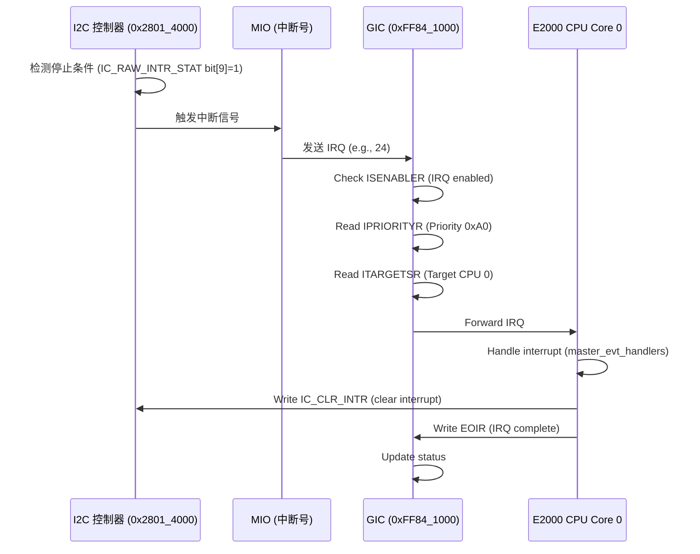

# 4.2 中断方式实现 i2c 驱动

### I2C 驱动的中断实现原理

I2C 驱动的中断实现是嵌入式系统中处理数据传输事件的关键机制，在飞腾派（Phytium Pi）开发板上，通过 MIO（Multi-Function Input/Output）控制器和 I2C 寄存器协作完成。原理基于中断信号的触发和响应：当 I2C 传输发生特定事件（如完成或错误）时，控制器产生中断信号，通过 GIC（Generic Interrupt Controller）路由到 CPU 核心。驱动在初始化时设置中断号（通过 FMioFuncGetIrqNum 获取 MIO 的 IRQ），并使用 master_evt_handlers 数组注册处理函数（默认为 None，需开发者自定义）。中断事件主要包括传输完成（检测到停止条件）和错误（如 NACK），通过轮询或中断模式处理数据 FIFO。IC_RAW_INTR_STAT 寄存器的 bit[9] 用于检测停止信号，触发传输完成中断；IC_CLR_INTR 用于清除中断状态，确保后续传输。整个过程依赖 50MHz 时钟（ref_clk_hz），分频后生成 I2C 速率（如 100kbps），并在 FI2cMioMasterInit 中初始化中断处理数组。

### 飞腾派 I2C 驱动的中断设备

飞腾派 I2C 驱动的中断设备集成在 MIO 控制器中，每个 MIO（基址 0x2801_4000~0x2803_2000）提供独立中断号，支持 I2C 主/从模式的中断事件。设备通过 IC_INTR_STAT (偏移 0x2C) 检查中断状态，IC_INTR_MASK (0x30) 使能/屏蔽中断，IC_RAW_INTR_STAT (0x34) 读取原始状态（bit[9]=停止检测，用于传输完成），IC_CLR_INTR (0x40) 清除中断。MIO 配置 creg_mio_func_sel=00 选择 I2C 模式，中断号通过 FMioFuncGetIrqNum 获取（e.g., UART IRQ 24 类似）。驱动在 FI2cMioMasterInit 中初始化 master_evt_handlers[0~2] = None，开发者需注册自定义函数处理事件（如 ACK/NACK）。中断支持轮询模式，适用于低速传感器传输（如 Pin 3/5 I2C1_SDA/SCL），PAD (0x32B30000) 配置 x_reg0=5 启用 I2C 引脚。

### 飞腾派 I2C 驱动的中断时序图

飞腾派 I2C 中断处理时序以传输完成中断（IC_RAW_INTR_STAT bit[9]=1）为例，涉及 I2C 控制器（基址 0x2801_4000）、MIO（中断号获取）、GIC（路由 IRQ）和 CPU 核心。当 I2C 传输结束检测到停止条件，控制器触发中断信号，发送到 GIC 分发器。GIC 检查使能和优先级，路由到 CPU 0 的接口。CPU 接口读取中断 ID，触发异常处理程序，调用注册的 master_evt_handlers 函数处理数据。处理完成后，写 IC_CLR_INTR 清除中断，GIC 标记完成。总时序延迟约 20~50 ns（50MHz 时钟）。

