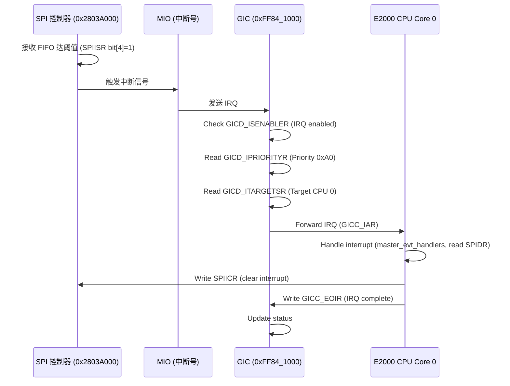

# 4.3 中断方式实现 spi 驱动

### SPI 驱动的中断实现原理

飞腾派（Phytium Pi）的 SPI 驱动中断实现基于 SPI 控制器（基址 0x2803A000），利用中断机制处理数据传输事件，优化高吞吐量场景下的性能。SPI 控制器支持主从模式、四种时序模式（CPOL/CPHA 组合）和中断模式，相较于轮询模式可减少 CPU 占用。中断事件包括发送 FIFO 阈值触发（SPITXFTLR）、接收 FIFO 阈值触发（SPIRXFTLR）、传输完成和错误（如溢出）。中断通过 SPIIMR（中断屏蔽寄存器，偏移 0x02C）使能，SPIISR（中断状态寄存器，偏移 0x030）反映状态，SPIDR（数据寄存器，偏移 0x060）用于数据读写。当发送或接收 FIFO 达到设定阈值，或传输完成时，控制器触发中断，信号通过 GIC（Generic Interrupt Controller）路由到 CPU。驱动在初始化时通过 FMioFuncGetIrqNum 获取 MIO 中断号，并注册中断处理程序（如 master_evt_handlers）。中断模式支持高效传输，适用于流数据设备（如 LCD 屏幕、AD 转换器），文档中提到测试模式（MISO/MOSI 短接）可用于验证。

### 飞腾派 SPI 驱动的中断设备

飞腾派的 SPI 控制器集成在 MIO（Multi-Function Input/Output）模块中，基址 0x2803A000，引脚通过 PAD（基址 0x32B30000）配置（如 MISO/MOSI/SCK/CS）。中断设备支持以下事件：

- **发送 FIFO 阈值中断**（SPIIMR bit[2]=TXEI）：发送 FIFO 数据量低于 SPITXFTLR 阈值时触发。
- **接收 FIFO 阈值中断**（SPIIMR bit[4]=RXFI）：接收 FIFO 数据量达到 SPIRXFTLR 阈值时触发。
- **传输错误中断**（SPIIMR bit[3]=TXOI, bit[5]=RXOI）：发送或接收 FIFO 溢出/下溢。 中断号通过 FMioFuncGetIrqNum 获取（类似 UART IRQ 24），由 GIC（基址 0xFF84_1000）路由。SPICTRL0（偏移 0x000）配置模式和数据位宽，SPIEN（偏移 0x008）控制使能，SPIBAUDR（偏移 0x014）设置波特率（基于 100MHz 时钟）。中断处理程序在 master_evt_handlers 中注册，处理数据传输和错误恢复，SPIICR（偏移 0x048）用于清除中断状态。

### 飞腾派 SPI 驱动的中断时序图

SPI 中断处理时序以接收 FIFO 阈值中断（SPIISR bit[4]=1）为例，涉及 SPI 控制器（0x2803A000）、MIO（中断号）、GIC（0xFF84_1000）和 CPU 核心。当接收 FIFO 达到 SPIRXFTLR 阈值，控制器触发中断信号，发送到 MIO 和 GIC。GIC 检查使能（GICD_ISENABLER）、优先级（GICD_IPRIORITYR，如 0xA0）和目标（GICD_ITARGETSR，CPU 0），转发到 CPU 接口（GICC）。CPU 读取 GICC_IAR 获取中断 ID，调用注册的 master_evt_handlers 处理接收数据（从 SPIDR 读取），完成后写 SPIICR 清除中断，通知 GIC 结束（GICC_EOIR）。总延迟约 20~50 ns（100MHz 时钟）。

