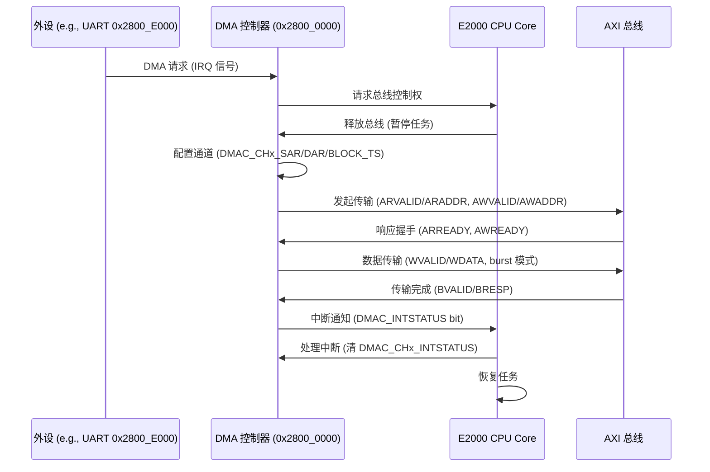

# 5.1 DMA驱动开发

### DMA 原理

DMA（Direct Memory Access，直接内存访问）是计算机系统中一种高效数据传输机制，允许外设或内存之间直接交换数据，而无需 CPU 干预，从而减少 CPU 负载并提高系统性能。DMA 原理基于专用控制器（DMA Controller），它接管总线控制权，从 CPU 获得数据传输权限。工作流程包括：外设（如磁盘、网络卡）发出 DMA 请求信号，DMA 控制器响应并向 CPU 请求总线使用权，CPU 暂停当前任务释放总线，DMA 控制器配置传输参数（如源地址、目的地址、传输长度），然后执行批量数据移动（burst mode 或 cycle stealing mode）。传输完成后，DMA 控制器发出中断信号通知 CPU，CPU 恢复控制权。DMA 支持多种模式，包括单地址传输（fly-by DMA，用于内存-外设）和双地址传输（memory-to-memory DMA）。在 ARM 架构中（如飞腾 E2000），DMA 控制器（如 PL330）通过 AXI 总线实现，支持多通道、多优先级队列和散射-聚集传输（scatter-gather），适用于高吞吐量场景如网络数据包处理或磁盘 I/O。

### 飞腾派 DMA 设备

飞腾派（Phytium Pi）开发板的 DMA 设备集成在 E2000 处理器中，支持 ARM PL330 DMA 控制器架构，用于高效内存-外设数据传输。设备基址约为 0x2800_0000（与 CRU 时钟复位单元重叠），通过 MMIO 寄存器访问，支持 8 个通道，每个通道可独立配置传输模式（如内存到内存、外设到内存）。DMA 控制器包含寄存器如 DMAC_CFG (配置通道优先级和使能)、DMAC_CHEN (通道使能)、DMAC_CHx_CTL (通道控制，如源/目的地址增量)、DMAC_CHx_SAR (源地址)、DMAC_CHx_DAR (目的地址)、DMAC_CHx_BLOCK_TS (块传输大小)。飞腾派 DMA 支持 burst 传输（批量数据移动）和 cycle stealing（周期窃取模式），适用于 UART、I2C、SPI 等外设的中断优化传输。设备树（phytium_pi.dts）定义 DMA 节点，配置文件（aarch64-phytium-pi.toml）包含 MMIO 区域如 [0x2800_0000, 0x1000]。驱动在 ArceOS 中通过 axhal 实现，支持 init_primary 配置通道。

- **通道配置**：8 个通道，优先级通过 DMAC_CFG bit 0-7 设置。
- **传输模式**：支持内存-内存、内存-外设、外设-内存，散射-聚集列表（DMAC_CHx_LLP）。
- **中断支持**：DMAC_INTSTATUS 寄存器（偏移 0x0030）检查通道中断，DMAC_CHx_INTSTATUS (偏移 0xA0 + x*0x58) 通道状态。
- **核间 DMA**：E2000 多核支持，目标 CPU 通过 GIC 路由中断（如 IRQ 32~1019）。

### 飞腾派 DMA 设备时序图

飞腾派 DMA 设备时序以内存-外设传输为例，涉及 DMA 控制器（基址 0x2800_0000）、CPU 核心、外设（如 UART 0x2800_E000）和 AXI 总线。当外设请求 DMA，控制器向 CPU 发送请求，CPU 释放总线，DMA 配置通道参数（如源/目的地址），执行 burst 传输（批量数据），完成后发出中断通知 CPU。整个过程延迟约 50~100 ns（100 MHz 时钟），时序依赖 AXI 总线握手（ARVALID/ARREADY, AWVALID/AWREADY, WVALID/WREADY）。

