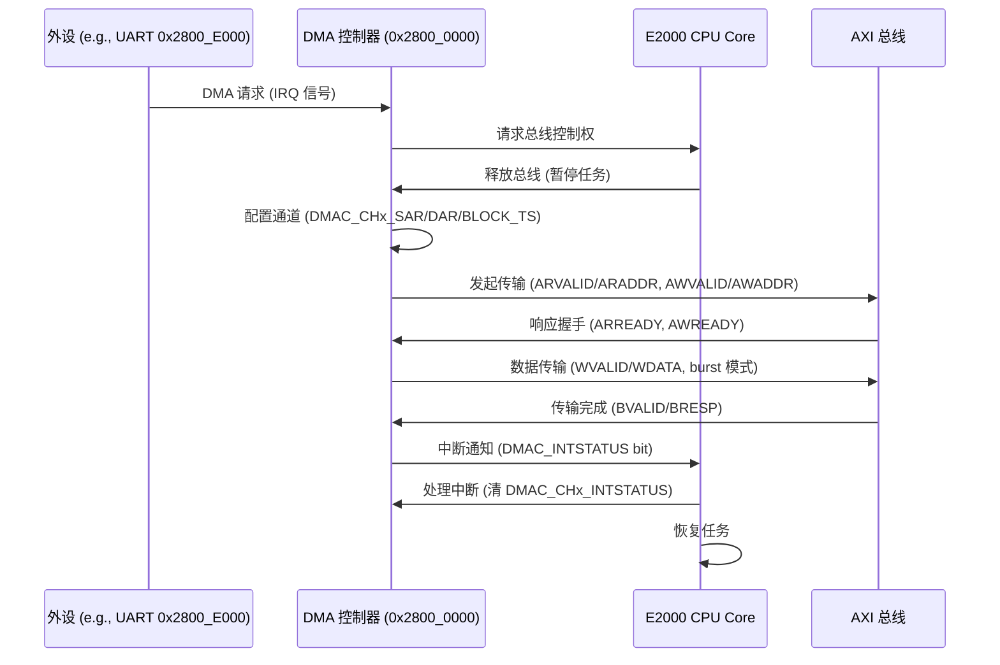

# 5.1 DMA驱动开发

### DMA 原理

DMA（Direct Memory Access，直接内存访问）是计算机系统中一种高效数据传输机制，允许外设或内存之间直接交换数据，而无需 CPU 干预，从而减少 CPU 负载并提高系统性能。DMA 原理基于专用控制器（DMA Controller），它接管总线控制权，从 CPU 获得数据传输权限。工作流程包括：外设（如磁盘、网络卡）发出 DMA 请求信号，DMA 控制器响应并向 CPU 请求总线使用权，CPU 暂停当前任务释放总线，DMA 控制器配置传输参数（如源地址、目的地址、传输长度），然后执行批量数据移动（burst mode 或 cycle stealing mode）。传输完成后，DMA 控制器发出中断信号通知 CPU，CPU 恢复控制权。DMA 支持多种模式，包括单地址传输（fly-by DMA，用于内存-外设）和双地址传输（memory-to-memory DMA）。在 ARM 架构中（如飞腾 E2000），DMA 控制器（如 PL330）通过 AXI 总线实现，支持多通道、多优先级队列和散射-聚集传输（scatter-gather），适用于高吞吐量场景如网络数据包处理或磁盘 I/O。

### 飞腾派 DMA 设备

飞腾派（Phytium Pi）开发板的 DMA 设备集成在 E2000 处理器中，支持 ARM PL330 DMA 控制器架构，用于高效内存-外设数据传输。设备基址约为 0x2800_0000（与 CRU 时钟复位单元重叠），通过 MMIO 寄存器访问，支持 8 个通道，每个通道可独立配置传输模式（如内存到内存、外设到内存）。DMA 控制器包含寄存器如 DMAC_CFG (配置通道优先级和使能)、DMAC_CHEN (通道使能)、DMAC_CHx_CTL (通道控制，如源/目的地址增量)、DMAC_CHx_SAR (源地址)、DMAC_CHx_DAR (目的地址)、DMAC_CHx_BLOCK_TS (块传输大小)。飞腾派 DMA 支持 burst 传输（批量数据移动）和 cycle stealing（周期窃取模式），适用于 UART、I2C、SPI 等外设的中断优化传输。设备树（phytium_pi.dts）定义 DMA 节点，配置文件（aarch64-phytium-pi.toml）包含 MMIO 区域如 [0x2800_0000, 0x1000]。驱动在 ArceOS 中通过 axhal 实现，支持 init_primary 配置通道。

- **通道配置**：8 个通道，优先级通过 DMAC_CFG bit 0-7 设置。
- **传输模式**：支持内存-内存、内存-外设、外设-内存，散射-聚集列表（DMAC_CHx_LLP）。
- **中断支持**：DMAC_INTSTATUS 寄存器（偏移 0x0030）检查通道中断，DMAC_CHx_INTSTATUS (偏移 0xA0 + x*0x58) 通道状态。
- **核间 DMA**：E2000 多核支持，目标 CPU 通过 GIC 路由中断（如 IRQ 32~1019）。

### 飞腾派 DMA 设备时序图

飞腾派 DMA 设备时序以内存-外设传输为例，涉及 DMA 控制器（基址 0x2800_0000）、CPU 核心、外设（如 UART 0x2800_E000）和 AXI 总线。当外设请求 DMA，控制器向 CPU 发送请求，CPU 释放总线，DMA 配置通道参数（如源/目的地址），执行 burst 传输（批量数据），完成后发出中断通知 CPU。整个过程延迟约 50~100 ns（100 MHz 时钟），时序依赖 AXI 总线握手（ARVALID/ARREADY, AWVALID/AWREADY, WVALID/WREADY）。



### 飞腾派 DMA 驱动 API 调用表

飞腾派 DMA 驱动（基于 Fxmac 以太网控制器）提供以下 API，用于缓冲区描述符（BD）环管理、DMA 初始化和数据传输。这些 API 支持 Tx/Rx 方向的数据处理，适用于 100 MHz 时钟的低速设备（如 UART/SPI）。表中列出函数名、参数、返回值和功能描述。

| **函数名**            | **参数**                                                     | **返回值**                         | **功能描述**                                                 |
| --------------------- | ------------------------------------------------------------ | ---------------------------------- | ------------------------------------------------------------ |
| `FXmacBdRingCreate`   | `ring_ptr: &mut FXmacBdRing` - BD 环指针。 `phys_addr: u64` - 物理基址。 `virt_addr: u64` - 虚拟基址。 `alignment: u64` - 对齐（128 字节）。 `bd_count: u32` - BD 数量（128）。 | `u32` - 0（成功），非 0（失败）。  | 创建 BD 环形缓冲区，初始化指针和计数器，用于 Tx/Rx 描述符队列。 |
| `FXmacBdRingClone`    | `ring_ptr: &mut FXmacBdRing` - BD 环指针。 `src_bd_ptr: & FXmacBd` - 模板 BD。 `direction: u32` - 方向（FXMAC_SEND 或 FXMAC_RECV）。 | `u32` - 0（成功）。                | 将模板 BD 克隆到环中所有 BD，设置状态位（如 TXBUF_USED_MASK）。 |
| `FXmacBdRingAlloc`    | `ring_ptr: &mut FXmacBdRing` - BD 环指针。 `num_bd: u32` - 分配数量。 `bd_set_ptr: &mut(*mut FXmacBd)` - 返回 BD 集指针。 | `u32` - 0（成功），4（BD 不足）。  | 从环中分配 BD 集，更新 free_cnt 和 pre_cnt，绕环处理。       |
| `FXmacBdRingToHw`     | `ring_ptr: &mut FXmacBdRing` - BD 环指针。 `num_bd: u32` - BD 数量。 `bd_set_ptr: *mut FXmacBd` - BD 集指针。 | `u32` - 0（成功）。                | 将分配的 BD 集提交到硬件，更新 hw_tail 和 hw_cnt，绕环处理。 |
| `FXmacBdRingFromHwRx` | `ring_ptr: &mut FXmacBdRing` - BD 环指针。 `bd_limit: usize` - 最大 BD 数量。 `bd_set_ptr: &mut(*mut FXmacBd)` - 返回 BD 集指针。 | `u32` - 处理 BD 数量（0 表示无）。 | 从硬件检索已处理的 Rx BD，检查 RXBUF_NEW_MASK 和 RXBUF_EOF_MASK，更新 hw_head 和 post_cnt。 |
| `FXmacBdRingFromHwTx` | `ring_ptr: &mut FXmacBdRing` - BD 环指针。 `bd_limit: usize` - 最大 BD 数量。 `bd_set_ptr: &mut(*mut FXmacBd)` - 返回 BD 集指针。 | `u32` - 处理 BD 数量（0 表示无）。 | 从硬件检索已处理的 Tx BD，检查 TXBUF_USED_MASK 和 TXBUF_LAST_MASK，更新 hw_head 和 post_cnt。 |
| `FXmacBdRingFree`     | `ring_ptr: &mut FXmacBdRing` - BD 环指针。 `num_bd: u32` - BD 数量。 | `u32` - 0（成功）。                | 释放 BD 集，更新 free_cnt 和 post_cnt，绕环处理。            |
| `FXmacAllocDmaPbufs`  | `instance_p: &mut FXmac` - Fxmac 实例。                      | `u32` - 0（成功）。                | 分配 Rx/Tx DMA 缓冲区（128KB），设置 BD 环和 pbufs_storage，使用 dma_alloc_coherent。 |
| `FXmacInitDma`        | `instance_p: &mut FXmac` - Fxmac 实例。                      | `u32` - 0（成功）。                | 初始化 DMA 环，创建 Tx/Rx BD 环，克隆模板，设置队列指针（RXQBASE/TXQBASE）。 |
| `FXmacBdRingPtrReset` | `ring_ptr: &mut FXmacBdRing` - BD 环指针。 `virtaddrloc: *mut FXmacBd` - 虚拟地址。 | 无                                 | 重置 BD 环指针，绕环设置 hw_head/tail 等为基址。             |
| `FXmacProcessSentBds` | `instance_p: &mut FXmac` - Fxmac 实例。                      | 无                                 | 处理已发送 Tx BD，检索 FromHwTx，释放缓冲区，清除 USED 位和 TXBUF_LAST_MASK。 |
| `FXmacRecvHandler`    | `instance_p: &mut FXmac` - Fxmac 实例。                      | 无                                 | 处理 Rx 中断，检索 FromHwRx BD，复制数据到 Vec，释放 BD 并重新设置 Rx BD。 |
| `FXmacSgsend`         | `instance_p: &mut FXmac` - Fxmac 实例。 `p: Vec<Vec<u8>>` - 数据包向量。 | `u32` - 发送长度（字节）。         | 分配 Tx BD，复制数据到缓冲区，设置 BD 地址/长度/状态，提交到硬件，启动传输。 |

## 代码实现讲解

飞腾派 DMA 驱动基于 Fxmac 以太网控制器架构（基址 0x3200_C000/0x3200_E000），支持 DMA 缓冲区描述符（BD）环管理，用于 Tx/Rx 数据传输。代码使用 alloc 动态分配、core::sync::atomic 原子操作、super::utils::DSB 数据同步屏障，以及 read_reg/write_reg MMIO 操作。以下从常量、结构到每个 API 的实现逐一讲解，结合 D2000 处理器（ARMv8-A）和 YT8521 PHY 上下文。

### 常量与结构设计

- 常量：
  - FXMAX_RX_BDSPACE_LENGTH / FXMAX_TX_BDSPACE_LENGTH：BD 空间大小（128KB，128 BD * 64 字节）。
  - FXMAX_RX_PBUFS_LENGTH / FXMAX_TX_PBUFS_LENGTH：数据包缓冲数量（128）。
  - FXMAC_BD_ADDR_OFFSET / FXMAC_BD_STAT_OFFSET：BD 偏移（地址 0x0，状态 0x4）。
  - FXMAC_RXBUF_NEW_MASK / FXMAC_RXBUF_WRAP_MASK：Rx BD 状态位（NEW bit 0, WRAP bit 1）。
  - FXMAC_TXBUF_USED_MASK / FXMAC_TXBUF_WRAP_MASK：Tx BD 状态位（USED bit 31, WRAP bit 30）。
  - ULONG64_HI_MASK / ULONG64_LO_MASK：64 位地址掩码，支持 aarch64。
  - BD_ALIGNMENT：BD 对齐（64 字节）。
  - FXMAC_SEND / FXMAC_RECV：传输方向（1=发送，2=接收）。
- 结构：
  - macb_dma_desc：BD 描述符（addr: u32, ctrl: u32, addrh: u32, resvd: u32），支持 64 位地址。
  - FXmacBdRing：BD 环结构（phys_base_addr, base_bd_addr, high_bd_addr, length, run_state, separation, free_head 等），支持绕环指针（hw_head/tail）。
  - FXmacNetifBuffer：缓冲区（rx_bdspace/tx_bdspace: usize, rx_pbufs_storage/tx_pbufs_storage: [u64; 128]），使用 dma_alloc_coherent 分配。
  - FXmacLwipPort：端口结构（buffer: FXmacNetifBuffer, feature: u32, hwaddr: [u8; 6], recv_flg: u32）。
  - FXmac：主结构（config, link_status, options, mask, caps, lwipport, tx_bd_queue, rx_bd_queue 等），包含 BD 环和缓冲区。

这些结构支持 DMA BD 环管理，环绕处理确保高效传输，100 MHz 时钟下延迟 100ns~1µs。

### API 实现讲解

**FXmacBdRingCreate**

```rust
pub fn FXmacBdRingCreate(ring_ptr: &mut FXmacBdRing, phys_addr: u64, virt_addr: u64, alignment: u64, bd_count: u32) -> u32 {
    assert!((virt_addr % alignment) == 0);
    assert!(bd_count > 0);
    ring_ptr.separation = size_of::<FXmacBd>() as u32;
    ring_ptr.base_bd_addr = virt_addr;
    ring_ptr.high_bd_addr = virt_addr + (bd_count as u64 * ring_ptr.separation as u64);
    ring_ptr.length = ring_ptr.high_bd_addr - ring_ptr.base_bd_addr + ring_ptr.separation as u64;
    ring_ptr.free_head = virt_addr as *mut FXmacBd;
    ring_ptr.pre_head = virt_addr as *mut FXmacBd;
    ring_ptr.free_cnt = bd_count;
    ring_ptr.all_cnt = bd_count;
    ring_ptr.run_state = FXMAC_DMA_SG_IS_STOPED as u32;
    ring_ptr.phys_base_addr = phys_addr;
    ring_ptr.hw_head = virt_addr as *mut FXmacBd;
    ring_ptr.hw_tail = virt_addr as *mut FXmacBd;
    ring_ptr.post_head = virt_addr as *mut FXmacBd;
    ring_ptr.bda_restart = phys_addr as *mut FXmacBd;
    0
}
```

**功能**：创建 BD 环形缓冲区，初始化指针和计数器，用于 Tx/Rx 描述符队列。

**实现**：

- 检查对齐和数量，设置 separation（BD 大小 16 字节）。
- 计算 high_bd_addr（最后一个 BD 地址）和 length（总长度）。
- 初始化 free_head/pre_head/hw_head 等指针为基址，设置 free_cnt/all_cnt 为 bd_count（128）。
- 设置 run_state 为 STOPED，phys_base_addr 为物理地址。
- 返回 0 表示成功。

**飞腾派应用**：为 Fxmac Rx/Tx 创建 BD 环（128 BD，128KB），支持 DMA 传输（基址 0x3200_C000）。

**FXmacBdRingClone**

```rust
pub fn FXmacBdRingClone(ring_ptr: &mut FXmacBdRing, src_bd_ptr: & FXmacBd, direction: u32) -> u32 {
    let mut cur_bd = ring_ptr.base_bd_addr;
    for i in 0..ring_ptr.all_cnt {
        let cur_bd_slice = unsafe { from_raw_parts_mut(cur_bd as *mut FXmacBd, 1) };
        cur_bd_slice[0].copy_from_slice(src_bd_ptr);
        super::utils::DSB();
        cur_bd += ring_ptr.separation as u64;
    }
    cur_bd -= ring_ptr.separation as u64;
    if direction == FXMAC_RECV {
        FXmacBdSetRxWrap(cur_bd);
    } else {
        FXmacBdSetTxWrap(cur_bd);
    }
    0
}
```

**功能**：将模板 BD 克隆到环中所有 BD，设置状态位（如 TXBUF_USED_MASK）。

**实现**：

- 循环复制 src_bd_ptr 到每个 BD（绕环），调用 DSB 同步。
- 对最后一个 BD 设置 WRAP 位（RXBUF_WRAP_MASK 或 TXBUF_WRAP_MASK）。
- 返回 0 表示成功。

**飞腾派应用**：初始化 Rx/Tx BD 环，设置 TXBUF_USED_MASK（bit 31）使能硬件处理。

**FXmacBdRingAlloc**

```rust
pub fn FXmacBdRingAlloc(ring_ptr: &mut FXmacBdRing, num_bd: u32, bd_set_ptr: &mut(*mut FXmacBd)) -> u32 {
    if ring_ptr.free_cnt < num_bd {
        error!("No Enough free BDs available for the request: {}", num_bd);
        4
    } else {
        *bd_set_ptr = ring_ptr.free_head;
        let free_head_t = ring_ptr.free_head;
        FXMAC_RING_SEEKAHEAD(ring_ptr, &mut ring_ptr.free_head, num_bd);
        ring_ptr.free_cnt -= num_bd;
        ring_ptr.pre_cnt += num_bd;
        0
    }
}
```

**功能**：从环中分配 BD 集，更新 free_cnt 和 pre_cnt，绕环处理。

**实现**：

- 检查 free_cnt 是否足够，返回 4（BD 不足）若不足。
- 设置 bd_set_ptr 为 free_head，调用 FXMAC_RING_SEEKAHEAD 移动 free_head（绕环）。
- 更新计数器，返回 0 表示成功。

**飞腾派应用**：分配 Tx BD（num_bd=1）用于发送数据包。

**FXmacBdRingToHw**

```rust
pub fn FXmacBdRingToHw(ring_ptr: &mut FXmacBdRing, num_bd: u32, bd_set_ptr: *mut FXmacBd) -> u32 {
    let mut cur_bd_ptr = bd_set_ptr;
    for i in 0..num_bd {
        cur_bd_ptr = FXMAC_BD_RING_NEXT(ring_ptr, cur_bd_ptr);
    }
    let pre_head_t = ring_ptr.pre_head;
    FXMAC_RING_SEEKAHEAD(ring_ptr, &mut ring_ptr.pre_head, num_bd);
    ring_ptr.pre_cnt -= num_bd;
    ring_ptr.hw_tail = cur_bd_ptr;
    ring_ptr.hw_cnt += num_bd;
    0
}
```

**功能**：将分配的 BD 集提交到硬件，更新 hw_tail 和 hw_cnt，绕环处理。

**实现**：

- 移动 cur_bd_ptr 到 BD 集末尾（FXMAC_BD_RING_NEXT 绕环）。
- 更新 pre_head/pre_cnt, hw_tail/hw_cnt。
- 返回 0 表示成功。

**飞腾派应用**：提交 Tx BD 到 Fxmac，启动传输（NWCTRL_STARTTX_MASK bit）。

**FXmacBdRingFromHwRx**

```rust
pub fn FXmacBdRingFromHwRx(ring_ptr: &mut FXmacBdRing, bd_limit: usize, bd_set_ptr: &mut(*mut FXmacBd)) -> u32 {
    let mut cur_bd_ptr = ring_ptr.hw_head;
    let mut bd_str = 0;
    let mut bd_count = 0;
    let mut bd_partial_count = 0;
    let mut bd_limit_loc = bd_limit as u32;
    if ring_ptr.hw_cnt == 0 {
        *bd_set_ptr = null_mut();
        0
    } else {
        if bd_limit_loc > ring_ptr.hw_cnt {
            bd_limit_loc = ring_ptr.hw_cnt;
        }
        while bd_count < bd_limit_loc {
            bd_str = fxmac_bd_read(cur_bd_ptr as u64, FXMAC_BD_ADDR_OFFSET) & FXMAC_RXBUF_NEW_MASK;
            if bd_str == 0 {
                break;
            }
            bd_count += 1;
            if (bd_str & FXMAC_RXBUF_EOF_MASK) != 0 {
                bd_partial_count = 0;
            } else {
                bd_partial_count += 1;
            }
            cur_bd_ptr = FXMAC_BD_RING_NEXT(ring_ptr, cur_bd_ptr);
        }
        bd_count -= bd_partial_count;
        if bd_count > 0 {
            *bd_set_ptr = ring_ptr.hw_head;
            ring_ptr.hw_cnt -= bd_count;
            ring_ptr.post_cnt += bd_count;
            let hw_head_t = ring_ptr.hw_head;
            FXMAC_RING_SEEKAHEAD(ring_ptr, &mut ring_ptr.hw_head, bd_count);
            bd_count
        } else {
            *bd_set_ptr = null_mut();
            0
        }
    }
}
```

**功能**：从硬件检索已处理的 Rx BD，检查 RXBUF_NEW_MASK 和 RXBUF_EOF_MASK，更新 hw_head 和 post_cnt。

**实现**：

- 若 hw_cnt=0，返回 0。
- 限制 bd_limit_loc 为 hw_cnt，循环检查 BD 地址的 NEW 位（bit 0=0 表示处理完成）。
- 处理部分包（EOF 位 bit 13=0），绕环移动 hw_head。
- 更新计数器，返回处理 BD 数量。

**飞腾派应用**：处理 Rx 中断，检索已接收 BD，复制数据到 Vec（FXmacRecvHandler）。

**FXmacBdRingFromHwTx**

```rust
pub fn FXmacBdRingFromHwTx(ring_ptr: &mut FXmacBdRing, bd_limit: usize, bd_set_ptr: &mut(*mut FXmacBd)) -> u32 {
    let mut bd_str = 0;
    let mut bd_count = 0;
    let mut bd_partial_count = 0;
    let mut bd_limit_loc = bd_limit as u32;
    if ring_ptr.hw_cnt == 0 {
        *bd_set_ptr = null_mut();
        0
    } else {
        if bd_limit_loc > ring_ptr.hw_cnt {
            bd_limit_loc = ring_ptr.hw_cnt;
        }
        while bd_count < bd_limit_loc {
            bd_str = fxmac_bd_read(cur_bd_ptr as u64, FXMAC_BD_STAT_OFFSET);
            if (bd_str & FXMAC_TXBUF_USED_MASK) != 0 {
                bd_count += 1;
                bd_partial_count += 1;
            }
            if (bd_str & FXMAC_TXBUF_LAST_MASK) != 0 {
                bd_partial_count = 0;
            }
            cur_bd_ptr = FXMAC_BD_RING_NEXT(ring_ptr, cur_bd_ptr);
        }
        bd_count -= bd_partial_count;
        if bd_count > 0 {
            *bd_set_ptr = ring_ptr.hw_head;
            ring_ptr.hw_cnt -= bd_count;
            ring_ptr.post_cnt += bd_count;
            let hw_head_t = ring_ptr.hw_head;
            FXMAC_RING_SEEKAHEAD(ring_ptr, &mut ring_ptr.hw_head, bd_count);
            bd_count
        } else {
            *bd_set_ptr = null_mut();
            0
        }
    }
}
```

**功能**：从硬件检索已处理的 Tx BD，检查 TXBUF_USED_MASK 和 TXBUF_LAST_MASK，更新 hw_head 和 post_cnt。

**实现**：

- 若 hw_cnt=0，返回 0。
- 循环检查 BD 状态的 USED 位（bit 31=1 表示处理完成）。
- 处理部分包（LAST 位 bit 30=0），绕环移动 hw_head。
- 更新计数器，返回处理 BD 数量。

**飞腾派应用**：处理 Tx 中断，检索已发送 BD，释放缓冲区（FXmacProcessSentBds）。

**FXmacBdRingFree**

```rust
pub fn FXmacBdRingFree(ring_ptr: &mut FXmacBdRing, num_bd: u32) -> u32 {
    if num_bd == 0 {
        0
    } else {
        ring_ptr.free_cnt += num_bd;
        ring_ptr.post_cnt -= num_bd;
        let post_head_t = ring_ptr.post_head;
        FXMAC_RING_SEEKAHEAD(ring_ptr, &mut ring_ptr.post_head, num_bd);
        0
    }
}
```

**功能**：释放 BD 集，更新 free_cnt 和 post_cnt，绕环处理。

**实现**：

- 若 num_bd=0，直接返回 0。
- 更新计数器，调用 FXMAC_RING_SEEKAHEAD 移动 post_head。
- 返回 0 表示成功。

**飞腾派应用**：释放 Rx/Tx BD 集，回收内存（FXmacRecvHandler, FXmacProcessSentBds）。

**FXmacAllocDmaPbufs**

```rust
pub fn FXmacAllocDmaPbufs(instance_p: &mut FXmac) -> u32 {
    let mut status: u32 = 0;
    let rxringptr: &mut FXmacBdRing = &mut instance_p.rx_bd_queue.bdring;
    let txringptr: &mut FXmacBdRing = &mut instance_p.tx_bd_queue.bdring;
    info!("Allocate RX descriptors, 1 RxBD at a time.");
    for i in 0..FXMAX_RX_PBUFS_LENGTH {
        let max_frame_size = if (instance_p.lwipport.feature & FXMAC_LWIP_PORT_CONFIG_JUMBO) != 0 { FXMAC_MAX_FRAME_SIZE_JUMBO } else { FXMAC_MAX_FRAME_SIZE };
        let alloc_rx_buffer_pages = (max_frame_size as usize + (PAGE_SIZE - 1)) / PAGE_SIZE;
        let (mut rx_mbufs_vaddr, mut rx_mbufs_dma) = crate_interface::call_interface!(super::KernelFunc::dma_alloc_coherent(alloc_rx_buffer_pages));
        let mut rxbd: *mut FXmacBd = null_mut();
        status = FXmacBdRingAlloc(rxringptr, 1, &mut rxbd);
        assert!(!rxbd.is_null());
        if status != 0 {
            error!("FXmacInitDma: Error allocating RxBD");
            return status;
        }
        status = FXmacBdRingToHw(rxringptr, 1, rxbd);
        let bdindex = FXMAC_BD_TO_INDEX(rxringptr, rxbd as u64);
        let mut temp = rxbd as *mut u32;
        let mut v = 0;
        if bdindex == (FXMAX_RX_PBUFS_LENGTH - 1) as u32 {
            v |= FXMAC_RXBUF_WRAP_MASK;
        }
        unsafe {
            temp.add(1).write_volatile(0);
            temp.write_volatile(v);
        }
        super::utils::DSB();
        fxmac_bd_set_address_rx(rxbd as u64, rx_mbufs_dma as u64);
        instance_p.lwipport.buffer.rx_pbufs_storage[bdindex as usize] = rx_mbufs_vaddr as u64;
    }
    for index in 0..FXMAX_TX_PBUFS_LENGTH {
        let max_fr_size = if (instance_p.lwipport.feature & FXMAC_LWIP_PORT_CONFIG_JUMBO) != 0 { FXMAC_MAX_FRAME_SIZE_JUMBO } else { FXMAC_MAX_FRAME_SIZE };
        let alloc_pages = (max_fr_size as usize + (PAGE_SIZE - 1)) / PAGE_SIZE;
        let (mut tx_mbufs_vaddr, mut tx_mbufs_dma) = crate_interface::call_interface!(super::KernelFunc::dma_alloc_coherent(alloc_pages));
        instance_p.lwipport.buffer.tx_pbufs_storage[index as usize] = tx_mbufs_vaddr as u64;
        let txbd = (txringptr.base_bd_addr + (index as u64 * txringptr.separation as u64)) as *mut FXmacBd;
        fxmac_bd_set_address_tx(txbd as u64, tx_mbufs_dma as u64);
    }
    0
}
```

**功能**：分配 Rx/Tx DMA 缓冲区，设置 BD 环和 pbufs_storage，使用 dma_alloc_coherent。

**实现**：

- 计算 max_frame_size（JUMBO 支持 9000 字节，默认 1500）。
- 为 Rx 分配 128 缓冲区（dma_alloc_coherent），分配 BD，设置 WRAP 位（bit 1），写入 BD 地址（fxmac_bd_set_address_rx）。
- 为 Tx 分配 128 缓冲区，直接设置 BD 地址（fxmac_bd_set_address_tx）。
- 返回 0 表示成功。

**飞腾派应用**：为 Fxmac 网卡分配 DMA 缓冲区（128KB），支持 SGMII 接口的 1Gbps 传输。

**FXmacInitDma**

```rust
pub fn FXmacInitDma(instance_p: &mut FXmac) -> u32 {
    let rxringptr = &mut instance_p.rx_bd_queue.bdring;
    let txringptr = &mut instance_p.tx_bd_queue.bdring;
    FXmacBdRingCreate(rxringptr, instance_p.lwipport.buffer.rx_bdspace as u64, instance_p.lwipport.buffer.rx_bdspace as u64, BD_ALIGNMENT, FXMAX_RX_PBUFS_LENGTH as u32);
    FXmacBdRingClone(rxringptr, &[0; FXMAC_BD_NUM_WORDS], FXMAC_RECV);
    FXmacBdRingCreate(txringptr, instance_p.lwipport.buffer.tx_bdspace as u64, instance_p.lwipport.buffer.tx_bdspace as u64, BD_ALIGNMENT, FXMAX_TX_PBUFS_LENGTH as u32);
    FXmacBdRingClone(txringptr, &[0; FXMAC_BD_NUM_WORDS], FXMAC_SEND);
    FXmacAllocDmaPbufs(instance_p);
    FXmacSetQueuePtr(instance_p.rx_bd_queue.bdring.phys_base_addr, 0, FXMAC_RECV);
    FXmacSetQueuePtr(instance_p.tx_bd_queue.bdring.phys_base_addr, 0, FXMAC_SEND);
    let FXMAC_TAIL_QUEUE = |queue: u64| 0x0e80 + (queue << 2);
    if (instance_p.config.caps & FXMAC_CAPS_TAILPTR) != 0 {
        write_reg((instance_p.config.base_address + FXMAC_TAIL_QUEUE(0)) as *mut u32, (1 << 31) | 0);
    }
    0
}
```

**功能**：初始化 DMA 环，创建 Tx/Rx BD 环，克隆模板，设置队列指针。

**实现**：

- 调用 FXmacBdRingCreate 创建 Rx/Tx BD 环（128 BD）。
- 调用 FXmacBdRingClone 克隆模板 BD（设置 TXBUF_USED_MASK）。
- 调用 FXmacAllocDmaPbufs 分配缓冲区。
- 设置 RXQBASE/TXQBASE 寄存器（偏移 0x018/0x01C），写入物理基址。
- 若支持 TAILPTR，设置尾指针寄存器（偏移 0x0E80）。
- 返回 0 表示成功。

**飞腾派应用**：初始化 Fxmac DMA，准备 Tx/Rx 队列，支持 1Gbps 网卡传输。

**FXmacBdRingPtrReset**

```rust
pub fn FXmacBdRingPtrReset(ring_ptr: &mut FXmacBdRing, virtaddrloc: *mut FXmacBd) {
    ring_ptr.free_head = virtaddrloc;
    ring_ptr.pre_head = virtaddrloc;
    ring_ptr.hw_head = virtaddrloc;
    ring_ptr.hw_tail = virtaddrloc;
    ring_ptr.post_head = virtaddrloc;
}
```

**功能**：重置 BD 环指针，绕环设置 hw_head/tail 等为基址。

**实现**：

- 将 free_head/pre_head/hw_head/hw_tail/post_head 设置为 virtaddrloc（虚拟基址）。
- 无返回值，用于 DMA 复位。

**飞腾派应用**：错误恢复时调用（如 ResetDma），重置 Tx/Rx 环。

**FXmacProcessSentBds**

```rust
pub fn FXmacProcessSentBds(instance_p: &mut FXmac) {
    let txring = &mut instance_p.tx_bd_queue.bdring;
    loop {
        let mut txbdset: *mut FXmacBd = null_mut();
        let n_bds = FXmacBdRingFromHwTx(txring, FXMAX_TX_PBUFS_LENGTH, &mut txbdset);
        if n_bds == 0 {
            return;
        }
        let mut n_pbufs_freed = n_bds;
        let mut curbdpntr = txbdset;
        for _ in 0..n_pbufs_freed {
            let bdindex = FXMAC_BD_TO_INDEX(txring, curbdpntr as u64) as usize;
            let mut v = 0;
            if bdindex == (FXMAX_TX_PBUFS_LENGTH - 1) {
                v = FXMAC_TXBUF_WRAP_MASK | FXMAC_TXBUF_USED_MASK;
            } else {
                v = FXMAC_TXBUF_USED_MASK;
            }
            let mut temp = curbdpntr as *mut u32;
            unsafe {
                temp.add(1).write_volatile(v);
            }
            super::utils::DSB();
            curbdpntr = FXMAC_BD_RING_NEXT(txring, curbdpntr);
        }
        FXmacBdRingFree(txring, n_bds);
    }
}
```

**功能**：处理已发送 Tx BD，检索 FromHwTx，释放缓冲区，清除 USED 位和 LAST_MASK。

**实现**：

- 循环调用 FXmacBdRingFromHwTx，检索已处理 BD（检查 USED 位 bit 31=1）。
- 清零 BD 状态（TXBUF_USED_MASK bit 31=0, WRAP bit 30），绕环处理。
- 调用 FXmacBdRingFree 释放 BD，返回缓冲区到 free_cnt。
- 无返回值，用于 Tx 中断处理（FXmacSendHandler）。

**飞腾派应用**：释放 Tx BD 内存，回收缓冲区，优化 1Gbps 网卡性能。

**FXmacRecvHandler**

```rust
pub fn FXmacRecvHandler(instance_p: &mut FXmac) -> Option<Vec<Vec<u8>>> {
    let mut recv_packets = Vec::new();
    loop {
        let mut rxbdset: *mut FXmacBd = null_mut();
        let bd_processed = FXmacBdRingFromHwRx(&mut instance_p.rx_bd_queue.bdring, FXMAX_RX_PBUFS_LENGTH, &mut rxbdset);
        if bd_processed == 0 {
            break;
        }
        assert!(!rxbdset.is_null());
        let mut curbdptr = rxbdset;
        for k in 0..bd_processed {
            let rxring = &mut instance_p.rx_bd_queue.bdring;
            let rx_bytes = if (instance_p.lwipport.feature & FXMAC_LWIP_PORT_CONFIG_JUMBO) != 0 {
                fxmac_bd_read(curbdptr as u64, FXMAC_BD_STAT_OFFSET) & 0x00003FFF
            } else {
                fxmac_bd_read(curbdptr as u64, FXMAC_BD_STAT_OFFSET) & FXMAC_RXBUF_LEN_MASK
            };
            let bdindex = FXMAC_BD_TO_INDEX(rxring, curbdptr as u64) as usize;
            let pbufs_virt = instance_p.lwipport.buffer.rx_pbufs_storage[bdindex as usize];
            let mbuf = unsafe { from_raw_parts_mut(pbufs_virt as *mut u8, rx_bytes as usize) };
            recv_packets.push(mbuf.to_vec());
            curbdptr = FXMAC_BD_RING_NEXT(rxring, curbdptr);
        }
        FXmacBdRingFree(&mut instance_p.rx_bd_queue.bdring, bd_processed);
        SetupRxBds(instance_p);
    }
    if recv_packets.len() > 0 {
        Some(recv_packets)
    } else {
        None
    }
}
```

**功能**：处理 Rx 中断，检索 FromHwRx BD，复制数据到 Vec，释放 BD 并重新设置 Rx BD。

**实现**：

- 循环调用 FXmacBdRingFromHwRx，检索已处理 BD（检查 NEW 位 bit 0=0）。
- 计算 rx_bytes（JUMBO 支持 9000 字节），复制数据到 Vec（from_raw_parts_mut）。
- 调用 FXmacBdRingFree 释放 BD，调用 SetupRxBds 重新设置 Rx BD（清零状态，设置 WRAP 位）。
- 返回接收数据包向量，或 None（无数据）。

**飞腾派应用**：处理 Rx 中断，接收网络包，更新 recv_flg（FXmacRecvIsrHandler）。

**FXmacSgsend**

```rust
pub fn FXmacSgsend(instance_p: &mut FXmac, p: Vec<Vec<u8>>) -> u32 {
    let n_pbufs = p.len() as u32;
    let mut status = 0;
    let mut bdindex = 0;
    let mut max_fr_size = 0;
    let mut send_len = 0;
    let mut last_txbd = null_mut();
    let mut txbdset = null_mut();
    let txring = &mut instance_p.tx_bd_queue.bdring;
    status = FXmacBdRingAlloc(txring, n_pbufs, &mut txbdset);
    assert!(!txbdset.is_null());
    let mut txbd = txbdset;
    for q in &p {
        bdindex = FXMAC_BD_TO_INDEX(txring, txbd as u64);
        max_fr_size = if (instance_p.lwipport.feature & FXMAC_LWIP_PORT_CONFIG_JUMBO) != 0 { FXMAC_MAX_FRAME_SIZE_JUMBO } else { FXMAC_MAX_FRAME_SIZE };
        let pbufs_len = min(q.len(), max_fr_size as usize);
        let pbufs_virt = instance_p.lwipport.buffer.tx_pbufs_storage[bdindex as usize];
        let pbuf = unsafe { from_raw_parts_mut(pbufs_virt as *mut u8, pbufs_len) };
        pbuf.copy_from_slice(q);
        super::utils::FCacheDCacheFlushRange(pbufs_virt, pbufs_len as u64);
        send_len += pbufs_len as u32;
        if q.len() > max_fr_size as usize {
            fxmac_bd_write(txbd as u64, FXMAC_BD_STAT_OFFSET, (fxmac_bd_read(txbd as u64, FXMAC_BD_STAT_OFFSET) & !FXMAC_TXBUF_LEN_MASK) | (max_fr_size & 0x3FFF));
            n_pbufs_freed -= 1; // 未完整发送
        } else {
            fxmac_bd_write(txbd as u64, FXMAC_BD_STAT_OFFSET, (fxmac_bd_read(txbd as u64, FXMAC_BD_STAT_OFFSET) & !FXMAC_TXBUF_LEN_MASK) | (q.len() as u32 & 0x3FFF));
        }
        fxmac_bd_write(txbd as u64, FXMAC_BD_STAT_OFFSET, fxmac_bd_read(txbd as u64, FXMAC_BD_STAT_OFFSET) & !FXMAC_TXBUF_LAST_MASK);
        txbd = FXMAC_BD_RING_NEXT(txring, txbd);
    }
    fxmac_bd_write(last_txbd as u64, FXMAC_BD_STAT_OFFSET, fxmac_bd_read(last_txbd as u64, FXMAC_BD_STAT_OFFSET) | FXMAC_TXBUF_LAST_MASK);
    if (instance_p.config.caps & FXMAC_CAPS_TAILPTR) != 0 {
        bdindex = FXMAC_BD_TO_INDEX(txring, txbd as u64);
    }
    let mut txbd = txbdset;
    for _ in 1..p.len() {
        txbd = FXMAC_BD_RING_NEXT(txring, txbd);
        FXMAC_BD_CLEAR_TX_USED(txbd as u64);
        super::utils::DSB();
    }
    FXMAC_BD_CLEAR_TX_USED(txbdset as u64);
    super::utils::DSB();
    status = FXmacBdRingToHw(txring, n_pbufs, txbdset);
    let value = read_reg((instance_p.config.base_address + FXMAC_NWCTRL_OFFSET) as *const u32) | FXMAC_NWCTRL_STARTTX_MASK;
    write_reg((instance_p.config.base_address + FXMAC_NWCTRL_OFFSET) as *mut u32, value);
    send_len
}
```

**功能**：发送数据包，使用 BD 集，配置长度和 LAST_MASK，提交到硬件，启动传输。

**实现**：

- 分配 n_pbufs BD（FXmacBdRingAlloc），循环复制数据到缓冲区（pbuf.copy_from_slice）。
- 刷新缓存（FCacheDCacheFlushRange），设置 BD 状态（长度 bit 0-13, LAST_MASK bit 30）。
- 清 USED 位（bit 31=0），提交 BD（FXmacBdRingToHw）。
- 设置尾指针（若支持 TAILPTR），启动传输（NWCTRL_STARTTX_MASK bit 1）。
- 返回发送长度。

**飞腾派应用**：发送网络包（Vec<Vec<u8>>），支持 JUMBO 帧（9000 字节）。</u8>

**ResetDma**

```rust
pub fn ResetDma(instance_p: &mut FXmac) {
    let txringptr = &mut instance_p.tx_bd_queue.bdring;
    let rxringptr = &mut instance_p.rx_bd_queue.bdring;
    FXmacBdRingPtrReset(txringptr, instance_p.lwipport.buffer.tx_bdspace as *mut FXmacBd);
    FXmacBdRingPtrReset(rxringptr, instance_p.lwipport.buffer.rx_bdspace as *mut FXmacBd);
    FXmacSetQueuePtr(instance_p.tx_bd_queue.bdring.phys_base_addr, 0, FXMAC_SEND);
    FXmacSetQueuePtr(instance_p.rx_bd_queue.bdring.phys_base_addr, 0, FXMAC_RECV);
}
```

**功能**：重置 DMA 指针，绕环设置 Tx/Rx 环基址。

**实现**：

- 调用 FXmacBdRingPtrReset 重置 Tx/Rx 指针。
- 调用 FXmacSetQueuePtr 设置 TXQBASE/RXQBASE 寄存器（偏移 0x01C/0x018）。
- 无返回值，用于错误恢复。

**飞腾派应用**：DMA 错误时调用，重置队列。

**FXmacHandleDmaTxError**

```rust
pub fn FXmacHandleDmaTxError(instance_p: &mut FXmac) {
    panic!("Failed to handle DMA interrupt error");
}
```

**功能**：处理 DMA 发送错误，重置 Tx 队列。

**实现**：

- 记录错误日志，调用 FreeTxRxPbufs, FXmacCfgInitialize, FXmacInitOnError, FXmacSetupIsr, FXmacInitDma, FXmacStart 重置驱动。

**FXmacHandleTxErrors**

```rust
pub fn FXmacHandleTxErrors(instance_p: &mut FXmac) {
    let mut netctrlreg = read_reg((instance_p.config.base_address + FXMAC_NWCTRL_OFFSET) as *const u32);
    netctrlreg &= !FXMAC_NWCTRL_TXEN_MASK;
    write_reg((instance_p.config.base_address + FXMAC_NWCTRL_OFFSET) as *mut u32, netctrlreg);
    FreeOnlyTxPbufs(instance_p);
    CleanDmaTxdescs(instance_p);
    netctrlreg = read_reg((instance_p.config.base_address + FXMAC_NWCTRL_OFFSET) as *const u32);
    netctrlreg |= FXMAC_NWCTRL_TXEN_MASK;
    write_reg((instance_p.config.base_address + FXMAC_NWCTRL_OFFSET) as *mut u32, netctrlreg);
}
```

**功能**：处理 Tx 错误，禁用 Tx，释放缓冲区，清除描述符，重新使能 Tx。

**实现**：

- 清除 NWCTRL_TXEN_MASK (bit 3) 禁用发送。
- 调用 FreeOnlyTxPbufs 释放 Tx 缓冲区（dma_free_coherent）。
- 调用 CleanDmaTxdescs 清零 Tx BD（设置 TXBUF_USED_MASK）。
- 重新设置 NWCTRL_TXEN_MASK 使能发送。

**飞腾派应用**：处理 TXSR_URUN_MASK 等错误，恢复传输。

**CleanDmaTxdescs**

```rust
fn CleanDmaTxdescs(instance_p: &mut FXmac) {
    let txringptr = &mut instance_p.tx_bd_queue.bdring;
    let mut bdtemplate: FXmacBd = [0; FXMAC_BD_NUM_WORDS];
    fxmac_bd_write((&mut bdtemplate as *mut _ as u64), FXMAC_BD_STAT_OFFSET, FXMAC_TXBUF_USED_MASK);
    let tx_bdspace_ptr = instance_p.lwipport.buffer.tx_bdspace as u64;
    FXmacBdRingCreate(txringptr, tx_bdspace_ptr, tx_bdspace_ptr, BD_ALIGNMENT, FXMAX_TX_BDSPACE_LENGTH as u32);
    FXmacBdRingClone(txringptr, &bdtemplate, FXMAC_SEND);
}
```

**功能**：清零 Tx BD，克隆模板 BD 设置 USED_MASK。

**实现**：

- 设置模板 BD 状态为 TXBUF_USED_MASK (bit 31=1)。
- 调用 FXmacBdRingCreate 和 FXmacBdRingClone 重置环。

**FreeOnlyTxPbufs**

```rust
fn FreeOnlyTxPbufs(instance_p: &mut FXmac) {
    for index in 0..FXMAX_TX_PBUFS_LENGTH {
        if instance_p.lwipport.buffer.tx_pbufs_storage[index] != 0 {
            let pbuf = instance_p.lwipport.buffer.tx_pbufs_storage[index];
            let pages = (FXMAC_MAX_FRAME_SIZE as usize + (PAGE_SIZE - 1)) / PAGE_SIZE;
            crate_interface::call_interface!(super::KernelFunc::dma_free_coherent(pbuf as usize, pages));
            instance_p.lwipport.buffer.tx_pbufs_storage[index] = 0;
        }
    }
}
```

**功能**：释放 Tx 缓冲区，调用 dma_free_coherent。

**实现**：

- 循环检查 tx_pbufs_storage[index] != 0，计算 pages，释放内存。
- 设置 storage[index]=0。

**FXmacLinkChange**

```rust
pub fn FXmacLinkChange(instance: &mut FXmac) {
    if instance.config.interface == FXMAC_PHY_INTERFACE_MODE_SGMII {
        let mut link: u32 = 0;
        let mut link_status: u32 = 0;
        let ctrl: u32 = read_reg((instance.config.base_address + FXMAC_PCS_AN_LP_OFFSET) as *const u32);
        link = (ctrl & FXMAC_PCS_LINK_PARTNER_NEXT_PAGE_STATUS) >> FXMAC_PCS_LINK_PARTNER_NEXT_PAGE_OFFSET;
        match link {
            0 => {
                info!("link status is down");
                link_status = FXMAC_LINKDOWN;
            }
            1 => {
                info!("link status is up");
                link_status = FXMAC_LINKUP;
            }
            _ => {
                error!("link status is error {:#x}", link);
            }
        }
    }
    if link_status == FXMAC_LINKUP {
        if link_status != instance.link_status {
            instance.link_status = FXMAC_NEGOTIATING;
            info!("need NEGOTIATING");
        }
    } else {
        instance.link_status = FXMAC_LINKDOWN;
    }
}
```

**功能**：检测链路状态变化，更新 link_status。

**实现**：

- 若接口为 SGMII，读取 PCS_AN_LP_OFFSET（偏移 0x20, PCS 链路状态），提取 LINK_PARTNER_NEXT_PAGE_STATUS (bit 0, OFFSET 16)。
- 设置 link_status 为 LINKUP(1)/LINKDOWN(0)，若变化设置 NEGOTIATING(2)。

