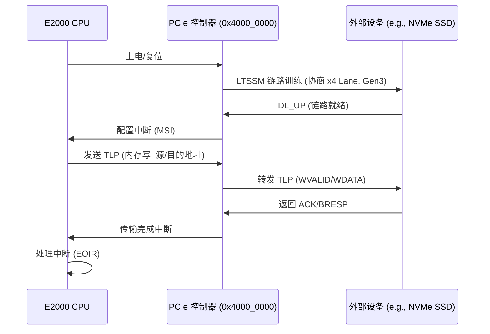

# 5.3 PCIe互联驱动

### 飞腾派 PCIe 设备

飞腾派（Phytium Pi）开发板基于飞腾 D2000 处理器（ARMv8 架构），其 PCIe 设备支持 PCIe 3.0 规范，提供 34 个 PCIe Lane，用于连接外部扩展卡（如网卡、存储控制器）。处理器内置 PCIe 控制器，基址约 0x4000_0000（ECAM 空间，TOML 配置），支持 x1, x4, x8, x16 配置，总带宽高达 31.5 GB/s (Gen3 x16)。飞腾派 PCIe 设备通过 Mini-PCIe 接口暴露，支持 NVMe SSD 或 WiFi 卡，但需适配器连接。设备树（phytium_pi.dts）定义 PCIe 节点：

```shell
pcie@40000000 {
    compatible = "phytium,pcie";
    reg = <0x0 0x40000000 0x0 0x10000000>;
    #interrupt-cells = <1>;
};
```

配置文件（aarch64-phytium-pi.toml）包含 PCIe MMIO 区域 [0x4000_0000, 0x1000_0000] 和 pci-ranges [0x58000000, 0x7fffffff], [0x6_0000_0000, 0x6_3fff_ffff]。驱动在 ArceOS 中通过 axhal 实现，支持 init_primary 配置 ECAM 空间和中断路由（GIC SPI）。

- 支持模式：
  - **根复合体（Root Complex）**：处理器侧，支持外设发现和配置。
  - **端点（Endpoint）**：外部设备侧，支持 MSI/MSI-X 中断。
  - **Lane 配置**：34 Lane，支持多设备（如 x16 GPU + x4 SSD）。
- **应用**：扩展网卡（如 Ixgeb Intel 10GbE）、存储（如 NVMe M.2）和 GPU（如 AMD Radeon RX560D）。

### 飞腾派 PCIe 设备时序图

飞腾派 PCIe 设备时序以数据传输过程为例，涉及处理器（E2000 Root Complex）、PCIe 控制器（基址 0x4000_0000）和外部设备（如 NVMe SSD）。上电后，链路训练（LTSSM）协商宽度和速度，处理器发送配置请求（TLP），控制器处理链路握手（DL_UP），设备返回配置响应。数据传输通过 TLP 包（内存读写），控制器确认 ACK，完成中断通知（MSI）。总时序延迟约 100ns~1µs（Gen3 2.5 GT/s），依赖 Lane 数和链路状态。



