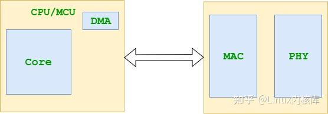

# IGB 网卡驱动

## 资料

[qemu igb文档](https://www.qemu.org/docs/master/system/devices/igb.html)

[igb网卡文档](https://www.intel.com/content/dam/www/public/us/en/documents/datasheets/82576eg-gbe-datasheet.pdf)

[linux igb驱动](https://github.com/torvalds/linux/tree/master/drivers/net/ethernet/intel/igb)

## 硬件架构

CPU集成MAC:


网卡包含MAC和PHY:



IGB网卡架构:


### MAC(Media Access Control)

### PHY(Physical Layer)

### MII(Media Independent Interface)


- 发送数据接口

- 接收数据接口

- MDIO：配置PHY芯片状态、读取寄存器、获取LINK状态等操作

RMII、GMII、RGMII、SGMII等都是MII的变种，主要区别在于数据传输速率和引脚数量。

## 驱动分析

### OSAL 操作系统抽象层

[trait-ffi](https://crates.io/crates/trait-ffi) 使用`trait`生成和安全使用外部函数。

### 驱动初始化

PCIe 枚举

手册阅读、寄存器定义

MAC定义

PHY定义

PHY寄存器读写

### Smoltcp

网络栈验证

### Request/Response 模型

### 收发数据

Ring

- Head

- Tail

Descriptor

- Read

- Write-Back

- Buffer

`Reqeust` 生命周期

## IxGBE 驱动 HAL API 调用表

| **函数名**          | **参数**                                                     | **返回值**                                                   | **功能描述**                                                 |
| ------------------- | ------------------------------------------------------------ | ------------------------------------------------------------ | ------------------------------------------------------------ |
| `dma_alloc`         | `size: usize` - 分配内存大小（字节）。                       | `(IxgbePhysAddr, NonNull<u8>)` - 物理地址（u64）和虚拟地址指针。失败返回 `(0, dangling)`。 | 使用 `axdma::alloc_coherent` 分配 8 字节对齐的 DMA 一致性内存，用于 Tx/Rx 环缓冲区。 |
| `dma_dealloc`       | `paddr: IxgbePhysAddr` - 物理地址。 `vaddr: NonNull<u8>` - 虚拟地址指针。 `size: usize` - 内存大小。 | `i32` - 始终返回 0（成功）。                                 | 使用 `axdma::dealloc_coherent` 释放 DMA 内存，处理原始指针，标记为 unsafe。 |
| `mmio_phys_to_virt` | `paddr: IxgbePhysAddr` - 物理地址。 `size: usize` - 大小（未使用）。 | `NonNull<u8>` - 虚拟地址指针。                               | 使用 `axhal::mem::phys_to_virt` 将 MMIO 物理地址转换为虚拟地址，访问设备寄存器，标记为 unsafe。 |
| `mmio_virt_to_phys` | `vaddr: NonNull<u8>` - 虚拟地址指针。 `size: usize` - 大小（未使用）。 | `IxgbePhysAddr` - 物理地址（u64）。                          | 使用 `axhal::mem::virt_to_phys` 将 MMIO 虚拟地址转换为物理地址，设置 DMA 描述符，标记为 unsafe。 |
| `wait_until`        | `duration: core::time::Duration` - 等待时间。                | `Result<(), &'static str>` - 始终返回 `Ok(())`。             | 使用 `axhal::time::busy_wait_until` 执行忙等待，用于驱动操作中的超时处理。 |

## 代码实现讲解

ixgbe.rs IxGBE 驱动 HAL 实现，通过 IxgbeHalImpl 结构体实现 IxgbeHal trait，支持 DMA 内存管理、MMIO 地址转换和定时操作。代码运行在 ArceOS 的 no_std 环境中，依赖 axdma（DMA 分配）、axdriver_net::ixgbe（trait 定义）、axhal::mem（地址转换）和 core 模块（指针和时间操作）。以下从依赖、结构到每个 API 的实现逐一讲解，确保与飞腾派硬件上下文（Mini-PCIe 接口支持 10GbE 网卡）相关。

#### 关键依赖与结构

- 依赖：
  - axdma：提供 alloc_coherent 和 dealloc_coherent，用于 DMA 一致性内存分配。
  - axdriver_net::ixgbe：定义 IxgbeHal trait 和类型（如 IxgbePhysAddr 为 u64，NonNull<u8> 为指针）。
  - axhal::mem：提供 phys_to_virt 和 virt_to_phys 用于 MMIO 地址转换。
  - core::alloc::Layout：定义内存布局，确保 8 字节对齐。
- 结构：
  - IxgbeHalImpl：空结构体，仅作为 IxgbeHal trait 的实现载体。
  - DMAInfo：axdma 提供的结构体，包含 cpu_addr（虚拟地址，NonNull<u8>）和 bus_addr（物理地址，BusAddr）。

#### API 实现讲解

**dma_alloc**

```rust
fn dma_alloc(size: usize) -> (IxgbePhysAddr, NonNull<u8>) {
    let layout = Layout::from_size_align(size, 8).unwrap();
    match unsafe { alloc_coherent(layout) } {
        Ok(dma_info) => (dma_info.bus_addr.as_u64() as usize, dma_info.cpu_addr),
        Err(_) => (0, NonNull::dangling()),
    }
}
```

**功能**：分配 8 字节对齐的 DMA 一致性内存，用于 IxGBE 的 Tx/Rx 环缓冲区（如描述符或数据包缓冲区）。

**实现**：

- 使用 Layout::from_size_align 创建内存布局，确保 8 字节对齐（匹配缓存线）。
- 调用 axdma::alloc_coherent（标记为 unsafe，处理原始内存），返回 DMAInfo（包含 bus_addr 和 cpu_addr）。
- 成功时返回物理地址（bus_addr 转为 usize）和虚拟地址指针（cpu_addr），失败返回 (0, dangling)。

**dma_dealloc**

```rust
unsafe fn dma_dealloc(paddr: IxgbePhysAddr, vaddr: NonNull<u8>, size: usize) -> i32 {
    let layout = Layout::from_size_align(size, 8).unwrap();
    let dma_info = DMAInfo {
        cpu_addr: vaddr,
        bus_addr: BusAddr::from(paddr as u64),
    };
    unsafe { dealloc_coherent(dma_info, layout) };
    0
}
```

**功能**：释放 DMA 一致性内存，清理 Tx/Rx 缓冲区。

**实现**：

- 标记为 unsafe，因涉及原始指针和内存释放。
- 重新创建 Layout（8 字节对齐），构造 DMAInfo（包含 vaddr 和 paddr）。
- 调用 axdma::dealloc_coherent 释放内存，始终返回 0（成功，假设释放无失败）。

**mmio_phys_to_virt**

```rust
unsafe fn mmio_phys_to_virt(paddr: IxgbePhysAddr, _size: usize) -> NonNull<u8> {
    NonNull::new(phys_to_virt(paddr.into()).as_mut_ptr()).unwrap()
}
```

**功能**：将 MMIO 物理地址转换为虚拟地址，用于访问 IxGBE 设备寄存器（如 BAR0）。

**实现**：

- 标记为 unsafe，因处理原始指针。
- 使用 axhal::mem::phys_to_virt 将物理地址（paddr）转为虚拟地址，返回 NonNull<u8> 指针。
- size 参数未使用，假设映射由 ArceOS 内存管理器处理。

**mmio_virt_to_phys**

```rust
unsafe fn mmio_virt_to_phys(vaddr: NonNull<u8>, _size: usize) -> IxgbePhysAddr {
    virt_to_phys((vaddr.as_ptr() as usize).into()).into()
}
```

**功能**：将 MMIO 虚拟地址转换为物理地址，用于 DMA 描述符设置。

**实现**：

- 标记为 unsafe，因处理原始指针。
- 使用 axhal::mem::virt_to_phys 将虚拟地址（vaddr）转为物理地址，返回 u64（IxgbePhysAddr）。
- size 参数未使用，假设映射固定。

**wait_until**

```rust
fn wait_until(duration: core::time::Duration) -> Result<(), &'static str> {
    axhal::time::busy_wait_until(duration);
    Ok(())
}
```

**功能**：执行指定时间的忙等待，用于驱动中的超时处理（如链路协商或设备重置）。

**实现**：

- 调用 axhal::time::busy_wait_until，基于 CPU 周期或定时器实现等待。
- 始终返回 Ok(())，无错误处理（假设忙等待无失败）。