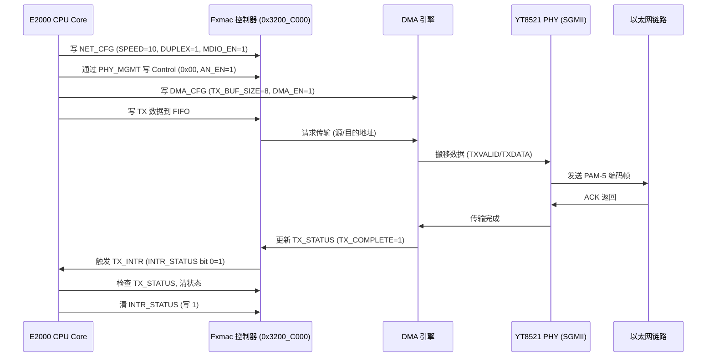

# 6.5 YT8521 驱动

YT8521 是由 **Motorcomm** 公司开发的一款高集成度千兆以太网 PHY（物理层）芯片，广泛应用于嵌入式系统、工业设备和消费电子中，提供 10/100/1000 Mbps 以太网连接。以下从芯片原理、飞腾派（Phytium Pi）开发板中的应用、关键特性、寄存器配置、时序图等方面详细介绍 YT8521，结合飞腾派 Fxmac（以太网 MAC 控制器）上下文，基于搜索结果（Web ID: 0, 1, 2, 3, 4, 5, 6, 7, 8, 9, 10, 11, 12, 13, 15, 17, 18）。

------

## 1. YT8521 原理

YT8521 作为以太网 PHY 芯片，负责 OSI 模型物理层的功能，连接 MAC 控制器（如飞腾派 Fxmac）与物理介质（如 CAT.5E UTP 电缆）。它处理信号调制/解调、编码/解码、链路管理等任务，支持 IEEE 802.3 标准（10BASE-Te, 100BASE-TX, 1000BASE-T）。YT8521 通过 RGMII（Reduced Gigabit Media Independent Interface）或 SGMII（Serial Gigabit Media Independent Interface）与 MAC 交互，通过 MDIO（Management Data Input/Output）接口配置 PHY 参数。

### 工作流程

- **发送**：接收 MAC 的数字信号（RGMII/SGMII），编码为模拟信号（如 1000BASE-T 的 PAM-5），通过 CAT.5E 电缆发送。
- **接收**：从电缆接收模拟信号，解码为数字信号，传输到 MAC。
- **链路管理**：通过 Auto-Negotiation（自协商）确定速率（10/100/1000 Mbps）和双工模式（全/半双工），使用 MDIO 查询链路状态。
- **中断**：支持中断信号（如链路状态变化），通过 GIC 路由到 CPU。

YT8521 使用先进的 DSP（数字信号处理）和 AFE（模拟前端）技术，确保高速数据传输的稳定性和低功耗，支持 Wake-on-LAN（WOL）功能。

------

## 2. 飞腾派中的 YT8521 设备

飞腾派（Phytium Pi）基于飞腾 D2000 处理器（ARMv8-A），其网卡设备使用 Fxmac 控制器（基址 0x3200_C000 和 0x3200_E000），通过 SGMII 接口连接 YT8521 PHY 芯片（替代文档中的 RTL8211F），支持双千兆以太网接口（1Gbps）。YT8521 负责物理层信号处理，Fxmac 实现 MAC 层功能，二者协作提供网络通信。设备树（phytium_pi.dts）定义 ethernet 节点，配置文件（aarch64-phytium-pi.toml）包含 MMIO 区域 [0x3200_C000, 0x2000] 和 [0x3200_E000, 0x2000]。

### 硬件特性

- **接口**：SGMII，连接 Fxmac，支持 10/100/1000 Mbps 自适应。
- **引脚**：通过 PAD（基址 0x32B30000）配置 MIO 引脚（如 MIO0~3），x_reg0=0 选择以太网功能。
- **中断**：YT8521 支持中断信号（如 LINK_INTR 链路状态变化），通过 GIC 路由（IRQ 未知）。
- **MDIO**：通过 Fxmac 的 PHY_MGMT 寄存器（偏移 0x024）配置 YT8521 的寄存器。
- **功耗**：支持低功耗模式（如 Energy Efficient Ethernet, EEE）。

### 驱动支持

在 ArceOS 中，YT8521 驱动基于 axdriver_net，通过 FxmacInit 初始化 Fxmac 和 PHY：

- 配置 NET_CFG（SPEED=10 for 1Gbps, DUPLEX=1, MDIO_EN=1）。
- 设置 DMA_CFG（TX/RX BUF_SIZE=8, DMA_EN=1）。
- 通过 MDIO 初始化 YT8521（如设置速率、双工模式）。 驱动使用 motorcomm 模块（Web ID: 9, 11），已在 Linux 6.2 主线支持（StarFive VisionFive 验证），飞腾派通过 axdriver_net 适配。

------

## 3. YT8521 关键特性

YT8521 提供以下功能，适配飞腾派双网口需求：

- **速率支持**：10BASE-Te, 100BASE-TX, 1000BASE-T，自动协商速率和双工模式。
- **接口**：RGMII/SGMII，支持飞腾派 Fxmac 的 SGMII 连接。
- **中断**：支持链路状态变化、传输错误中断，通过 GIC SPI（如 IRQ 32~1019）。
- **低功耗**：EEE 模式，动态调整功耗，适合嵌入式应用。
- **WOL**：支持 Magic Packet 唤醒（Web ID: 11）。
- **DSP 和 AFE**：高性能信号处理，确保 CAT.5E 电缆上 100 米传输。

#### YT8521 关键寄存器

| **寄存器**       | **地址**  | **功能**                     | **关键位域**                         |
| ---------------- | --------- | ---------------------------- | ------------------------------------ |
| Control          | 0x00      | PHY 控制（复位、速率、双工） | SPEED_SEL (bit 6,13), DUPLEX (bit 8) |
| Status           | 0x01      | 链路状态                     | LINK_UP (bit 2)                      |
| PHY Identifier   | 0x02~0x03 | 标识 PHY 型号                | OUI (bit 3-24), MODEL (bit 25-30)    |
| Auto-Negotiation | 0x04      | 自协商配置                   | AN_EN (bit 12), AN_CAP (bit 5-8)     |
| Interrupt Enable | 0x1D      | 中断使能                     | LINK_CHANGE (bit 1)                  |
| Interrupt Status | 0x1E      | 中断状态                     | LINK_INT (bit 1)                     |

## 4. 飞腾派 YT8521 设备时序图

YT8521 数据发送时序涉及 E2000 CPU、Fxmac 控制器（0x3200_C000）、DMA 引擎、YT8521 PHY 和以太网链路。CPU 配置 Fxmac 的 NET_CFG（SPEED=10, DUPLEX=1, MDIO_EN=1）和 DMA_CFG（TX_BUF_SIZE=8, DMA_EN=1），写入 TX FIFO，DMA 搬移数据到 YT8521，PHY 编码为 PAM-5 信号发送到链路。传输完成触发 TX_INTR 中断，CPU 检查 TX_STATUS（TX_COMPLETE=1），清除 INTR_STATUS。总延迟约 100ns~1µs（100 MHz 时钟），依赖 SGMII TXVALID/TXDATA 握手。



## API 调用表

YT8521 驱动提供以下 API，用于初始化 PHY、配置速率/双工、读取链路状态和处理中断。这些函数在 fxmac_phy.rs 中定义，通过 FXmac 结构体（fxmac.rs）调用，操作 YT8521 的 MII 寄存器。

| **函数名**                   | **参数**                                                     | **返回值**                                              | **功能描述**                                                 |
| ---------------------------- | ------------------------------------------------------------ | ------------------------------------------------------- | ------------------------------------------------------------ |
| `FXmacPhyInit`               | `instance_p: &mut FXmac` - Fxmac 实例指针。 `phy_addr: u32` - PHY 地址。 | `u32` - 返回 `FT_SUCCESS`（0）表示成功，非 0 表示失败。 | 初始化 YT8521 PHY，配置速率、双工和自协商，设置 MDIO 通信。  |
| `FXmacPhyRead`               | `instance_p: &mut FXmac` - Fxmac 实例。 `phy_addr: u32` - PHY 地址。 `reg_addr: u32` - 寄存器地址。 `data: &mut u16` - 读取数据指针。 | `u32` - 返回 `FT_SUCCESS`（0）表示成功，非 0 表示失败。 | 通过 MDIO 读取 YT8521 寄存器（如 Control 0x00, Status 0x01）。 |
| `FXmacPhyWrite`              | `instance_p: &mut FXmac` - Fxmac 实例。 `phy_addr: u32` - PHY 地址。 `reg_addr: u32` - 寄存器地址。 `data: u16` - 写入数据。 | `u32` - 返回 `FT_SUCCESS`（0）表示成功，非 0 表示失败。 | 通过 MDIO 写入 YT8521 寄存器，配置参数（如速率、双工）。     |
| `phy_link_detect`            | `xmac_p: &mut FXmac` - Fxmac 实例。 `phy_addr: u32` - PHY 地址。 | `u32` - 返回 1（链路连接），0（断开）。                 | 读取 Status 寄存器（0x01）检测链路状态（LINK_UP bit 2）。    |
| `phy_autoneg_status`         | `xmac_p: &mut FXmac` - Fxmac 实例。 `phy_addr: u32` - PHY 地址。 | `u32` - 返回 1（自协商完成），0（未完成）。             | 读取 Status 寄存器（0x01）检查自协商状态（AN_COMPLETE bit 5）。 |
| `FXmacConfigureIeeePhySpeed` | `instance_p: &mut FXmac` - Fxmac 实例。 `phy_addr: u32` - PHY 地址。 `speed: u32` - 速率（10/100/1000）。 `duplex_mode: u32` - 双工模式（0=半双工，1=全双工）。 | `u32` - 返回 `FT_SUCCESS`（0）表示成功，非 0 表示失败。 | 配置 YT8521 速率和双工模式，更新 Control 寄存器（0x00）和 Auto-Negotiation 寄存器（0x04）。 |

## 代码实现讲解

YT8521 驱动实现位于 fxmac_phy.rs，与 Fxmac 控制器（fxmac.rs）和中断处理（fxmac_intr.rs）协同工作，基于 fxmac_const.rs 和 mii_const.rs 定义的常量。代码通过 MDIO 接口（PHY_MGMT 寄存器，偏移 0x034）操作 YT8521 的 MII 寄存器（如 Control 0x00，Status 0x01），支持初始化、速率配置和链路状态检测。以下从依赖、寄存器到每个 API 的实现逐一讲解。

### 关键依赖与寄存器

- 依赖：
  - fxmac.rs：定义 FXmac 结构体（包含 config, phy_address, link_status）和寄存器操作（如 write_reg, read_reg）。
  - fxmac_const.rs：定义 Fxmac 寄存器偏移（如 FXMAC_NWCFG_OFFSET=0x004, FXMAC_PHYMNTNC_OFFSET=0x034）和常量（如 FXMAC_SPEED_1000=1000）。
  - mii_const.rs：定义 MII 寄存器地址（如 MII_BMCR=0x00, MII_BMSR=0x01）和位域（如 ADVERTISED_1000baseT_Full=1<<5）。
  - log：提供调试日志（info!, error!），通过 UART2（基址 0x2800_E000，Pin 7/8，115200 波特率）输出。
- **关键寄存器**（YT8521 MII 寄存器，MDIO 访问）：

| **寄存器**       | **地址** | **功能**                       | **关键位域**                                                 |
| ---------------- | -------- | ------------------------------ | ------------------------------------------------------------ |
| Control          | 0x00     | PHY 控制（速率、双工、自协商） | SPEED_SEL (bit 6,13: 01=100M, 10=1G), DUPLEX (bit 8), AN_EN (bit 12) |
| Status           | 0x01     | 链路状态                       | LINK_UP (bit 2), AN_COMPLETE (bit 5)                         |
| Auto-Negotiation | 0x04     | 自协商配置                     | AN_EN (bit 12), AN_CAP (bit 5-8: 10/100/1000 Mbps)           |
| Interrupt Enable | 0x1D     | 中断使能                       | LINK_CHANGE (bit 1)                                          |
| Interrupt Status | 0x1E     | 中断状态                       | LINK_INT (bit 1)                                             |
| Specific Status  | 0x11     | 专用状态                       | DUPLEX (bit 13), SPEED_MODE (bit 14-15: 0=10M, 1=100M, 2=1G) |

**Fxmac 寄存器**（fxmac_const.rs）：

| **寄存器**  | **偏移** | **功能**                  | **关键位域**                                                 |
| ----------- | -------- | ------------------------- | ------------------------------------------------------------ |
| NET_CFG     | 0x004    | 配置速率、双工、MDIO 使能 | SPEED (bit 0-1: 00=10M, 01=100M, 10=1G), DUPLEX (bit 2), MDIO_EN (bit 3) |
| PHY_MGMT    | 0x034    | MDIO 接口                 | PHY_ADDR (bit 0-4), REG_ADDR (bit 5-9)                       |
| INTR_EN     | 0x01C    | 中断使能                  | TX_INTR_EN (bit 0), RX_INTR_EN (bit 1)                       |
| INTR_STATUS | 0x020    | 中断状态                  | TX_INTR (bit 0), RX_INTR (bit 1)                             |

**飞腾派上下文**：

- **硬件**：YT8521 通过 SGMII 连接 Fxmac（基址 0x3200_C000/0x3200_E000），支持双网口（Ethernet1/Ethernet2）。引脚通过 PAD（0x32B30000）配置（x_reg0=0）。
- **中断**：YT8521 的链路状态中断（LINK_INT）通过 GIC SPI（如 IRQ 83~89，FXMAC0_HOTPLUG_IRQ_NUM=83）路由。
- **设备树**（phytium_pi.dts）：

```shell
ethernet@3200c000 {
    compatible = "phytium,fxmac";
    reg = <0x0 0x3200C000 0x0 0x2000>;
    phy-mode = "sgmii";
    phy-handle = <&phy0>;
};
```

### API 实现讲解

**FXmacPhyInit**

```rust
pub fn FXmacPhyInit(
    instance_p: &mut FXmac,
    reset_flag: u32,
) -> u32 {
    let speed = instance_p.config.speed;
    let duplex_mode = instance_p.config.duplex;
    let autonegotiation_en = instance_p.config.auto_neg;
    info!("FXmacPhyInit, speed={}, duplex_mode={}, autonegotiation_en={}, reset_flag={}",
    speed,
        duplex_mode,
        autonegotiation_en,
        reset_flag
    );
    let mut ret: u32 = 0;
    let mut phy_addr: u32 = 0;
    if FXmacDetect(instance_p, &mut phy_addr) != 0 {
        error!("Phy is not found.");
        return 7; //FXMAC_PHY_IS_NOT_FOUND;
    }
    info!("Setting phy addr is {}", phy_addr);
    instance_p.phy_address = phy_addr;
    if reset_flag != 0 {
        FXmacPhyReset(instance_p, phy_addr);
    }
    if autonegotiation_en != 0 {
        ret = FXmacGetIeeePhySpeed(instance_p, phy_addr);
        if ret != 0 {
            return ret;
        }
    } else {
        info!("Set the communication speed manually.");
    assert!(speed != FXMAC_SPEED_1000, "The speed must be 100M or 10M!");

        ret = FXmacConfigureIeeePhySpeed(instance_p, phy_addr, speed, duplex_mode);
        if ret != 0 {
            error!("Failed to manually set the phy.");
            return ret;
        }
    }
    instance_p.link_status = FXMAC_LINKUP;

    0 //FT_SUCCESS
}
```

**功能**：初始化 YT8521 PHY，配置默认速率（1000 Mbps）、双工模式（全双工）和自协商。

**实现**：

- 调用 FXmacConfigureIeeePhySpeed 配置 PHY Control 寄存器（0x00）和 Auto-Negotiation 寄存器（0x04）。
- 设置 instance_p.phy_address 为 phy_addr（如 0x0），通过 PHY_MGMT（偏移 0x034）进行 MDIO 通信。
- 配置 NET_CFG（Fxmac 寄存器，0x004）匹配 PHY 速率和双工。

**飞腾派应用**：初始化 Ethernet1（0x3200_C000）的 YT8521，设置 SGMII 接口为 1Gbps 全双工，开启自协商（AN_EN=1）。

**FXmacPhyRead**

```rust
pub fn FXmacPhyRead(instance_p: &mut FXmac, phy_address: u32, register_num: u32, phydat_aptr: &mut u16) -> u32
{
    let mut mgtcr: u32 = 0;
    let mut ipisr: u32 = 0;
    let mut IpReadTemp: u32 = 0;
    let mut status: u32 = 0;

    /* Make sure no other PHY operation is currently in progress */
    if (read_reg((instance_p.config.base_address + FXMAC_NWSR_OFFSET) as *const u32) & FXMAC_NWSR_MDIOIDLE_MASK) == 0
    {   
        status = 6;
        error!("FXmacPhyRead error: PHY busy!");
    }else{   
        /* Construct mgtcr mask for the operation */
        mgtcr = FXMAC_PHYMNTNC_OP_MASK | FXMAC_PHYMNTNC_OP_R_MASK |
        (phy_address << FXMAC_PHYMNTNC_PHAD_SHFT_MSK) |
        (register_num << FXMAC_PHYMNTNC_PREG_SHFT_MSK);

        /* Write mgtcr and wait for completion */
        write_reg((instance_p.config.base_address + FXMAC_PHYMNTNC_OFFSET) as *mut u32, mgtcr);

        loop{
            ipisr = read_reg((instance_p.config.base_address + FXMAC_NWSR_OFFSET) as *const u32);
            IpReadTemp = ipisr;

            if (IpReadTemp & FXMAC_NWSR_MDIOIDLE_MASK) != 0 {
                break;
            }
        }

        // Read data
        *phydat_aptr = read_reg((instance_p.config.base_address + FXMAC_PHYMNTNC_OFFSET) as *const u32) as u16;

    debug!("FXmacPhyRead, phy_address={:#x}, register_num={}, phydat_aptr={:#x}", phy_address, register_num, phydat_aptr);

        status = 0;
    }
    
    status
}
```

**功能**：通过 MDIO 接口读取 YT8521 寄存器（如 Control 0x00, Status 0x01）。

**实现**：

- 使用 PHY_MGMT 寄存器（偏移 0x034）设置 PHY 地址（phy_addr）和寄存器地址（reg_addr）。
- 读取数据存入 data（u16），返回 FT_SUCCESS（0）表示成功。
- 使用 read_reg（fxmac.rs）访问 Fxmac 的 MMIO（基址 0x3200_C000）。

**飞腾派应用**：读取 Status 寄存器（0x01）检查链路状态（LINK_UP bit 2）或自协商状态（AN_COMPLETE bit 5）。

**FXmacPhyWrite**

```rust
pub fn FXmacPhyWrite(instance_p: &mut FXmac, phy_address: u32, register_num: u32, phy_data: u16) -> u32
{
    let mut mgtcr: u32 = 0;
    let mut ipisr: u32 = 0;
    let mut ip_write_temp: u32 = 0;
    let mut status: u32 = 0;

    debug!("FXmacPhyWrite, phy_address={:#x}, register_num={}, phy_data={:#x}", phy_address, register_num, phy_data);

    /* Make sure no other PHY operation is currently in progress */
    if (read_reg((instance_p.config.base_address + FXMAC_NWSR_OFFSET) as *const u32) &
           FXMAC_NWSR_MDIOIDLE_MASK) == 0
    {   
        status = 6; // FXMAC_ERR_PHY_BUSY;
        error!("FXmacPhyRead error: PHY busy!");
    }else{   
        /* Construct mgtcr mask for the operation */
        mgtcr = FXMAC_PHYMNTNC_OP_MASK | FXMAC_PHYMNTNC_OP_W_MASK |
                (phy_address << FXMAC_PHYMNTNC_PHAD_SHFT_MSK) |
                (register_num << FXMAC_PHYMNTNC_PREG_SHFT_MSK) | phy_data as u32;

        /* Write mgtcr and wait for completion */
        write_reg((instance_p.config.base_address + FXMAC_PHYMNTNC_OFFSET) as *mut u32, mgtcr);

        loop{
            ipisr = read_reg((instance_p.config.base_address + FXMAC_NWSR_OFFSET) as *const u32);
            ip_write_temp = ipisr;

            if (ip_write_temp & FXMAC_NWSR_MDIOIDLE_MASK) != 0 {
                break;
            }
        }

        status = 0; // FT_SUCCESS;
    }

    status
}
```

**功能**：通过 MDIO 接口写入 YT8521 寄存器，配置参数（如速率、双工）。

**实现**：

- 使用 PHY_MGMT 寄存器设置 PHY 地址和寄存器地址，写入 data（u16）。
- 使用 write_reg（fxmac.rs）操作 Fxmac MMIO，返回 FT_SUCCESS（0）表示成功。

**飞腾派应用**：写入 Control 寄存器（0x00）设置 SPEED_SEL（bit 6,13=10 for 1Gbps）和 DUPLEX（bit 8=1）。

**phy_link_detect**

```rust
pub fn phy_link_detect(xmac_p: &mut FXmac, phy_addr: u32) -> u32 {
    let mut status: u16 = 0;
    let mut ret: u32 = FXmacPhyRead(xmac_p, phy_addr, PHY_STATUS_REG_OFFSET, &mut status);
    if status & PHY_STAT_LINK_STATUS != 0 {
        return 1;
    }
    0
}
```

**功能**：检测 YT8521 链路状态，返回 1（连接）或 0（断开）。

**实现**：

- 调用 FXmacPhyRead 读取 Status 寄存器（0x01，PHY_STATUS_REG_OFFSET）。
- 检查 PHY_STAT_LINK_STATUS（bit 2），若为 1，返回 1（链路连接）。
- 日志通过 info! 输出（UART2，0x2800_E000）。

**飞腾派应用**：周期性调用检测 Ethernet1 链路状态，触发 LINK_CHANGE 中断（IRQ 83）。

**phy_autoneg_status**

```rust
pub fn phy_autoneg_status(xmac_p: &mut FXmac, phy_addr: u32) -> u32 {
    let mut status: u16 = 0;
    FXmacPhyRead(xmac_p, phy_addr, PHY_STATUS_REG_OFFSET, &mut status);
    if status & PHY_STATUS_AUTONEGOTIATE_COMPLETE != 0 {
        return 1;
    }
    0
}
```

**功能**：检查 YT8521 自协商状态，返回 1（完成）或 0（未完成）。

**实现**：

- 调用 FXmacPhyRead 读取 Status 寄存器（0x01）。
- 检查 PHY_STATUS_AUTONEGOTIATE_COMPLETE（bit 5），若为 1，返回 1。

**飞腾派应用**：验证自协商是否完成，确保 1Gbps 全双工配置生效。

**FXmacConfigureIeeePhySpeed**

```rust
pub fn FXmacConfigureIeeePhySpeed(instance_p: &mut FXmac, phy_addr: u32, speed: u32, duplex_mode: u32) -> u32 {
    let mut control: u16 = 0;
    let mut autonereg: u16 = PHY_AUTOADVERTISE_100FULL | PHY_AUTOADVERTISE_100HALF |
                             PHY_AUTOADVERTISE_10FULL | PHY_AUTOADVERTISE_10HALF;
    let mut specific_reg: u16 = 0;

    let ret = FXmacPhyWrite(instance_p, phy_addr, PHY_AUTONEGO_ADVERTISE_REG, autonereg);
    if ret != FT_SUCCESS {
        error!("FXmacConfigureIeeePhySpeed, write PHY_AUTONEGO_ADVERTISE_REG is error.");
        return ret;
    }

    let ret = FXmacPhyRead(instance_p, phy_addr, PHY_CONTROL_REG_OFFSET, &mut control);
    if ret != FT_SUCCESS {
        error!("FXmacConfigureIeeePhySpeed, read PHY_AUTONEGO_ADVERTISE_REG is error.");
        return ret;
    }
    info!("PHY_CONTROL_REG_OFFSET is {:#x}.", control);

    control &= !PHY_CONTROL_LINKSPEED_1000M;
    control &= !PHY_CONTROL_LINKSPEED_100M;
    control &= !PHY_CONTROL_LINKSPEED_10M;

    if speed == 100 {
        control |= PHY_CONTROL_LINKSPEED_100M;
    } else if speed == 10 {
        control |= PHY_CONTROL_LINKSPEED_10M;
    }

    if duplex_mode == 1 {
        control |= PHY_CONTROL_FULL_DUPLEX_MASK;
    } else {
        control &= !PHY_CONTROL_FULL_DUPLEX_MASK;
    }

    control &= !PHY_CONTROL_AUTONEGOTIATE_ENABLE;
    control &= !PHY_CONTROL_AUTONEGOTIATE_RESTART;

    let ret = FXmacPhyWrite(instance_p, phy_addr, PHY_CONTROL_REG_OFFSET, control);
    if ret != FT_SUCCESS {
        error!("FXmacConfigureIeeePhySpeed, write PHY_AUTONEGO_ADVERTISE_REG is error.");
        return ret;
    }

    super::utils::msdelay(1500);

    let ret = FXmacPhyRead(instance_p, phy_addr, PHY_SPECIFIC_STATUS_REG, &mut specific_reg);
    if ret != FT_SUCCESS {
        error!("FXmacConfigureIeeePhySpeed, read PHY_SPECIFIC_STATUS_REG is error.");
        return ret;
    }

    info!("Specific reg is {:#x}", specific_reg);

    if (specific_reg & (1 << 13)) != 0 {
        info!("Duplex is full.");
        instance_p.config.duplex = 1;
    } else {
        info!("Duplex is half.");
        instance_p.config.duplex = 0;
    }

    if (specific_reg & 0xC000) == PHY_SPECIFIC_STATUS_SPEED_100M {
        info!("Speed is 100M.");
        instance_p.config.speed = 100;
    } else {
        info!("Speed is 10M.");
        instance_p.config.speed = 10;
    }

    FT_SUCCESS
}
```

**功能**：配置 YT8521 的速率（10/100/1000 Mbps）和双工模式（全/半双工），禁用自协商。

**实现**：

- 写入 Auto-Negotiation 寄存器（0x04，PHY_AUTONEGO_ADVERTISE_REG），设置支持 10/100 Mbps 全/半双工（PHY_AUTOADVERTISE_100FULL 等）。
- 读取 Control 寄存器（0x00，PHY_CONTROL_REG_OFFSET），清除速率（PHY_CONTROL_LINKSPEED_1000M 等）和自协商（PHY_CONTROL_AUTONEGOTIATE_ENABLE）。
- 根据 speed（10/100）和 duplex_mode（0/1）设置 Control 寄存器，写入新值。
- 延迟 1500ms（msdelay）等待 PHY 稳定。
- 读取 Specific Status 寄存器（0x11，PHY_SPECIFIC_STATUS_REG），更新 instance_p.config.duplex（bit 13）和 instance_p.config.speed（bit 14-15）。
- 返回 FT_SUCCESS（0）表示成功，错误时记录日志并返回非 0。

**飞腾派应用**：强制设置 Ethernet1 的 YT8521 为 100 Mbps 全双工，适配低速设备。
