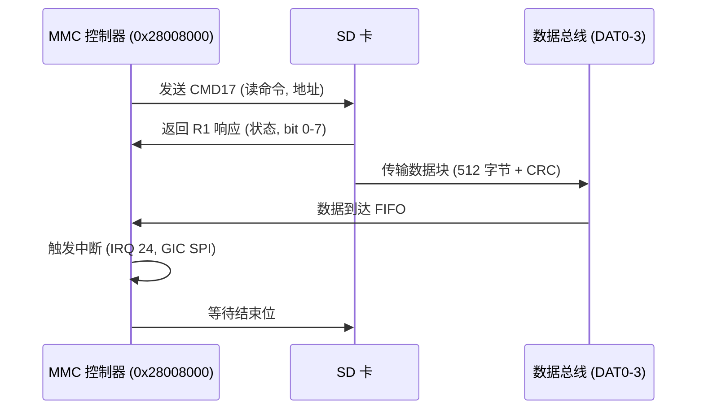

# 7.1 Micro SD驱动

### SD 卡设备原理

SD 卡（Secure Digital Card）是一种非易失性存储设备，广泛用于嵌入式系统的数据存储和传输。SD 卡原理基于闪存芯片和控制器架构，控制器处理命令和数据，通过 SPI 或 SD 模式与主机通信。SD 模式支持 1~4 位数据总线，速率从默认 25 MHz 到 UHS-II 的 208 MHz，提供 12.5 MB/s 到 624 MB/s 带宽。SD 卡协议包括初始化、命令/响应和数据传输阶段：主机发送 CMD 命令（如 CMD0 复位，CMD8 接口条件），SD 卡返回响应（R1/R3/R7），数据块以 512 字节为单位传输，支持 CRC 校验和错误重试。SD 卡类型包括 SDSC（标准容量，≤2GB）、SDHC（高容量，4~32GB）和 SDXC（扩展容量，64GB~2TB），文件系统通常为 FAT32 或 exFAT。控制器内部闪存阵列通过 NAND 闪存实现，支持磨损均衡和错误纠正（ECC），电源管理包括低功耗模式和热插拔。

- 命令类型：

  - **基本命令**：CMD0（复位）、CMD1（初始化 OCR）。
  - **读写命令**：CMD17（单块读）、CMD24（单块写）、CMD18/25（多块读写）。
  - **响应格式**：R1（正常响应，bit 0-7 状态）、R2（CID/CSD 寄存器）、R3（OCR 寄存器）。
  
- **数据传输**：块模式（512 字节），总线宽度 1/4 位，CRC16 校验数据完整性。

SD 卡支持电压切换（3.3V 到 1.8V），UHS-I/II 模式提升速率，适用于飞腾派等嵌入式板卡的 boot 和存储。

### 飞腾派 SD 卡设备

飞腾派（Phytium Pi）开发板的 SD 卡设备集成在 D2000 处理器中，支持 SD 3.0 规范，提供 eMMC/SD 接口，用于启动和数据存储。设备控制器基址为 0x28008000，支持 1/4 位总线宽度，最大速率 50 MHz（SDR25 模式），带宽 25 MB/s。飞腾派 SD 卡设备通过 MMC 控制器实现，支持 SDHC/SDXC 卡（容量 >2GB），文件系统为 FAT32。设备树（phytium_pi.dts）定义 mmc 节点：

```shell
mmc@28008000 {
    compatible = "phytium,mmc";
    reg = <0x0 0x28008000 0x0 0x1000>;
    clocks = <&clk MMC_CLK>;
    interrupts = <0 24 4>; // IRQ 24
};
```

配置文件（aarch64-phytium-pi.toml）包含 MMIO 区域 [0x28008000, 0x1000]。驱动在 ArceOS 中通过 axhal 实现，支持初始化命令（如 CMD0/CMD8）和数据块传输，适用于 SD 卡 boot（arceos.img）。

- 硬件特性：

  - **接口**：microSD 卡槽，支持热插拔。
  - **中断**：IRQ 24，通过 GIC 路由 SPI。
  - **时钟**：50 MHz（MMC_CLK），支持 DDR 模式。
  - **扩展**：支持 SDIO 设备（如 WiFi 模块）。
  
- **驱动支持**：ArceOS 的 axdriver_mmc 模块（假设），初始化控制器，配置 CMD/DAT 引脚，通过 PAD (0x32B30000)。

------

### 飞腾派 SD 卡设备时序图

飞腾派 SD 卡设备时序以单块读操作（CMD17）为例，涉及主机控制器（基址 0x28008000）、SD 卡和数据总线。主机发送 CMD17（读地址），SD 卡返回 R1 响应（状态），然后传输数据块（512 字节），结束后触发中断（IRQ 24）通知 CPU。总延迟约 1~10 ms（50 MHz 时钟），依赖总线宽度（1/4 位）。



#### 时序分析

- **命令阶段**：CMD 线传输 48 位命令（CRC7 校验），响应延迟 <1 ms。
- **数据阶段**：DAT 线传输块数据，4 位宽度下速率 25 MB/s。
- **中断**：传输完成后，控制器触发 IRQ 24，GIC 路由到 CPU 0。

------

## 相关寄存器信息、位域及基地址

飞腾派 SD 卡设备寄存器基于 MMC 控制器（基址 0x28008000），支持命令、数据和中断配置。以下是关键寄存器、位域和基地址信息。

- **基址**：MMC 控制器基址 0x28008000。

- 寄存器表：

  | **寄存器**      | **偏移** | **功能**       | **关键位域**                                                 |
  | --------------- | -------- | -------------- | ------------------------------------------------------------ |
  | MMC_CMD         | 0x00     | 命令寄存器     | CMD_IDX (bit 0-5: 命令索引，如 CMD17=17), CMD_RESP (bit 6-7: 响应类型) |
  | MMC_ARG         | 0x04     | 命令参数寄存器 | ARG (bit 0-31: 命令参数，如读地址)                           |
  | MMC_RESP0       | 0x08     | 响应寄存器 0   | RESP (bit 0-31: R1/R3 响应)                                  |
  | MMC_DATA_CTRL   | 0x0C     | 数据控制寄存器 | BLOCK_SIZE (bit 0-11: 512 字节), DMA_EN (bit 0)              |
  | MMC_INTR_EN     | 0x10     | 中断使能寄存器 | TX_COMPLETE (bit 0), RX_COMPLETE (bit 1), ERR_INTR (bit 2)   |
  | MMC_INTR_STATUS | 0x14     | 中断状态寄存器 | TX_INTR (bit 0), RX_INTR (bit 1)                             |
  | MMC_CLK_DIV     | 0x18     | 时钟分频寄存器 | DIV (bit 0-7: 分频值，50 MHz / DIV)                          |

MMC_CMD 寄存器位域：

- **CMD_IDX** (bit 0-5)：命令索引，如 CMD0=0 (复位), CMD17=17 (单块读)。
- **CMD_RESP** (bit 6-7)：响应类型，00=无响应, 01=R1/R3/R4/R5, 10=R2。
- **CMD_DATA** (bit 8)：1=有数据传输。

MMC_DATA_CTRL 寄存器位域：

- **BLOCK_SIZE** (bit 0-11)：数据块大小（512 字节=0x200）。
- **DMA_EN** (bit 0)：1=使能 DMA 传输。
- **DIR** (bit 1)：0=写（主机到卡），1=读（卡到主机）。

MMC_INTR_EN 寄存器位域：

- **TX_COMPLETE_EN** (bit 0)：使能发送完成中断。
- **RX_COMPLETE_EN** (bit 1)：使能接收完成中断。
- **ERR_INTR_EN** (bit 2)：使能错误中断（如 CRC 错误）。
