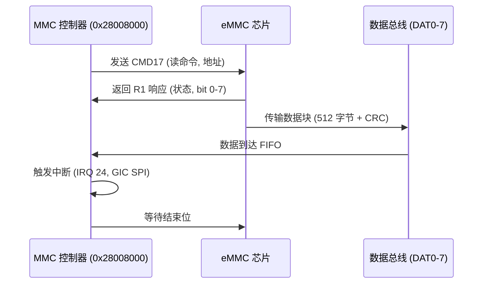

# 7.2 eMMC驱动

### eMMC 设备原理

eMMC（embedded Multi-Media Card）是一种嵌入式多媒体卡标准，专为移动设备和嵌入式系统设计，集成 NAND 闪存和控制器于单一芯片中。eMMC 原理基于主机-从机模型，主机（如处理器）通过命令、数据和响应线控制从机（eMMC 卡）。它遵循 JEDEC 标准，支持 1/4/8 位数据总线，速率从 HS200（200 MB/s）到 HS400（400 MB/s）。eMMC 工作流程包括初始化（CMD0 复位, CMD1 OCR 查询, CMD2 CID 获取, CMD3 RCA 分配, CMD7 选择卡, CMD6 切换模式）、数据传输（CMD17/18 单/多块读, CMD24/25 单/多块写）和错误处理（CRC 校验, 重试机制）。控制器内部处理闪存管理（如磨损均衡、坏块处理、ECC 纠错），主机通过 SDMMC 控制器访问 eMMC，文件系统通常为 FAT32 或 ext4。eMMC 与 SD 卡的区别在于集成控制器和固定封装，支持 Boot Partition 用于启动镜像加载。

- 关键特性：
  - **容量**：eMMC 5.1 支持 4GB~1TB，分为用户区和引导区。
  - **接口**：8 位数据线（DAT0~7）、命令线（CMD）、时钟线（CLK）、电源（VCC/VSS）。
  - **模式**：默认模式 (25 MHz), 高速模式 (HS200/HS400), DDR 模式 (双边沿采样)。
  - **电源管理**：支持低功耗睡眠模式和快速唤醒。

eMMC 的优势在于高集成度、低功耗和可靠性，适用于飞腾派等嵌入式板卡的启动和存储，传输块大小固定 512 字节，支持多分区。

------

### 飞腾派 eMMC 设备

飞腾派（Phytium Pi）开发板的 eMMC 设备集成在 D2000 处理器中，支持 eMMC 5.1 规范，提供 onboard eMMC 存储（8/16/32GB 选项）用于操作系统安装和数据持久化。设备控制器基址为 0x28008000，支持 1/4/8 位总线宽度，最大速率 50 MHz (SDR25 模式)，带宽 25 MB/s。飞腾派 eMMC 设备通过 MMC 控制器实现，支持 HS200 模式和 Boot Partition，用于加载 ArceOS 镜像（如 arceos.img）。设备树（phytium_pi.dts）定义 emmc 节点，配置文件（aarch64-phytium-pi.toml）包含 MMIO 区域 [0x28008000, 0x1000]。驱动在 ArceOS 中通过 axdriver_mmc 模块实现，支持初始化命令（如 CMD0/CMD8）和数据块传输，适用于 SD 卡/eMMC boot。

- 硬件特性：
  - **接口**：onboard eMMC 芯片，支持热插拔 SD 卡槽扩展。
  - **中断**：IRQ 24，通过 GIC 路由 SPI，用于传输完成和错误。
  - **时钟**：50 MHz (MMC_CLK)，支持 DDR 模式。
  - **扩展**：支持 SDIO 设备（如 WiFi 模块）。

飞腾派的 eMMC 设备通过 PAD (0x32B30000) 配置引脚（如 DAT0~7, CMD, CLK），MIO (0x2801_4000~0x2803_2000) 选择功能，适用于启动和存储场景。

------

### 飞腾派 eMMC 设备时序图

飞腾派 eMMC 设备时序以单块读操作（CMD17）为例，涉及 MMC 控制器（基址 0x28008000）、eMMC 芯片和数据总线（DAT0~7）。主机发送 CMD17（读地址），eMMC 返回 R1 响应（状态），然后传输数据块（512 字节 + CRC），结束后触发中断（IRQ 24）通知 CPU。总延迟约 1~10 ms（50 MHz 时钟），依赖总线宽度（1/4/8 位）。

#### 时序分析

命令阶段：CMD 线传输 48 位命令（CRC7 校验），响应延迟 <1 ms。数据阶段：DAT 线传输块数据，8 位宽度下速率 50 MB/s，CRC16 校验完整性。中断阶段：传输完成后控制器触发 IRQ 24，GIC 路由到 CPU 0。

------

## 相关寄存器信息、位域及基地址

飞腾派 eMMC 设备寄存器基于 MMC 控制器（基址 0x28008000），支持命令、数据和中断配置。以下是关键寄存器、位域和基地址信息。

- **基址**：MMC 控制器基址 0x28008000。

- 寄存器表：

  | **寄存器**      | **偏移** | **功能**       | **关键位域**                                                 |
  | --------------- | -------- | -------------- | ------------------------------------------------------------ |
  | MMC_CMD         | 0x00     | 命令寄存器     | CMD_IDX (bit 0-5: 命令索引，如 CMD17=17), CMD_RESP (bit 6-7: 响应类型) |
  | MMC_ARG         | 0x04     | 命令参数寄存器 | ARG (bit 0-31: 命令参数，如读地址)                           |
  | MMC_RESP0       | 0x08     | 响应寄存器 0   | RESP (bit 0-31: R1/R3/R4/R5 响应)                            |
  | MMC_DATA_CTRL   | 0x0C     | 数据控制寄存器 | BLOCK_SIZE (bit 0-11: 512=0x200), DMA_EN (bit 0), DIR (bit 1: 0=写, 1=读) |
  | MMC_INTR_EN     | 0x10     | 中断使能寄存器 | TX_COMPLETE_EN (bit 0), RX_COMPLETE_EN (bit 1), ERR_INTR_EN (bit 2) |
  | MMC_INTR_STATUS | 0x14     | 中断状态寄存器 | TX_INTR (bit 0), RX_INTR (bit 1)                             |
  | MMC_CLK_DIV     | 0x18     | 时钟分频寄存器 | DIV (bit 0-7: 分频值，50 MHz / DIV)                          |

MMC_CMD 寄存器位域：

- CMD_IDX (bit 0-5)：命令索引，如 CMD0=0 (复位), CMD17=17 (单块读)。
- CMD_RESP (bit 6-7)：响应类型，00=无响应, 01=R1/R3/R4/R5, 10=R2。
- CMD_DATA (bit 8)：1=有数据传输。

MMC_DATA_CTRL 寄存器位域：

- BLOCK_SIZE (bit 0-11)：数据块大小（512 字节=0x200）。
- DMA_EN (bit 0)：1=使能 DMA 传输。
- DIR (bit 1)：0=主机到卡（写），1=卡到主机（读）。

MMC_INTR_EN 寄存器位域：

- TX_COMPLETE_EN (bit 0)：使能发送完成中断。
- RX_COMPLETE_EN (bit 1)：使能接收完成中断。
- ERR_INTR_EN (bit 2)：使能错误中断（如 CRC 错误）。
