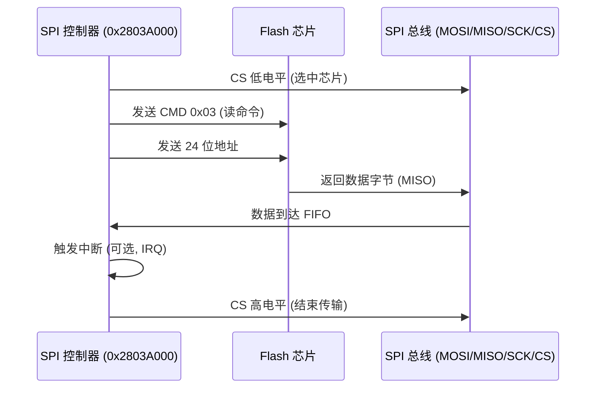

# 7.3 Flash驱动

### Flash 设备原理

Flash 存储器是一种非易失性半导体存储技术，能够在断电后保留数据，广泛用于嵌入式系统中的固件存储和数据持久化。Flash 原理基于浮栅晶体管（Floating Gate Transistor），通过隧道效应（Fowler-Nordheim Tunneling）或热电子注入在浮栅上存储电荷，表示 0/1 状态。Flash 分两种类型：NOR Flash 支持随机访问和执行代码（XIP），适用于固件启动；NAND Flash 支持块访问，高密度低成本，适用于数据存储，但需错误纠正（ECC）和坏块管理。Flash 操作包括读、写（编程）和擦除：读操作直接访问单元；写操作注入电荷到浮栅，通常以页（2K~16K 字节）为单位；擦除操作移除电荷，以块（64K~512K 字节）为单位，必须先擦除再写。Flash 寿命有限（10K~100K 次擦除），使用磨损均衡算法延长使用。接口包括 SPI（串行外围接口）用于低速小容量 Flash 和 Parallel 接口用于高速大容量。

- 关键特性：
  - **读速度**：NOR Flash ~100 MB/s，NAND Flash ~200 MB/s。
  - **写/擦除时间**：写页 200µs~2ms，擦除块 1~5ms。
  - **电压**：1.8V~3.3V，支持低功耗模式。
  - **错误处理**：内置 CRC 或 ECC，坏块标记。

Flash 与 EEPROM 的区别在于块擦除而非字节擦除，适用于飞腾派等嵌入式板卡的 boot loader 和文件系统。

------

### 飞腾派 Flash 设备

飞腾派（Phytium Pi）开发板的 Flash 设备使用 SPI NOR Flash（如 W25Q128JV），容量 16MB，支持 SPI 模式，用于存储固件和启动代码。设备控制器集成在 SPI 模块中，基址 0x2803A000，支持主模式、四种时序模式（CPOL/CPHA 组合）和最大 104 MHz 时钟速率，带宽 52 MB/s。飞腾派 Flash 设备通过 Mini-SPI 接口连接，支持 Quad SPI (4 位数据线) 提升性能，适用于 U-Boot 和 ArceOS 镜像存储。设备树（phytium_pi.dts）定义 spi-flash 节点，配置文件（aarch64-phytium-pi.toml）包含 MMIO 区域 [0x2803A000, 0x1000]。驱动在 ArceOS 中通过 axdriver_spi 模块实现，支持命令如读 ID (0x90)、页编程 (0x02) 和块擦除 (0xD8)，适用于 boot 和数据持久化。

- 硬件特性：
  - **容量**：16MB (128Mb)，页大小 256 字节，块大小 64KB。
  - **接口**：SPI，支持 Single/Dual/Quad 模式，引脚 MISO/MOSI/SCK/CS 通过 PAD (0x32B30000) 配置。
  - **中断**：IRQ 通过 GIC 路由（SPI 模式下可选）。
  - **扩展**：支持外部 SD 卡扩展，但内置 Flash 用于固件。

飞腾派的 Flash 设备与 eMMC 不同，前者用于固件存储，后者用于大容量数据，驱动支持轮询和中断模式。

------

### 飞腾派 Flash 设备时序图

飞腾派 Flash 设备时序以页读操作（CMD 0x03）为例，涉及 SPI 控制器（基址 0x2803A000）、Flash 芯片和 SPI 总线（MISO/MOSI/SCK/CS）。主机发送 CMD 0x03 和地址，Flash 返回数据字节，完成后 CS 高电平结束传输。总延迟约 10~100 µs（104 MHz 时钟），依赖模式（Single SPI 1 位，Quad SPI 4 位）。

#### 时序分析

命令阶段：MOSI 发送 8 位命令 + 24 位地址（32 位总），响应延迟 <1 µs。数据阶段：MISO 返回字节数据，4 位模式下速率 52 MB/s，CRC 校验完整性。中断阶段：传输完成后控制器触发 IRQ，通过 GIC 路由到 CPU 0。

------

## 相关寄存器信息、位域及基地址

飞腾派 Flash 设备寄存器基于 SPI 控制器（基址 0x2803A000），支持命令、数据和中断配置。以下是关键寄存器、位域和基地址信息。

- **基址**：SPI 控制器基址 0x2803A000。

- 寄存器表：

  | **寄存器**     | **偏移** | **功能**           | **关键位域**                                              |
  | -------------- | -------- | ------------------ | --------------------------------------------------------- |
  | SPICTRL0       | 0x000    | 控制寄存器 0       | DATA_WIDTH (bit 0-3: 8/16 位), CPOL (bit 6), CPHA (bit 7) |
  | SPIEN          | 0x008    | 使能寄存器         | SPI_EN (bit 0: 1=使能)                                    |
  | SPIBAUDR       | 0x014    | 波特率寄存器       | BAUDR (bit 0-31: 分频值, 104 MHz / BAUDR)                 |
  | SPITXFTLR      | 0x018    | 发送 FIFO 阈值     | TX_THR (bit 0-7: 阈值 0~255)                              |
  | SPIRXFTLR      | 0x01C    | 接收 FIFO 阈值     | RX_THR (bit 0-7: 阈值 0~255)                              |
  | SPITXFLR       | 0x020    | 发送 FIFO 等级     | TX_LVL (bit 0-7: 当前等级)                                |
  | SPIRXFLR       | 0x024    | 接收 FIFO 等级     | RX_LVL (bit 0-7: 当前等级)                                |
  | SPISR          | 0x028    | 状态寄存器         | BUSY (bit 0: 1=忙), TFNF (bit 1: TX FIFO 非满)            |
  | SPIIMR         | 0x02C    | 中断屏蔽寄存器     | TXEI (bit 2: TX 阈值中断), RXFI (bit 4: RX 阈值中断)      |
  | SPIISR         | 0x030    | 中断状态寄存器     | TXEI (bit 2), RXFI (bit 4)                                |
  | SPIRISR        | 0x034    | 原始中断状态寄存器 | TXEI (bit 2), RXFI (bit 4)                                |
  | SPIICR         | 0x048    | 中断清除寄存器     | CLR_ALL (bit 0: 写 1 清所有中断)                          |
  | SPIDMACR       | 0x04C    | DMA 控制寄存器     | DMA_EN (bit 0: 1=使能 DMA)                                |
  | SPIDR          | 0x060    | 数据寄存器         | DR (bit 0-7/15: 数据字节)                                 |
  | SPIRXSAMPLEDLY | 0x0FC    | 接收采样延迟       | DELAY (bit 0-7: 采样延迟周期)                             |
  | SPICS          | 0x100    | 片选寄存器         | CS (bit 0: 0=选中，1=释放)                                |

SPICTRL0 寄存器位域：

- DATA_WIDTH (bit 0-3)：数据位宽，3=8 位, 4=16 位。
- CPOL (bit 6)：时钟极性，0=空闲低电平, 1=空闲高电平。
- CPHA (bit 7)：时钟相位，0=第一个边沿采样, 1=第二个边沿采样。

SPIEN 寄存器位域：

- SPI_EN (bit 0)：1=使能 SPI 控制器。

SPIBAUDR 寄存器位域：

- BAUDR (bit 0-31)：分频值，速率 = 时钟 / BAUDR (104 MHz / BAUDR)。

SPIIMR 寄存器位域：

- TXEI (bit 2)：发送阈值中断使能。
- RXFI (bit 4)：接收阈值中断使能。
